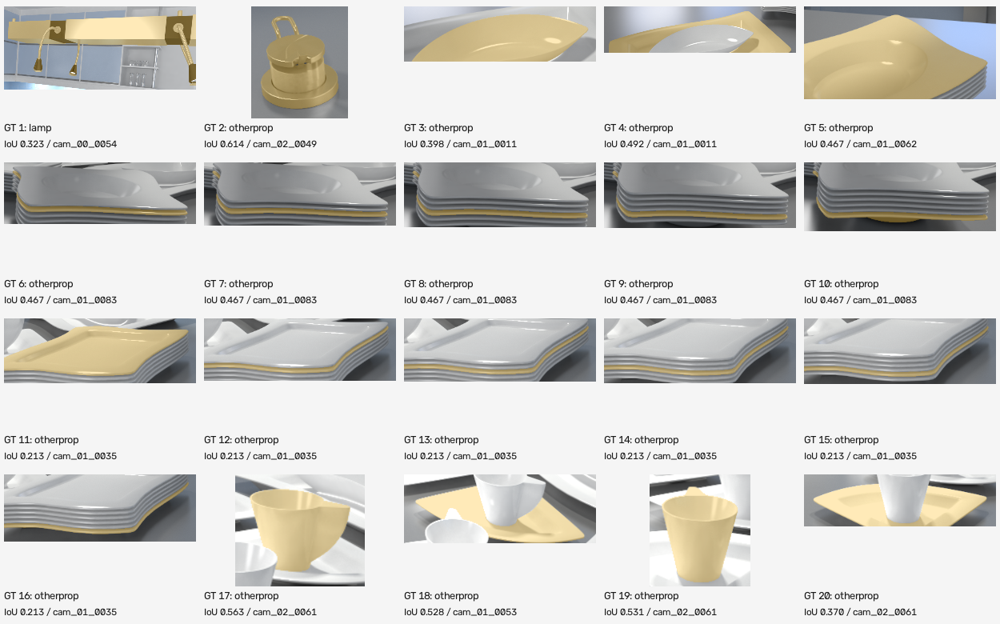
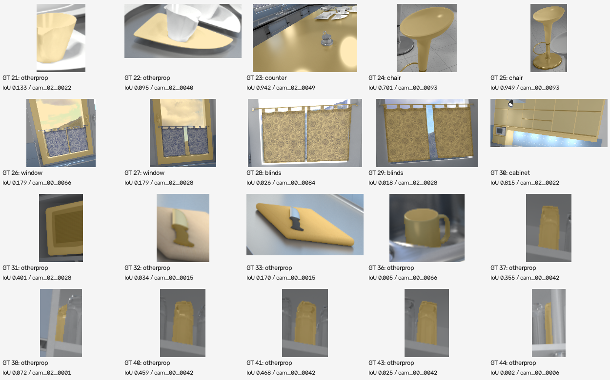
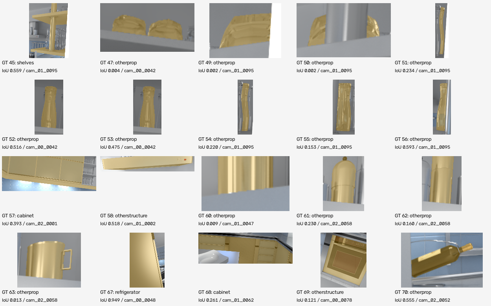
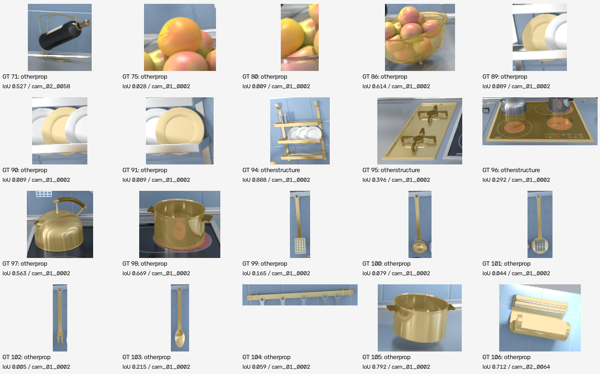
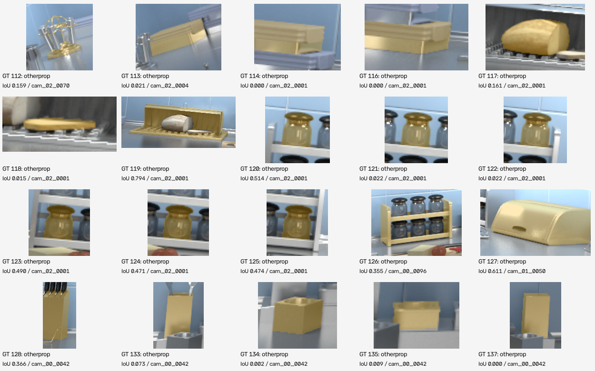
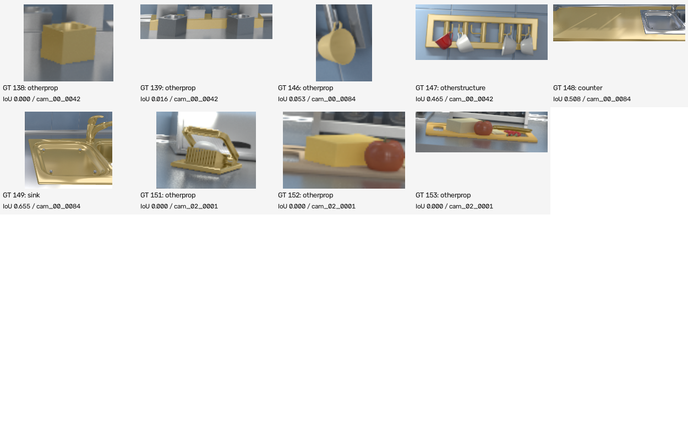

# PartAware-SG 综合研发与实验报告

更新：2026-10-07。当前默认实现为v11：保留v10柜体、台面和上部灯具实测恢复，进一步用完整掩码共识与共享实测表面消解重复实例。前六章只维护最新主流程、数学原理与接口，各版本变化独立记录。严格AP、MVO和观测真值范围保持原协议；逐物体低分列表与GT定位附图见17.7，v11对照见18章。

## 1. 当前主脉络

**ScanNet/Hypersim RGB-D 与位姿 → 复用类别、描述及 Florence/DINO/SAM 观测 → 本地 YOLOE 检测与原生分割 → 深度投影、地面及低平台过滤 → 一对一关联与全局实例共识 → 实测表面精修 → 包含残片合并、冲突身份消解、逐点留出视角与台面身份核验 → 联合深度/掩码存在核验及稳定表面核心 → 共享表面与完整掩码消解重复、稳定区域所有权复核 → 缓存身份授权的有界实测柜体/台面恢复及封闭柜体身份判定 → 选择性 AdaPoinTr 与实测后方结构约束的完整体积推断、观测验收 → 正式几何框与空间边 → VLPart部件与父归属 → 三视角实测部件回填整体 → 稀疏几何触发、密集深度/掩码共识与自动三维种子分割 → 唯一轴向支撑与上部横梁纳入整体并保留部件、同步框与边 → 已确认横梁的密集实测恢复 → 原始像素上部本体测量、杆身连续性验收与父归属 → 最终统一发布物体/部件图与框边 → 严格AP、MVO及表面/碎片评价 → 原版可视化。**

两个既有场景全部复用 Qwen 缓存，新增 Qwen 识图请求为零。新输入缺少缓存时使用固定室内词表，不自动请求 Qwen。构图与补全不读取 Hypersim 真值文件；真值只进入独立评价程序。

| 阶段 | 当前作用 | 核心入口与输出 |
| --- | --- | --- |
| 输入 | 保留原 ScanNet 文件夹和 Hypersim manifest；完整有序帧列表每三帧选一帧，最多150帧 | `partaware/geometry.py`、`prepare_hypersim.py` |
| 缓存与前端 | 复用原语义和 Florence 观测；YOLOE-v8-S 原生掩码补充独立候选 | `run_pipeline.py`、`yoloe_frontend.py`；`refined_instance`、`frontend_cache` |
| 投影与背景 | 使用光轴深度、两套内参与米制位姿；背景支持的地面和低平台不获得物体身份 | `op3dsg_fusion.py`；`floor_filter.json` |
| 实例身份 | 在线 Hungarian 关联，随后用第三视角完整物体掩码复核重复与互补片段 | `multiview_association.py`、`instance_consensus.py`；映射、轨迹与中文日志 |
| 实测精修 | 清除多次可见且反复被否定的点；保留未知/遮挡区域和重要断开表面 | `instance_consensus.py`、`map_ply_post_filter.py`；`instance_cloud_cleaned.ply` |
| 候选验收 | 语义门控、背景/台面反证、冲突身份消解及联合实测存在/稳定核心审核 | `proposal_validation.py`、`background_consensus.py`；`object_validation.json`、`validated_object_tracks.json` |
| 实例粒度复核 | 仅在共享表面、完整掩码、多帧共识和唯一归属通过时合并；错误区域转移独立验收 | `instance_granularity.py`；`instance_granularity_audit.json` |
| 结构表面恢复 | 缓存储物/台面身份、前后平面和多视角深度共同授权；以封闭立面及缓存类别复核柜体 | `structural_surfaces.py`；`structural_surface_audit.json` |
| 形状补全 | AdaPoinTr-PCN及后方结构约束长方体分别提案；实测与自由空间验收，明确区分生成表面 | `shape_completion.py`、`backed_cuboid.py`；两份completion审核 |
| 正式几何 | 不对精修点云重复执行破坏性过滤；用已验证的竖直轴拟合框，同步空间边 | `canonical_geometry.py`；`topology_map.json`、`topology_map_observed.json` |
| 部件与层级 | 官方VLPart检测部件；独立RN50融合及父归属；审核实测水槽部件并回填整体 | `vlpart_graph.py`、`run_partaware.py`；`part_nodes`、`part_relations` |
| 细结构恢复 | 稀疏几何触发；密集投影、三视角确认、自动几何种子SAM和连通验收；其他点云冻结 | `thin_geometry.py`；`thin_geometry_audit.json`、`geometry_recovery` |
| 整体粒度 | 唯一同轴支撑或欠解析本体的上部横梁，须有接触与多帧所有权；保留部件及全部原点 | `axial_assembly.py`；`assembly_audit.json`、几何部件 |
| 横梁密集测量 | 对已确认crossbar用缓存深度和掩码密集回填，保护其他物体 | `assembly_density.py`；`assembly_density_audit.json` |
| 原始像素上部结构 | 3毫米测量、与既有本体连接、三视角深度；连续杆身独立验收 | `suspension_geometry.py`；`suspension_geometry_audit.json` |
| 评价及显示 | 同一图接口；评价正式图的框，点云保留实测证据；沿用原可视化并添加部件节点 | `evaluate_hypersim.py`、`script/visualize_map.py` |

YOLOE 和 AdaPoinTr 都已实际接入默认流程，不是展示插件。补全候选可以被拒绝；拒绝不意味着组件没有执行，也不能把“运行了补全”写成“补全提高了精度”。

## 2. 前端与实例关联的数学原理

### 2.1 候选并集与特征接口

YOLOE 使用缓存类别与固定室内词表，输出框、类别和原生实例掩码。候选采用并集：

$$
\mathcal D=\mathcal D_{\mathrm{cached\ Florence/DINO/SAM}}\cup\mathcal D_{\mathrm{YOLOE}}.
$$

掩码 IoU≥0.6 时作为同一局部候选的双来源证据；只有当 YOLOE 面积为原掩码的0.65至1.5倍时才采用其边界。原候选即使未被 YOLOE 检测到也保留；独立新增 YOLOE 候选要求分数≥0.3，仍需后续三维确认。分数是未校准模型分数，不是准确概率。

模型掩码先去掉少于64像素或超过图像80%的异常区域；保持原 uint8 标签接口。大区域先绘制，小物体保留其内部区域的所有权。该规则仍可能受完整物体/局部部件粒度冲突影响，需要多视角复核。

运行 YOLOE 前端后的物体视觉特征统一来自 GroundingDINO 投影后的256维骨干特征图，在物体框内平均池化：

$$
f_i=\frac{1}{|\Omega_i|}\sum_{u\in\Omega_i}F_{\mathrm{DINO}}(u),\qquad f_i\in\mathbb R^{256}.
$$

这是新的 ROI 特征提取方式，不能声称与旧版解码器查询特征数值相同。语义特征仍为384维 SBERT；部件特征仍为独立1024维 RN50，三者不混用。原 JSON 字段与维度保持兼容。保留的 ScanNet 文件夹前端仍可使用原256维解码器特征；同一批关联数据不能混合这两种特征空间。

### 2.2 投影、方向覆盖与在线关联

深度反投影与世界变换为：

$$
p_c=zK_d^{-1}[u_d,v_d,1]^T,\qquad p_w=R_{wc}p_c+t_{wc},\qquad \pi_c(p_c)=K_cp_c/z.
$$

设观测点集为 A，历史点集为 B，方向覆盖和语义相似度为：

$$
c(A,B)=\frac{1}{|A|}\sum_{a\in A}\mathbf1[d(a,B)\le r],\quad
g=\max(c(A,B),c(B,A)),\quad q=\hat s_A^T\hat s_B.
$$

在线融合使用10厘米覆盖半径。要求几何覆盖≥0.2；当语义相似度低于0.8时，必须有双向覆盖≥0.7的强几何证据。名称变化不再直接否定相同的实测物体。语义相似度≥0.8时，保留原几何与语义总分门控。

可见性、投影框 IoU、轮廓覆盖和颜色构成关联分数。Hungarian 矩阵增加未匹配列，禁止把没有证据的候选强行分配。两个可靠、同时独立可见的物体仍保留不同身份。

### 2.3 全局视角共识

参考 MaskClustering 的完整物体掩码共识思想：

$$
C(A,B)=\frac{N_{\mathrm{same\ whole\ mask}}}{N_{\mathrm{jointly\ visible}}}.
$$

代码在最多12个代表视角上检查两块表面。共同可见不足时视为未知。不同、可靠的掩码分别覆盖两块表面时形成分离冲突证据，阻止合并。

- 高重叠重复：3厘米双向覆盖最小值≥0.65、最大值≥0.85，至少2个支持视角，共识≥0.6且没有分离冲突。
- 互补表面：没有高重叠时要求语义相似度≥0.5、包围区域间隙≤25厘米，至少3个支持视角，共识≥0.8且没有分离冲突。
- 最终物体仍至少由两个不同帧确认；低可见物体通过增加真实候选寻找更多证据，不通过生成点凑足确认次数。

这是受论文启发的项目适配算法，不是 MaskClustering 或 MV3DIS 的完整原版复现。

## 3. 背景、表面精修与正式几何

### 3.1 深度权重及点归属

参考 MV3DIS 的深度一致性权重，采用与当前深度噪声相适配的容差：

$$
\delta_t=0.025+0.01D_t(\pi_t(p)),\qquad
w_t(p)=V_t(p)\max\left(0,1-\frac{|z_t(p)-D_t(\pi_t(p))|}{\delta_t}\right).
$$

归属可靠度为：

$$
v_i(p)=\frac{\sum_tw_t(p)\mathbf1[\pi_t(p)\in M_{i,t}]}{\sum_tw_t(p)}.
$$

分母为零表示未知。被遮挡、投影无效或无有效深度的视角不投反对票。精修在所属帧与额外视角中采样复核；仅当负面视角≥3、正面视角≤1且归属比例<0.35时删除该点。单帧漏检是较弱的否定证据。

物体排序分数结合逐帧平均检测分数、已有 SAM 质量和回投影支持：

$$
s_i=\overline{s}_{\mathrm{det},i}\,\eta_i\sqrt{\overline v_i},\qquad
\eta_i=\begin{cases}(1+\overline q_{\mathrm{SAM},i})/2,&\text{有 SAM 质量}\\1,&\text{质量未知}.\end{cases}
$$

未知质量不冒充高质量。当前没有训练校准器，不能把该分数解释为概率；借鉴 GFL 的质量感知思想不等于实现或训练了 GFL。

### 3.2 地面及低平台

只在已声明的米制 Hypersim Z-up 坐标中执行。首先沿用多帧背景覆盖的最低地面检查：至少100个10厘米背景网格、至少3个视角各提供30个支持点、最低位置约束。随后检查最低地面以上3至35厘米的低平台。

额外平台必须具有尖锐的水平高度峰：1厘米内支持占2厘米邻域至少80%；二维背景网格填充率至少25%。这避免把墙面在不同高度的切片误认成一组地面。接受的水平面使用±1厘米清除带。桌面不因“水平”这一条件自动删除。

`floor_filter.json` 记录所有接受高度、背景覆盖及支持帧。其他坐标约定保留基础几何，不自行假定竖直轴。

### 3.3 一次精修、统一正式框与空间边

统计离群点清理后，保留不少于最大聚类10%且达到最小点数的断开表面，避免只保留椅面而丢掉椅腿。正式图不再把已精修点云送回 C++ 再次裁剪。

已知竖直轴时，在 XY 平面凸包的候选边方向中求最小面积矩形：

$$
\theta^*=\arg\min_\theta
(\max x_\theta-\min x_\theta)(\max y_\theta-\min y_\theta).
$$

旋转后的各轴最小最大值确定尺寸，局部框中心变换回世界坐标。竖直轴保持世界 Z 轴。未知竖直轴沿用任意方向表面 OBB。该物理约束也减少了残缺表面 PCA 把水平物体拟合成倾斜框的问题。

空间边继续使用原 `next to` 接口：距离小于原阈值2米的中心对构建边，方向和距离根据最新中心重新计算。现有部件和父子关系随后进入同一正式图。

### 3.4 正式物体的候选验收

新增验收借鉴 [Details Matter（ICCV 2025）](https://arxiv.org/abs/2507.23134) 的迭代合并、包含清理及 SMS，以及 [MaskClustering](https://arxiv.org/abs/2401.07745) 的混合掩码反证。候选不会仅因出现在两帧中就直接成为正式节点。

**包含残片合并。** 在实测点云上计算有方向的表面覆盖：

$$
r_{a\to b}=\frac{1}{|P_a|}\sum_{p\in P_a}\mathbf1[d(p,P_b)\le0.03].
$$

候选先通过三维包围区域95%包含检查。相近语义（余弦≥0.6）的残片，若表面覆盖≥0.99，或原始完整掩码至少3个视角支持且共识≥0.8，可吸收到完整观测中。原始掩码从前端缓存读取，避免融合掩码的互斥像素把一个完整物体人为切开。

对于重复实测表面，要求语义≥0.8、双向3厘米覆盖最小值≥0.5且最大值≥0.8；这种直接几何证据可以纠正错误的二维分裂。其他情况仍被原始独立物体分离证据否决。对已经覆盖的重复表面只吸收观测身份，不扩张完整候选的几何；否则较差残片的边缘会再次拉大正确的框。95%包围检查是带噪观测的候选预筛，0.99表面包含与论文的超点包含率并非同一计算，不能宣称完全复现。仅在虚拟框内包含另一个物体，不足以合并。

**跨视角反证。** 只检查至少30%表面实际可见且有有效深度的视角。将局部掩码映射到物理实例后，如果同一候选在至少3个视角同时覆盖多个独立实例，且这类视角占比超过0.2，则拒绝混合候选。可见视角至少5个但检测支持比例低于0.2时，也不进入正式物体图。遮挡和未知深度不作负票。这些条件是项目适配；小物体漏检风险仍需同时看 FN。

**掩码语义与 SMS。** 使用已有 RN50，对最多5个高可见视角的掩码裁剪提取特征；非物体区域置灰，方形补边避免改变比例。这里使用普通 CLIP 掩码裁剪，没有安装论文的 Alpha-CLIP，不能把二者效果等同。观测特征按可见比例融合，得到与类别文字的余弦矩阵 $L$。逐类别标准化如下：

$$
\mu_c=\frac1K\sum_iL_{ic},\qquad
\sigma_c^2=\frac1K\sum_i(L_{ic}-\mu_c)^2,
$$

$$
c_i^*=\arg\max_cL_{ic},\qquad
\mathrm{SMS}_i=\frac{L_{i,c_i^*}-\mu_{c_i^*}}{\max(\sigma_{c_i^*},10^{-6})}.
$$

对于回投影支持低于0.6的候选，SMS低于0时拒绝；较强实测几何不会仅因普通 CLIP 的语义低分被删除。少于5个候选时不以场景标准化作删除依据。另将物体最大语义分数与 wall、floor、ceiling、background texture 的最大分数比较，差值不足0.02且回投影支持低于0.6时判为背景对比不足。该差值是工程验收阈值，不是校准概率，也不能保证所有场景都最优。

验收改变正式物体、实测点云、局部到全局映射及之后的框、边和部件父归属。拒绝和合并证据保留在日志；原始融合轨迹保存用于重建，不靠隐藏可视化节点降低统计数。全程不使用 GT 指定节点数量或身份。

### 3.5 外部取景与开口：逐点留出视角的身份核验

外部相机可以通过开口观测到室内真实物体。二维大掩码可能把墙、窗、吊柜及远处物体一起叫成`mirror`或其他单一类别；每个点的深度仍然正确，但它们不一定属于同一个物体。v6不改变深度或假设镜面，改的是这个整体身份的准入算法。借鉴[MaskClustering](https://arxiv.org/abs/2401.07745)的跨视角反证，并结合[Open3DIS](https://arxiv.org/abs/2312.10671)指出的二维掩码可能混入邻近物体/背景的问题；这里是项目适配，未完整移植两篇网络。

仅核验最长世界轴跨度超过3米的已有候选，以限制当前规则对小物体漏检的影响。候选原观测帧集合为 $S$；以确定性步长采样候选实测点云，记采样集合为 $P$。从最多100个已缓存帧中留出 $S$，以其他帧检查点归属。点与实测深度不一致、遮挡或投影无效时，沿用现有深度权重置零，不计反对票。

$$
k(p)=\sum_{t\notin S}\mathbf1[w_t(p)>0],\qquad
b(p)=\frac{\sum_{t\notin S}w_t(p)\mathbf1[M_t(\pi_t(p))=0]}{\sum_{t\notin S}w_t(p)},\qquad
H=\{p:k(p)\ge3\}.
$$

掩码0表示未分配给前景实例，不能单独当成材质真值。至少三个留出视角实际看见该点才纳入 $H$；逐点背景权重占比≥0.8才计为反证。候选的覆盖和反证比例为：

$$
\phi=\frac{|H|}{|P|},\qquad
B=\frac{1}{|H|}\sum_{p\in H}\mathbf1[b(p)\ge0.8].
$$

只有当 $\phi\ge0.5$、$B>0.5$，且至少5个留出帧各有16个深度一致可见采样点、这些点的加权背景占比≥0.8时，否决这个大物体身份。这里的0.5是多数实测点门槛，不按场景名、节点ID或类别决定。逐点统计允许大混合区域在不同视角仅部分可见，避免要求每个视角同时看见整个候选。

删除的是错误整体身份在正式图中的资格。原始RGB-D、位姿、原始融合及含背景导出保留；其他有效物体的几何、置信度和合并规则保持v5。后续正式PLY、映射、框、空间边和部件由正常流水线重新生成，没有手动删除成品节点。未被其他前景解释的实测点保留在原始/背景导出中，不冒充新物体。

每个候选的`direct_background_consensus`记录源帧留出后的覆盖、背景反证比例及视角数；代码挂接项是`BACKGROUND_VALIDATION`，删除注册项与对应导入即可撤除。未知/遮挡的点不构成否决。该规则当前针对大混合区域，不等于已经解决所有小物体识别，也未训练“外部相机”分类器。

### 3.6 冲突身份消解与反光台面候选核验

当前使用两个独立组件，构图时只使用实测几何、缓存掩码及位姿。对于语义余弦低于0.6的包含候选，不能仅因名称不同而保留第二个物体。记小候选在大物体框中的包含率为 $I$、距大物体表面3厘米内的点占比为 $C$，独立完整掩码支持帧数为 $V_+$、明确分离帧数为 $V_-$、共同可见帧数为 $V$。新身份消解条件为：

$$
I\ge0.95,\quad C\ge0.99,\quad V_+\ge3,\quad
\frac{V_+}{\max(V,1)}\ge0.5,\quad V_-=0.
$$

通过时将小候选记为完整物体的重复观测，保留来源名称、帧与证据。不会将错误名称的嵌入平均进父物体，也不把框内任意物体当部件。既有高语义相似分支保留原有规则。此规则修复凳子座面被误认成独立水槽/椅子的身份，不能单凭几何接近证明机器人已理解功能。

反光台面的核验只针对水槽身份声明及已声明竖直轴的米制输入。用点集协方差最小特征向量拟合平面法向 $n$，计算：

$$
\phi=\frac{1}{|P|}\sum_{p\in P}\mathbf1\bigl[|n^T(p-\bar p)|\le0.01\bigr],
\qquad \phi\ge0.9,\quad |n_z|\ge0.95.
$$

几何通过后，再检查不属于候选自身来源帧的留出视角。深度不一致、遮挡或未知情况不投否定票；投影落在背景或台面/桌面掩码才是反证。使用3.5节相同的逐点权重比：至少3个深度一致视角、有效覆盖率≥0.5、超过80%的有效点负证据比例≥0.8，且至少5帧负证据占比≥0.8，才撤销该候选的水槽身份。保留原始融合数据及中文拒绝记录。

这不是通用反光材质分类器，没有依据亮度或颜色直接删点，也未安装SpecSeg模型。真实盆缘可同样较薄，平面性单独不能触发拒绝；其他视角的身份反证不可缺少。构图时不读取真值，不修改RGB或深度。


### 3.7 几何触发的细结构恢复

很多帧检测到同一类结构并不等于已经获得三维表面。细杆可能只有一两个像素宽：隔点采样和1厘米压缩会降低覆盖；掩码边界混入的墙面/天花板点又会扩大范围，使不同灯头误关联。当前不修改识图文本，使用一条只针对已验收但欠解析物体的实测恢复路径。

对物体点数N与轴对齐跨度e，采用稀疏触发量：

$$
\rho=\frac{N(0.01)^2}{2(e_xe_y+e_ye_z+e_xe_z)}.
$$

要求N小于512、最大跨度至少0.5米、rho小于0.08。这是计算预算与欠解析筛查启发式，不是物理表面覆盖率。以缓存384维语义余弦至少0.65形成观测候选组；若有多个已验收物体与该组相容，停止恢复，避免混合独立实例。候选组须有至少12个不同帧。

候选掩码逐像素反投影，内部5毫米压缩。三维点投影到深度图，在中心及四个相邻像素内逐一核对深度；同一个深度像素必须通过注册内参对应到自己的颜色掩码。不能用一个像素的深度配另一个像素的标签。深度容差为0.004米加0.001倍光轴深度；遮挡、无深度和出视野不投反对票。

$$
v_t(p)=\mathbf1\{\exists u:\ |z_t(p)-D_t(u)|\le0.004+0.001z_t(p)\},
\qquad a_t(p)=\mathbf1\{\exists u:\ \text{同一深度样本一致且注册掩码支持}\}.
$$

$$
\sum_t a_t(p)\ge3,\qquad
\frac{\sum_ta_t(p)}{\max(\sum_tv_t(p),1)}\ge0.65.
$$

每帧最多一票。首轮共识仅在候选组出现的帧上统计；没有该组的帧不凭类别缺失否定物体。保留2.5厘米连通距离、至少64点的种子分量，排除距其他已验收物体1.5厘米以内的点。三视角种子至少128点且超过原点数三倍时才进入扩展。

参考SAMPro3D的三维种子投影思想，最多16帧使用自动最远点采样的16个正点，另生成由投影种子范围四周各扩展其最长边10%的ROI。已有SAM ViT-H只接收点和几何ROI，不接收物体名称、场景编号或新增文本。对点引导及点+ROI引导的全部候选先要求覆盖至少85%的实测投影种子、SAM分数至少0.65、面积不超过图像30%，再合并合格候选。最高模型分数若漏掉实测种子也被拒绝。

新增候选仍须独立三视角深度/掩码支持率至少0.65，与种子通过不超过5厘米的实测连通边相接，并避开其他物体。最终发布5毫米实测点；无插值、无生成点，也不扩大盒子以凑AP。替换只发生在触发物体的区域，其他点数组按原顺序保留，再通过原正式几何接口更新框和边。

这些是SAI3D的几何与多视角掩码共识思想及SAMPro3D的自动几何提示思想的项目适配，未完整复现两篇论文。自动几何提示不同于为某个类别编写文本特化提示词。阈值仍需在更多场景验证，不能把点数增加直接视为AP提高。

### 3.8 联合实测证据与稳定表面核心

语义标准化分数可能把外形罕见但稳定存在的物体排除。当前增加独立的 `OBSERVED_VALIDATION`，不按类别或场景编号放行。使用3.7节的深度像素与对应掩码联合核验，在全部输入帧统计同一全局实例的所有权。点的稳定集合为：

$$
P_* = \{p:\sum_t a_t(p)\ge3,\quad \sum_t a_t(p)/\max(\sum_t v_t(p),1)\ge0.65\}.
$$

每个确认帧至少有32个实际可见采样点，其中自身掩码所有权至少70%；至少5个确认帧，支持相机中心的最大基线至少0.08米。若至少65%的采样点稳定且混合视角比例不超过0.1，允许几何存在证据保护候选，语义分数仍保留在日志中。

若只有部分稳定表面，而且唯一拒绝原因是语义，则逐点重算稳定核心。要求核心至少128点、保留至少30%的原点数；三个世界轴跨度保留比排序后，最大至少0.8、第二大至少0.6。只发布核心，原来的不稳定点不被一起放行。混合实例、背景反证、台面身份反证仍能否决，几何救援不能覆盖这些拒绝。

$$
\eta_k=\frac{\operatorname{extent}_k(P_*)}{\max(\operatorname{extent}_k(P),0.01)},\qquad
\eta_{(3)}\ge0.8,\quad \eta_{(2)}\ge0.6.
$$

这两项是防止只剩细线的保守空间跨度检查，使用世界坐标轴，因此仍有旋转敏感性；不是从论文照搬的通用最佳阈值。稳定表面不能证明名称或功能正确，当前只确认物理实例的几何存在。小于阈值、没有足够视角或空间跨度时保持拒绝，并记录具体原因。

### 3.9 已确认横梁的密集实测恢复

唯一连接验收通过后，对其横梁来源掩码逐像素反投影，5毫米体素去重，重新执行独立三视角及65%可见所有权验收。候选须位于原横梁包围范围外扩2厘米以内、距离原横梁不超过3厘米，且距其他物体至少1.5厘米。距整体原云超过3毫米的新实测点至少64个才发布。

这条路径只作用于有真实连接证据的横梁，不依赖灯类别，也不补造细杆。保留整体已有点的原坐标，更新对应crossbar部件点、中心、跨度、轨迹点数及原正式图的框和空间边。审核产物为 `assembly_density_audit.json`。没有新增模型、文本提示或Qwen调用。


### 3.10 缓存身份与前后边界联合恢复平面物体

大柜门和台面可能与墙/地面相似，前端局部掩码或语义验收会删掉本来存在的表面。当前先保留原判定，再从含背景原始实测云提出几何区域；不能把“平面”直接当作“物体”。借鉴SAI3D的几何区域与多视角证据结合思想，但没有移植其完整超点图与网络。[SAI3D](https://arxiv.org/html/2312.11557v2)

在1.2厘米体素云上以9毫米RANSAC拟合平面，用4.5厘米邻接分量形成有界区域。至少700点，两条面内跨度分别至少0.5/1米。已声明Z轴时，储物立面要求 $|n_z|<0.01$，台面要求 $|n_z|>0.995$：

$$
\mathcal F=\{p:|n^Tp-h_f|\le0.009\},\qquad \|n\|_2=1.
$$

身份来自已有缓存的shelf/shelves/cabinet/bookshelf或counter/countertop轨迹；wall、floor、ceiling、sink、stove等不能授权这个分支。身份轨迹至少出现3帧，其中至少55%的点距平面小于2.5厘米，且至少256个点受到支持。没有新语言提示词、Qwen请求或GT坐标。这是类别族约束的几何适配器，不是一个训练好的通用物体模型。

储物立面在后方0.12至0.8米、台面在下方0.04至0.22米查找独立实测平行面。最多考察8个RANSAC假设，要求法向相容度至少0.995、至少256个平面点；不能让不平行的大墙面挡住较小的合法后界。只在实测前后边界和切向跨度内取原始点：

$$
\mathcal B=\{p:h_f-d+0.012\le n^Tp\le h_f+0.015,\quad a_k-0.015\le r_k^Tp\le b_k+0.015\}.
$$

台面还要求切向投影距实际前表面小于3.5厘米，保留L形足迹，不把包围矩形填满室内。距任何已验收物体小于1.5厘米的点排除；旧点和已有物体身份不删除。若同族旧物体至少90%位于区域内，则追加它的点；否则从原始编号最大值之后分配新整体编号。名称和256/384维特征继承最有支持的缓存身份。

原始全部帧提供逐点深度验收，精度容差为 $0.004+0.001z$ 米；中央及相邻像素仅处理采样误差，遮挡不算反证。每点至少3视角实测支持，且不能有2帧自由空间反证；自由空间容差为 $0.012+0.003D$ 米：

$$
s(p)=\sum_t\mathbf1[|z_t(p)-D_t(\pi_t(p))|\le0.004+0.001z_t(p)],\qquad
P_{new}=\{p\in\mathcal B:s(p)\ge3,\ b(p)<2\}.
$$

最终至少512点、保留候选至少65%、有效相机基线至少8厘米。新增的每一个点都是深度测量，不是长方体生成点。只把此前已拒绝的对应局部记录从负编号映射到已验收整体，其他字段、原PNG和特征缓存不改。实际帧观察历史与编号同步，不能把几何验证帧冒充新的识图观测。

### 3.11 原始像素中的上部本体恢复与杆身连续性

现有物体掩码可能只留下柔性灯头或长条本体的局部面。当前在含背景实测云中估计上方水平面，从已有本体的水平几何面自动提出ROI，再投影全部原始RGB-D像素，步长1、体素3毫米。先恢复本体真实深度表面，随后才检查独立杆件。这里的上方平面是搜索边界，不能把外部屋顶安装点直接当作室内杆身。

几何种子面至少128点，近水平，短边至少3.5厘米、长边至少30厘米。本体到上方边界距离0.3至1米，短边最多0.6米、长短比至少3。上部本体候选仅位于种子面上方25厘米内、种子XY足迹各外扩2厘米。要求每点三视角实测支持且无两帧自由空间反证；距其他已验收对象至少1.5厘米。以1.8厘米邻接连接到原本体，孤立屋顶点和无法连接的几何不进入整体：

$$
P_{body}=\{p\in P_{RGBD}:s(p)\ge3,\ b(p)<2,\ p\leftrightarrow P_{seed}\},\qquad
\|p_i-p_j\|\le0.018\ \text{for each connectivity edge}.
$$

去掉距旧本体3毫米内的重复点后，至少256个新增点、有效相机基线至少8厘米才发布。所有旧实测坐标保留；生成几何不被替换为实测子集。上部本体纳入整体点云、正式框与空间边，同时导出无视觉特征的geometry-only部件。这是实测表面恢复，不是根据标签生成长方体。

悬挂细杆独立要求竖直方向PCA特征值比至少50、竖直轴对齐至少0.98、跨度至少15厘米、横向最多5.5厘米，唯一父物体接触及上方端点接近条件保留：

$$
\Sigma=\frac1N\sum_i(p_i-\bar p)(p_i-\bar p)^T,\qquad
\frac{\lambda_1}{\lambda_2+\lambda_3}\ge50,\qquad |v_1^Te_z|\ge0.98.
$$

仅两端对齐也会满足PCA，这不足以证明中间有杆。按高度分12段，至少10段有真实点，且在新增点通过三视角支持、其他物体保护和重复过滤后再次检验连续性：

$$
o_k=\mathbf1[\exists p:z(p)\in I_k],\qquad \sum_{k=1}^{12}o_k\ge10.
$$

不足的杆件保持拒绝，不能把端点跨度或外包络框写成整杆恢复，也不插值伪造杆身。自动几何ROI方向参考[SAMPro3D](https://mutianxu.github.io/sampro3d/)，当前没有移植完整网络。完整的多视角线段三角化可参考[LIMAP](https://openaccess.thecvf.com/content/CVPR2023/html/Liu_3D_Line_Mapping_Revisited_CVPR_2023_paper.html)及[官方实现](https://github.com/cvg/limap)；本轮轴线匹配试验没有足够可靠RGB支持，未把推断圆柱加入成品。

FINAL_GEOMETRY=[suspension_geometry] 仍为独立挂接处；当前悬挂杆候选均未通过连续性，实际采用的是上部本体实测恢复。未知重力轴输入保持原ScanNet接口。期待恢复可见但被掩码遗漏的结构表面，不能保证恢复数据没有提供的真实隐藏结构。完整阶段的恢复参数不是组件开关，撤除仍通过代码注册项。

### 3.12 封闭柜体身份与墙体/开放格架的区分

本轮源码核查发现，检测标签0只说明没有物体掩码，不提供wall类别真值。background_consensus仍以可见未分配区域作为大候选的背景反证；这一反证可抑制外部错误投影，也会在系统性漏检柜面时误伤真实储物结构。当前采用有界结构恢复处理该冲突，没有全局取消背景过滤。其授权来自缓存身份、有限纵深、三视角实测点及自由空间核验。

原恢复代码直接继承最强种子轨迹的多数名称。一个完整柜面的局部观测多数为shelf，少数帧却已明确给出cabinet/cupboard；仅取多数名称会在几何恢复后继续丢失柜体身份。现汇总全部兼容种子的不同帧证据，结合闭合立面与侧面作有限语义推断。该逻辑位于structural_surfaces.storage_identity，在构图时执行，先于VLPart部件识别；原始缓存名称、掩码和特征均不改写。

将正面投影到其切平面，以2.5厘米网格计算实测占据率；侧面只能来自已通过多视角深度验收的点：

$$
C_f=\frac{|\{\text{occupied facade cells}\}|}{N_{\text{facade cells}}},\qquad
V_c=\{t:\exists\text{ cached observation at }t\text{ named cabinet/cupboard}\}.
$$

设正面到实测后方边界的距离为d，侧面点需在正面外框3厘米邻域内，且向后延伸至少0.15d。N_s为这些侧面点数，D_s为它们最大后向距离。柜体身份门控为：

$$
\text{closed cabinet}=\mathbf1[C_f\ge0.60\ \land\ N_s\ge128\ \land\ D_s\ge d/2\ \land\ |V_c|\ge3].
$$

这条门控还必须通过第3.10节的缓存身份、实测后界、三视角深度和相机基线检查，不能单独把平面变成柜子。开放格架的正面填充不足、没有侧面的薄片、没有cabinet类别缓存或同一帧的重复投票均保持原身份。名称和纵深不从GT取值；本轮没有新增文字提示或千问调用。256维视觉特征与384维语义特征仍继承原兼容轨迹，几何推断类别另外记录来源和门控证据。

整体/部件粒度尚需另一层证据。参考[Part2Object](https://www.ecva.net/papers/eccv_2024/papers_ECCV/papers/02657.pdf)的多层聚类与物体性选择、[Clutt3R-Seg](https://arxiv.org/html/2602.11660v1)的条件父掩码替代，下一项应建立多个尺度的父掩码树，并以多视角完整掩码和共有柜架边界选择整柜层；柜门、抽屉保留part_of。单凭共面、邻近或同名不能证明一个整体。此次共面柜门试验缺少可靠后界，未采用强并。

[MoMa-SG](https://momasg.cs.uni-freiburg.de/)进一步提供柜门运动与容器层级的路线，但其关键输入包括物体开合观测；当前静态Hypersim帧不能提供该运动证据，未宣称已经接入关节推断。这些论文支持分层方案的研究方向，不能保证本项目门槛的泛化，也不是其完整模型的复现。

### 3.13 共享表面与完整掩码的重复实例消解

当前主流程在物体候选验收之后、结构恢复和补全之前调用 instance_granularity。以实测点数从大到小比较实例，不依赖某个场景的类别提示词、坐标、对象编号或GT。重复判定同时需要：小候选至少128个点；95%以上点在大候选实测AABB加2.5厘米容差内；80%以上小候选点距大候选实测表面不超过1.5厘米；384维SBERT语义余弦至少0.6。

$$
C(B\!\to\!A)=\frac1{|B|}\sum_{b\in B}\mathbf1[d(b,A)\le0.015],\qquad
q=\frac{s_A^{T}s_B}{\|s_A\|\|s_B\|}.
$$

遍历均匀选取的至多24帧共同可见视图。每个区域每帧至少16个深度一致点，只有同一个非背景局部掩码各覆盖双方80%以上加权可见点才算完整掩码支持。支持至少5帧、支持率至少0.5，并且独立分离视角数必须为零；同时出现不同主掩码、双方各80%以上支持时构成独立分离反证。参考 MaskClustering 的多视角共识原则，但这是项目适配器，不是完整论文实现。

$$
\mathrm{merge}(B,A)=\mathbf1[I(B,A)\ge0.95]\mathbf1[C(B\!\to\!A)\ge0.8]\mathbf1[q\ge0.6]\mathbf1[V_{\mathrm{whole}}\ge5]\mathbf1[V_{\mathrm{whole}}/V_{\mathrm{joint}}\ge0.5]\mathbf1[V_{\mathrm{sep}}=0].
$$

每个小候选必须有唯一合格父候选。按实测点数建立无环映射并解析最终父编号，保留全部原坐标，以逐点拼接并入父节点；保持父节点原名称、特征和置信度，不以GT调分，不人为提高排序。更新轨迹、局部映射与来源别名；既有别名也重新解析到最终父节点。合并发生在部件检测之前，之后所有部件、正式框和边仍走原主流程。瓶子与格架仅凭包含关系不能合并；只有同语义、共享表面及完整掩码共同支持时才会合并。

### 3.14 断开小区域的既有所有权复核

对最大跨度不超过1米、至少256点的实例，2厘米DBSCAN（邻域至少5点）形成几何分量；至少64点的分量才提供稳定分离证据。弱小岛只在距稳定分量3厘米以内时加入最近稳定分量，其余未知点保留原归属。候选与其他稳定分量距离至少3厘米，并要求至少3个独立分离视角、零完整共掩码支持。

候选区域只能转移到已经存在且唯一的对象：该对象AABB内包含率至少95%，1.5厘米表面覆盖至少65%，SBERT余弦至少0.6；至少8帧主掩码提供80%以上加权所有权支持；目标获得至少70%的有效帧主归属票；旧来源支持帧数不超过目标支持帧数的25%；相机基线至少8厘米。所有点坐标保留，不新增候选节点。该分支已接入，但本次两场景没有区域通过最终全部门槛，因此不能写成已经解决了混合盘堆或挂架。

## 4. 选择性形状补全

### 4.1 实际模型与准入

默认组件实际加载官方 AdaPoinTr-PCN 预训练权重，完整结构和参数严格匹配。该模型以几何为输入，没有文字或身份编码输入；类别信息用于限制适用范围，不能把它描述成已经实现文字条件补全。

当前考虑 chair、table/desk、cabinet、sofa、lamp 类物体，要求至少128个实测点、至少3个观测帧、质量分数≥0.4、回投影支持≥0.55且最大轴跨度≤3米。未知米制竖直轴或者缺少物体轨迹时保留基础几何。

输入先归一化到模型坐标，输出还原到原米制世界坐标：

$$
P_n=R_c(P-\mu)/\rho,\qquad
S=\rho R_c^Tf_\theta(P_n)+\mu.
$$

模型坐标使用 Y-up，Hypersim 使用 Z-up，适配器显式转换。归一化不能凭空提供真实隐藏尺寸；PCN 训练分布与实际房间物体之间仍有差异。

### 4.2 对齐与验收

借鉴 SCORP 的“先生成代理、再与实测对齐”结构，用观测点到候选表面的近邻对应优化有界 Sim(3)：

$$
\min_{s,R,t}\sum_{(p,q)\in\mathcal C}\|p-(sRq+t)\|_2^2,
\qquad R\in SO(3),\quad 0.8\le s\le1.25.
$$

当前实现进行8轮近邻/Procrustes更新，每轮保留距离较小的80%对应。它没有移植 SCORP 的整个 Gaussian 场景系统，也没有执行 SDS-Complete 的扩散优化。

候选完整度和实测锚定率分别为：

$$
\widehat C=\frac{1}{|S|}\sum_{q\in S}\mathbf1[d(q,P)\le\varepsilon],\qquad
A=\frac{1}{|P|}\sum_{p\in P}\mathbf1[d(p,S)\le\varepsilon].
$$

其中 $\varepsilon=\max(0.025,0.015\|\mathrm{extent}(P)\|_2)$ 米。要求锚定率≥0.8、估计完整度在0.1至0.85之间、轴向扩张不超过3倍。完整度依赖候选模型，不是真实完整度标签。

对于投影进入有效深度图的生成点，若其深度小于实测深度减去容差，则侵入已观测自由空间：

$$
L_{\mathrm{free}}=\frac{\#\{q:\exists t,\ z_t(q)<D_t(\pi_t(q))-\delta_t\}}{\#\{q:\text{至少有一次有效深度投影}\}}.
$$

自由空间冲突超过3%时拒绝候选。生成表面与独立物体可见掩码的冲突超过5%也拒绝。实测表面之后、被遮挡的未知区域不按空区域处理。至少32个有效新增点才发布补全。

生成点单独进入 `instance_cloud_completed.ply`，实测点仍在 `instance_cloud_cleaned.ply`。生成点不参与身份关联、不凑确认帧数、不新增物体编号。接受后会影响正式几何框及空间边，既有部件的父归属仍依赖实测证据。

当前没有多样本不确定性估计，也没有完整网格误差证明；不能声称生成背面一定正确。`completion_audit.json` 对每个物体记录未准入、拒绝或接受及具体数值。

### 4.3 实测后方结构约束的完整体积假设

当前在AdaPoinTr之后增加可独立移除的 `backed_cuboid`。这不是新训练的身份条件网络，也没有移植ROCA的CAD检索器；借鉴[CubeSLAM](https://arxiv.org/html/1806.00557v2)的受几何约束长方体提案与[Total3DUnderstanding](https://arxiv.org/html/2002.12212v1)的物体和布局联合约束，利用已有RGB-D、背景实测云和位姿。

用1.2厘米RANSAC拟合近竖直正面，至少512点、竖直跨度至少0.5米，正面点占比至少0.6，法向竖直分量不超过0.08。投影到20×20正面网格，覆盖至少65%；宽度至少0.3米、高度至少0.5米。正面法向朝支持相机的中位位置，组成局部坐标：

$$
R=[n,\ e_z\times n,\ e_z],\qquad p_{\mathrm{local}}=R^Tp.
$$

模型在正面后方查找原含背景实测云的独立平面，搜索深度在0.1米到正面宽度与1.2米的较小值之间，侧向各扩25%正面宽度，竖直上下扩0.1/0.25米。至少256个背景点，后方平面点占比至少45%，与正面法向相容度至少0.99，横向覆盖至少80%正面宽度。

不能仅凭一张薄片和远处一堵墙就推断体积。至少128个物体实测点已向后方延伸到预计纵深的15%以上，最深实测点至少达到预计纵深的40%，才提出“物体靠近后方结构”的假设。若实测物体已有超过宽/高较小值60%的纵深，或者后方边界不能提供至少3厘米新增纵深，则跳过。

$$
d=h_{\mathrm{front}}-h_{\mathrm{rear}},\qquad
|n_{\mathrm{rear}}^T n_{\mathrm{front}}|\ge0.99.
$$

把手或孤立凸起不被扩展为整个实体截面：生成正面终点采用正面中位平面，侧向及高度采用正面0.5%至99.5%分位范围；背面终点在实测后方平面前方1厘米。每2厘米采样背面、侧面和上下表面，保留全部实测点，生成点与实测点分文件存储。物体贴近后方结构仍是有条件假设，不是后方确切形状真值。

候选接受全部输入帧的自由空间与其他物体检查；遮挡后的未知区域不算空。深度容差为0.012米加0.003倍光轴深度：

$$
b_t(q)=\mathbf1[z_t(q)<D_t(\pi_t(q))-(0.012+0.003D_t(\pi_t(q)))].
$$

至少两帧反证的点占比超过3%、其他可见物体归属/2厘米邻近冲突超过5%，或者全部被否定候选点超过10%，则整项假设拒绝，不能靠删掉大量冲突点隐藏不合法体积。通过后仅保留零反证的新点，至少128点且距实测表面超过1.5厘米才发布。

正式图保存 `geometry_hypothesis.measured=false` 和靠后结构假设标记，`cuboid_completion_audit.json`记录每项准入/拒绝依据。点数增加、符合自由空间和高AP都不能证明隐藏细节完全正确。复杂非长方体、缺少后方边界、没有侧面支持或活动物体不适用；未知竖直轴的ScanNet输入继续保留原流程。


## 5. 部件融合与父归属的数学原理

VLPart 使用官方物体—部件词表和原生预测，SAM 对部件掩码进行现有精修。部件按1厘米体素下采样，使用独立 RN50 掩码裁剪1024维特征：

$$
\hat f=f/\|f\|_2,\qquad q_p=\hat f_A^T\hat f_B,\qquad S_p=(q_p+1)/2.
$$

相同部件名称、父归属无冲突且当前帧未进入候选轨迹时才关联。3厘米方向覆盖要求≥0.2，CLIP余弦要求≥0.7。

颜色采用四通道32箱归一化直方图，通道为 Lab 的 a、b，以及 $(R-G+1)/2$、$(R+G-2B+2)/4$。一维 Wasserstein 距离为：

$$
W_1(h_A,h_B)=\frac1{32}\sum_{k=1}^{31}
\left|\sum_{j=1}^{k}(h_{A,j}-h_{B,j})\right|,
\qquad S_c=\frac1{1+3\overline W_1}.
$$

部件融合分数为：

$$
S=2\left[(1-0.6)(G+S_p)+0.6S_c\right],\qquad S\ge1.5.
$$

特征按原始单位观测求和后归一化，避免对历史均值反复归一化。部件至少在两个不同帧出现才确认。父归属投票至少2票且占比≥0.7时建立子到父的 `part_of` 边；初始无父节点的部件允许后续观测恢复父归属。

部件进入正式 `scene_graph`，并将审核通过的实测水槽部件点回填整体物体几何；身份消解由独立物体证据决定。可视化的 `--show_parts` 只控制显示。

### 5.1 从实测部件回填整体几何

部件词表优先依据已验收的物体名称构建，避免帧级错误名称给凳子附上马桶或水槽部件。独立可撤除的 `PART_GEOMETRY`：在正式部件融合后，将已确认的水槽盆体、龙头、排水口实测点审核后回填整体水槽，重新计算原接口中的框与空间边。`--show_parts`仍只控制显示。

候选部件须与整体水槽名称一致、父编号一致，至少出现于3帧，至少3票支持该父节点且占有效父归属证据一半。每个点再次接受深度与对应部件掩码核验：

$$
v(p)=\sum_f\mathbf1[\text{depth consistent}]\,
\mathbf1[\pi_f(p)\in M_f^{\mathrm{part}}],\qquad
P_{\mathrm{accept}}=\{p:v(p)\ge3\}.
$$

盆体种子周边的XY扩展量为各自跨度与0.15米的较大值，Z上下各0.5米。审核点与原实测点建立3.5厘米连接图，只保留连接到原种子的分量；最终最大跨度不得超过2米，以1厘米体素合并重复观测。这些约束限制部件掩码泄漏，不根据真值调整边界。

所有回填点来自实测深度，生成点数为零。原物体编号、256维/384维特征接口保持不变；若其他物体存在已验收补全，其生成几何被保留并与实测文件分开。组件跳过未知竖直轴输入，ScanNet原始接口仍可运行。`part_geometry_audit.json`记录候选、三视角支持、最终点数、部件编号、逐帧证据与代码哈希。该组件当前只支持水槽，不宣称已解决所有类别的部件回填。


### 5.2 唯一实测连接的整体—部件组合

本体与细杆/底座可能分别获得独立物体编号。当前策略在已声明米制Z轴的输入上，从实测几何推断整体组成。处理发生在构图算法中，评价程序不按GT合并、不豁免FP。

支撑高度至少0.2米，且至少为最大水平跨度的1.5倍。取高度20%至80%的六个分带，要求每带至少16点；中位细杆水平跨度w须不超过本体跨度b的70%，最下方15%的底座跨度至少为w的1.4倍。杆心最大漂移不超过3厘米。

$$
\|c_{B,xy}-c_{S,xy}\|\le0.15\|b_{xy}\|,\qquad
-0.04\le z_B^{\min}-z_S^{\max}\le0.03,\qquad
\min_{p\in B,q\in S}\|p-q\|\le0.02.
$$

本体和支撑必须互为唯一几何候选，并至少有三帧同时获得各自60%以上深度一致掩码所有权支持。宽平台、相隔较远的堆叠物体和偏轴接触不组合。静态接触不能证明机械连接或动态刚性；这是有保守几何证据的整体粒度推断策略，不是完整的关节建模。

$$
P_{\mathrm{whole}}=P_{\mathrm{body}}\mathbin{\Vert}P_{S_1}\mathbin{\Vert}\cdots\mathbin{\Vert}P_{S_m}.
$$

这里是逐点拼接，不重新采样：每个原坐标和接触点都保留。整体使用本体原编号、名称、256/384维特征和原置信度；支撑独立物体编号变成来源别名。同时导出body、support或crossbar几何部件、实测点文件和part_of边，重映射已有部件父节点。几何部件没有视觉特征，明确记录geometry_only，不能伪装成VLPart的RN50输出。

对已经通过稀疏实测恢复的本体，还审核其上部横梁片段。横梁竖直跨度不超过0.18米，最大水平跨度至少0.3米且至少为竖直跨度的两倍，最小水平跨度不超过0.35米；最低点须在本体高度的上部45%，最高点不超过本体最高点加0.05米。双方水平PCA的最大特征值至少为最小特征值的2.5倍，主轴方向相容：

$$
|u_{B,xy}^{T}u_{S,xy}|\ge0.9,\qquad
\min_{p\in B,q\in S}\|p-q\|\le0.025,\qquad
\#\{q\in S:d(q,B)<0.035\}\ge32.
$$

每个横梁只能有一个合格的恢复本体，一个本体可以包含多个横梁碎片；原本体只拼接一次。遍历全部输入视角，以第3.7节的严格深度像素/注册掩码联合检查代替宽深度容差，双方每帧各须至少16个可见样点、60%自身掩码支持，并至少有三帧同时通过。被验收算法淘汰的旧本体观测只在内存中映射至唯一恢复本体用于复核，不修改原标签缓存。原横梁点全部保留为crossbar部件，不因被误命名而丢弃；名称、类别和真值都不授权连接。

严格AP仍按预测整体一对一匹配，部件仍不计作独立物体。整体框覆盖更完整、独立重复数减少属于构图结果改变；不是评价口径绕过错误。当前策略覆盖具有唯一细杆及展开底座、或恢复本体的唯一上部横梁的情况，不能自动解决所有坐垫/伸缩杆、可拆卸物体或不同人的粒度偏好。

## 6. 接口、组件撤除与评价

### 6.1 原接口及新增产物

保留 `object_nodes.nodes`、`edge_hypotheses`、物体256维视觉特征和384维文本特征。部件使用额外字段及独立特征空间。ScanNet RGB-D、两套内参和位姿接口、Hypersim manifest 均保留；没有新增3RScan或KITTI360专属接口。

| 产物 | 用途 |
| --- | --- |
| `refined_instance/*.json` | 复用的类别/描述及局部实例结果；更新 JSON 映射到全局编号 |
| `frontend_cache/*.npz` | 原始前端观测和 RGB 校验值，支持恢复及避免重复融合 |
| `object_tracks.json` | 原始融合的实测视角、名称票、质量分数和点数，供阶段恢复 |
| `validated_object_tracks.json` | 验收后的物体与合并观测；正式评价和补全使用它 |
| `instance_granularity_audit.json` | 重复合并与断开区域归属证据、点坐标保留、代码哈希及零Qwen调用 |
| `object_validation.json` | 包含合并、语义分数及逐个拒绝原因，不读取真值 |
| `instance_cloud_cleaned.ply` | 身份确认后的实测点云，评价及部件证据使用它 |
| `instance_cloud_completed.ply` | 仅在补全验收通过时出现，生成点不会冒充实测点 |
| `topology_map_observed.json` | 最新物体的实测几何假设，用于补全前后对照 |
| `topology_map.json` | 正式物体、空间边、部件和层级图 |
| `completion_audit.json`、`cuboid_completion_audit.json` | 网络补全和结构约束体积分别记录逐项准入、对齐及拒绝/接受证据 |
| `assembly_density_audit.json` | 已确认横梁的逐点实测恢复审核 |
| `evaluation_mvo.json` | 指定历史版本固定框的新MVO评价及源文件哈希 |
| `thin_geometry_audit.json`、`geometry_recovery` | 稀疏触发、实测共识及自动SAM候选和掩码，不含生成点 |
| `assembly_audit.json`、`parts/assembly_*.points.npy` | 整体组成、接触证据、多帧复核和原始来源部件点 |
| `pipeline_zh.jsonl`、`object_association_zh.jsonl` | 中文阶段及算法决策日志 |

组件唯一挂接点是 `pipeline_components/__init__.py`：`FRONTEND`、`ASSOCIATION`、`FUSION`、`INSTANCE_REFINEMENT`、`GEOMETRY_COMPONENTS`、`GEOMETRY_OUTPUT`、`OBJECT_VALIDATION`、`GRAPH_COMPONENTS`及`BACKGROUND_VALIDATION`。移除采用删除导入与注册项的代码编辑，之后在新结果目录重建。不是靠备份或开关参数模拟移除。`--start-stage` 只用于恢复阶段，`--reuse-scene` 只指定同场景缓存。

独立注册项 `IDENTITY_VALIDATION`、`SURFACE_VALIDATION`、`PART_GEOMETRY` 和 `EVALUATION_DIAGNOSTICS`。前两项插入原候选验收；部件几何在 `GRAPH_COMPONENTS` 后发布；评价诊断只挂入评价程序。各自删除导入与注册即可撤除。新增 `object_identity_aliases` 保留重复观测来源，`part_geometry_audit.json` 保存实测回填证据，`granularity_surface_diagnostic` 保存新增统计。

当前`MEASURED_REFINEMENT=[thin_geometry, axial_assembly, assembly_density]`在部件回填之后执行。删除某个列表项和对应import即可独立移除算法，再从原始融合在新目录重建；无需参数开关或备份。三个模块均只写正常图、点云、部件和审核产物。`OBSERVED_VALIDATION=observed_consensus`插入候选验收；`GEOMETRY_COMPONENTS=[shape_completion, backed_cuboid]`依次提出独立补全候选。分别删除导入与注册项即可移除，恢复原框必须从原始融合重建，不能沿用已补全成品。细结构算法兼容原ScanNet/Hypersim投影接口；轴向组合在未知重力方向输入上停止。

结构表面恢复位于 `GEOMETRY_COMPONENTS` 首项，悬挂杆位于独立 `FINAL_GEOMETRY`。新增审核文件记录实测点数、缓存身份来源、有效深度帧、连接/后界证据、代码哈希以及零Qwen调用。原物体字段（包括 `id`）、点云编码和特征维度不变；最终发布同时同步对象图、实测图、scene_graph和部件图。原可视化新增可选 `--view-front`、`--view-lookat`、`--view-zoom`，只改变相机，不改变几何。

独立评价还输出 `object_error_diagnostic`：全部GT的前三个最佳预测、25/50/75最优一对一匹配，以及全部预测按AP规则的排序命中/重复竞争/低IoU原因。它只解释原指标，不改变匹配、GT或对象。AP不是单个物体指标；单物体报告IoU与阈值命中。

### 6.2 指标与边界

当前采用类别无关的三维框 AP，预测框来自正式图的姿态和尺寸，真值来自官方完整物体框转为 AABB：

$$
\mathrm{IoU}_{3D}=\frac{|B_p\cap B_g|}{|B_p\cup B_g|},\qquad
\mathrm{AP}_\tau=\sum_k(R_k-R_{k-1})\max_{j\ge k}P_j.
$$

AP25、AP50、AP75分别要求 IoU≥0.25、≥0.5、≥0.75。预测按质量分数排序并贪心一对一匹配。另用最大一对一几何匹配统计 TP、FP、FN、precision、recall 和 F1；这个匹配不等同于 AP 的排序匹配。当前评价程序默认输出这三个阈值和预测框坐标，后续版本沿用。历史AP75补测覆盖v5及第二场景原始RAM、复用Qwen基线，后续评价默认包含AP75；v6试验分数另列，不补测v1—v4。

用户指定的数量指标为：

$$
E_N=\left|\ln\frac{N_{\mathrm{pred}}}{N_{\mathrm{GT}}}\right|.
$$

越小越好，但漏检与重复可以相互抵消。计数排除墙、地板、天花板和部件。零预测对应无限误差状态，JSON使用 null及明确状态；零真值为未定义。

评价只覆盖当前所选帧可观测、达到最小观测体素数量的官方物体。不是官方 ScanNet 掩码 AP，也不是完整 scene graph 关系正确率。Hypersim没有部件和关系三元组真值，相关指标保持不可用。两场景是本轮开发对照，不能据此宣称跨场景泛化成绩。

### 6.3 粒度、表面覆盖与实例精度分别统计

一个椅子能被理解为整体，也能有座面和底座等部件；正确层级应同时表达两者。当前严格AP本来就只统计 `object_nodes`，不统计独立 `part_nodes`。座面若仍占一个独立物体编号且未建立可靠归属，属于实例碎片，不能仅凭人工解释免除FP。

保留同一AP25/AP50/AP75与数量对数误差协议，另增加两个诊断层次。第一层仅检查几何是否观测出来：将1厘米体素中心作为点，以2厘米邻近容差，令所有预测实测点的并集为 $P$、可观测前景真值为 $G=\bigcup_jG_j$，定义：

$$
\operatorname{Prec}_{s}=\frac{\sum_i\sum_{p\in P_i}\mathbf1[d(p,G)\le0.02]}{\sum_i|P_i|},\qquad
c_j=\frac{\sum_{g\in G_j}\mathbf1[d(g,P)\le0.02]}{|G_j|},
\qquad R_s=\frac{\sum_j|G_j|c_j}{\sum_j|G_j|}.
$$

$$
F_s=\frac{2\operatorname{Prec}_{s}R_s}{\operatorname{Prec}_{s}+R_s},\qquad
C_t=\frac1{N_{\mathrm{GT}}}\sum_j\mathbf1[c_j\ge t],\quad t\in\{0.5,0.75\}.
$$

同时输出物体平均覆盖率。$C_{0.5}$、$C_{0.75}$是覆盖召回，不是AP50/AP75。这层忽略实例名称与归属：错误水槽落在真实台面上也可能有高表面精度，因此不能替代身份、语义和框评价；把全部前景混成一物体同样可能得到高几何覆盖。

第二层检查碎片与混合实例。每个预测点找到2厘米内最近真值物体，预测 $P_i$ 的主要归属纯度为：

$$
\rho_i=\frac{\max_j\#\{p\in P_i:d(p,G)\le0.02,\ \operatorname{nearestGT}(p)=j\}}{|P_i|},
\qquad\rho_i\ge0.8.
$$

仅满足纯度的预测进入对应真值的碎片并集，另统计纯碎片覆盖和每个真值的碎片个数 $K_j$。超额碎片量为：

$$
E_{\mathrm{frag}}=\sum_j\max(K_j-1,0).
$$

这里的真值分组只用于评价诊断，不写回预测父子关系，也不将GT自动组合作为算法。混合了两个物体的预测可能保有几何覆盖，却不能获得纯碎片覆盖。所有新增结果均在 `granularity_surface_diagnostic`，严格AP字段不变。Hypersim缺少部件级真值，PartPQ和真实层级准确率保持不可用；本轮采用PartPQ关于物体/部件分层评价的原则，没有伪造完整PartPQ分数。


### 6.4 最大体积归一重叠与标注粒度审计

新增用户定义指标“最大体积归一重叠”（Maximum Volume Overlap，MVO）：

$$
\operatorname{MVO}(B_p,B_g)=\frac{|B_p\cap B_g|}{\max(|B_p|,|B_g|)}.
$$

MVO25、MVO50分别要求严格大于0.25、0.5；同一置信度排序、一对一贪心匹配形成MVO-AP25、MVO-AP50，另报告最大一对一几何匹配的TP/FP/FN及precision/recall/F1。框仍是同一正式图和官方GT的AABB，不改变原AP的IoU≥阈值定义。新指标没有冒称论文或官方标准。

$$
\operatorname{IoU}\le\operatorname{MVO}\le1;\qquad
B_p\subseteq B_g\ \Longrightarrow\ \operatorname{MVO}=\operatorname{IoU}=|B_p|/|B_g|.
$$

因此它对部分交错但体积相近的框更宽容，却不能掩盖冰箱薄片的缺失纵深。只为v8、正式v9和原始对照生成新指标；历史v5至v7不补算它。历史评价文件冻结，新增 `evaluation_mvo.json`引用其文件哈希和原框；正式v9完整评价内直接输出 `maximum_volume_overlap`。

预测数小于GT只说明总数净缺口，不能单独定位缺失类别。漏检与重复仍能同时发生。将FP50诊断为弱前景证据、混合实例、纯表面冗余片段以及纯实例框不完整/错位；2厘米表面容差与80%纯度是诊断规则，分类不能直接当成有人工审核的语义真假标注。真值只参与独立评价，不能据此手动删除成品或授予算法父节点。


## 7. 版本 v1：部件分支建立

在原 ScanNet-SG 物体图上接入官方 VLPart 与 OP3DSG 知识适配，建立独立部件点云、语义特征和父子关系。原物体接口与基础输入保留。初期部件输出独立于物体正式图。

## 8. 版本 v2：Florence 与统一可视化

物体前端增加本地 Florence 裁剪证据。部件可视化沿用原版点云、球节点、框和空间边，额外添加子节点及父子连线。修复特征归一化、父归属及背景处理中的问题；不把视觉效果改善当作精度指标。

## 9. 版本 v3：组件进入主流程与独立评价

物体改用 OP3DSG 风格融合和可见性 Hungarian 关联；VLPart 部件进入同一正式图。准备 ai_001_002 与 ai_001_010 两个 Hypersim 场景，完整帧序列每三帧取一帧并最多150帧。增加官方独立框评价、数量对数误差及最低地面过滤。

后续删除不再使用的主流程脚本，完成第二场景 RAM 原流程、复用 Qwen 的 DINO 原流程及同观测 C++融合对照。其历史结果单列，不混入当前算法说明。

## 10. 版本 v4：实例共识、YOLOE 与选择性补全

本轮按照“先修实例及几何 → 补充前端候选 → 选择性补全”的顺序实施。

1. 取消名称变化直接否定强几何匹配；增加全局完整掩码共识、独立物体分离冲突及互补表面合并。
2. 增加深度权重、可见点反证、质量排序和有背景支持的低平台过滤。
3. 加入真实 YOLOE 原生分割，复用 Qwen/Florence 缓存，统一提取256维 DINO ROI 特征。
4. 加载官方 AdaPoinTr-PCN，进行有界对齐及观测验收，保留生成点的独立来源。
5. 正式图使用统一几何和重新计算的边；已知竖直轴时使用最小面积直立框。
6. 主流程禁止自动调用 Qwen 识图；数学报告总述与接口全部更新到本版本。

第一阶段试验发现，把精修点云再次交给原生成器会重复裁剪表面，使 AP50下降。最终实现已取消该二次过滤。该失败试验保留评价 JSON以解释调整原因，不作为最终结果。

### 10.1 两场景实测对照

| 场景 / 版本 | 预测 / GT | AP25 | AP50 | FP50 | FN50 | 数量对数误差 |
| --- | --- | --- | --- | --- | --- | --- |
| ai_001_002 / v3 | 13 / 10 | 35.00% | 0.00% | 13 | 10 | 0.2624 |
| ai_001_002 / v4 | 24 / 10 | 88.73% | 72.91% | 14 | 0 | 0.8755 |
| ai_001_010 / v3 | 138 / 109 | 14.92% | 1.36% | 133 | 104 | 0.2359 |
| ai_001_010 / v4 | 182 / 109 | 22.82% | 8.23% | 151 | 78 | 0.5127 |

两场景分别使用99和100帧。v3与v4均使用相同独立真值、框评价程序及可见物体定义；背景、部件不计入物体数量。AP为类无关三维框AP，不能当作官方点云掩码 mAP 或场景关系准确率。正式框发布修复也参与整体提升，当前没有把每个组件的贡献独立拆分出来。

### 10.2 补全实际验收与残留问题

两场景的补全接受数均为0：ai_001_002有1个候选被实测锚定约束拒绝，其余23个未准入；ai_001_010有1个被拒绝，其余183个原始融合轨迹未准入，其中部分轨迹在正式几何清理中移除。没有生成点进入最终几何，v4的增益不能归因于形状补全。

该阶段仍产生大量重复及背景候选，数量对数误差分别恶化为0.8755和0.5127。这是后续v5专项验收的动因，历史分数保持不变。

## 11. 版本 v5：过多候选的专项修复

v4 两个场景的 AP50提升，但正式物体从13/138个增加到24/182个。数量误差恶化，不能称为假阳性问题已解决。用户指出后，本版本增加物体验收阶段，重点处理同一表面的重复轨迹、局部残片、多个物体混合的区域及缺少可靠语义的背景。

新增 `OBJECT_VALIDATION` 组件，置于原始精修之后、补全和正式几何发布之前。复用 v4 全部前端与原始融合产物，不重新 Qwen 识图，也不重新 YOLOE/Florence 分割；两个场景均从图构建阶段执行验收、补全审查、正式图和部件重建。

### 11.1 两场景最终评价

| 场景 / 版本 | 预测 / GT | AP25 | AP50 | FP50 | FN50 | 数量对数误差 |
| --- | --- | --- | --- | --- | --- | --- |
| ai_001_002 / v4 | 24 / 10 | 88.73% | 72.91% | 14 | 0 | 0.8755 |
| ai_001_002 / v5 | 13 / 10 | 94.06% | 81.54% | 3 | 0 | 0.2624 |
| ai_001_010 / v4 | 182 / 109 | 22.82% | 8.23% | 151 | 78 | 0.5127 |
| ai_001_010 / v5 | 80 / 109 | 18.47% | 7.53% | 59 | 88 | 0.3093 |

ai_001_002 在0.25和0.5两个阈值下均匹配10个物体，FP为3、FN为0；预测/GT比为1.30。ai_001_010 在0.25下为TP38、FP42、FN71，在0.5下为TP21、FP59、FN88；预测/GT比为0.7339。

相较v4，第一场景FP50从14降到3，AP50从72.91%升到81.54%；第二场景FP50从151降到59，但FN50从78增到88，AP50从8.23%降到7.53%。不能把这个取舍写成所有指标同时提高。相较v3，两个场景AP50及FP50/FN50均改善；第二场景的数量对数误差0.3093仍高于v3的0.2359。

算法不读取标注数量，不把输出硬裁成10或109个物体。80个预测不表示第二场景已经完整覆盖109个GT。两个场景用于开发与调试，不构成独立测试集上的泛化证明。


### 11.2 验证结论与边界

验收先于补全、空间框和部件构建，确实改变正式场景图。第一场景从24个候选合并3个、拒绝8个，保留13个；第二场景从182个候选合并39个、拒绝63个，保留80个。没有只在可视化中隐藏多余节点。

第一场景保留2个 audio amplifier 和1个 laptop。两个场景的 Qwen 类别缓存逐帧与v3字节一致，分别为99/100份；本轮 Qwen API调用为0。v5只复用v4的前端及原始融合产物，完成候选验收和后续图/部件重建。

补全：ai_001_002有1个符合准入条件的桌子候选，锚定率约0.685低于0.8，实际推理后被拒绝；其余12个未准入。ai_001_010的80个最终候选均未达到补全准入条件，接受数为0。模型权重加载和预先的真实网络推理测试成功，但当前两个最终图都没有补全点。实测几何图与正式几何图的物体框相同，完整模型几何准确率尚未评估。

37项测试通过；两个完整正式图通过256/384/1024维特征、父子关系、点云ID、框包含和空间边验证。原ScanNet真实输入的3帧验证在原C++路径及当前组件路径均生成2个物体，原文件夹接口保留，临时测试产物清除。两个场景沿用同一原可视化渲染器。

第一场景仍有3个未达IoU0.5匹配的预测；第二场景漏检仍明显。预期目标是降低重复/背景误检的同时尽量保留可见物体、维持较高AP50，而非仅让数量比接近1。第二场景尚未同时达到“比v4更少FP且不损失召回/AP50”的目标，下一优先方向应是提高掩码完整性及细小物体的多视角覆盖，避免继续单纯加严删除阈值。

历史失败尝试：首次仅靠稀疏混合视角就过滤候选，可能误删功放；后续要求至少3个混合反证。严格语义版本把第二场景压至64个，AP50为6.29%，因过度删除而未作为最终流程。合并时直接扩大原框使第一场景AP50降至65.38%，最终改为在重复包含情况下保留较完整的实测几何。失败试验不冒充最终成功结果。


### 11.3 验证与复现命令

环境：主物体处理继续使用 `scannet-sg`，YOLOE 使用 `.venv-yoloe`，AdaPoinTr 使用 `.venv-completion`，VLPart 使用 `.venv-vlpart`。都在项目环境中管理，不升级基础 PyTorch。模型阶段使用同一 GPU 文件锁。

```bash
cd /home/lewisliu/PartAware-SG
conda activate scannet-sg
python -m unittest discover -s scannet/script/tests_partaware -v

python scannet/script/run_pipeline.py \
  --manifest /home/lewisliu/datasets/scannet-sg-input/hypersim/ai_001_002_v3/manifest.json \
  --reuse-scene /home/lewisliu/datasets/scannet-sg-processed/partaware_ai_001_002_v3/hypersim/ai_001_002 \
  --processed-scene /home/lewisliu/datasets/scannet-sg-processed/my_ai_001_002_v5/hypersim/ai_001_002
```

第二场景替换场景名为 `ai_001_010`。结果目录必须新建；已有目录按 `--start-stage` 恢复。无需 Qwen API 凭证。

可视化沿用原接口，并保留用户要求的 X11 软件渲染环境：

```bash
cd /home/lewisliu/PartAware-SG
conda activate scannet-sg
SCENE=ai_001_002
RESULT=/home/lewisliu/datasets/scannet-sg-processed/partaware_${SCENE}_v5/hypersim/${SCENE}
env -u WAYLAND_DISPLAY -u WAYLAND_SOCKET \
  XDG_SESSION_TYPE=x11 LIBGL_ALWAYS_SOFTWARE=true \
  python script/visualize_map.py \
  --map_ply_path "$RESULT/instance_cloud_cleaned.ply" \
  --topology_map_path "$RESULT/topology_map.json" \
  --show_bboxes --show_parts
```

第二场景只改 `SCENE=ai_001_010`。若补全通过，可把 PLY 改为 `instance_cloud_completed.ply` 查看生成表面；默认命令显示实测点云。

### 11.4 AP75补测与AP50误差诊断（2026-10-05）

本节只增加独立评价与研究诊断，没有改动v5建图算法、既有点云或正式图，没有重新调用Qwen。四组评价重新读取同一输入与官方真值；旧AP25、AP50、真值哈希和图哈希逐项保持一致。报告仍采用类别无关三维框AP，不能与论文官方掩码AP混比。

| 场景 / 方法 | 预测 / GT | AP25 | AP50 | AP75 | TP75 / FP75 / FN75 |
| --- | --- | --- | --- | --- | --- |
| ai_001_002 / v5 | 13 / 10 | 94.06% | 81.54% | 32.14% | 5 / 8 / 5 |
| ai_001_010 / v5 | 80 / 109 | 18.47% | 7.53% | 0.60% | 5 / 75 / 104 |
| ai_001_010 / 原始RAM→DINO/SAM→C++ | 50 / 109 | 0.43% | 0.00% | 0.00% | 0 / 50 / 109 |
| ai_001_010 / 复用Qwen→DINO/SAM→C++ | 46 / 109 | 1.73% | 0.03% | 0.00% | 0 / 46 / 109 |

表中TP/FP/FN采用最大一对一几何匹配，不是AP排序过程的逐预测匹配。四组完整结果分别保存在各结果总目录的`evaluation_ap75.json`；后续版本默认输出AP75，v1至v4不补测。

第二场景的绝对精度仍然很低。“比原始路线改善”不能解释成“已经高精度”。109个可观测GT中，88个为`otherprop`；它们的最佳框IoU中位数仅0.1915，细小器具的几何实例完整性是主要瓶颈。下表用每个GT与任意预测的最大IoU统计，不是一对一TP数。

| 最佳预测IoU区间 | GT数量 |
| --- | --- |
| 无重叠 | 7 |
| 大于0但小于0.25 | 57 |
| 0.25至小于0.50 | 23 |
| 0.50至小于0.75 | 17 |
| 至少0.75 | 5 |

因此只有22个GT存在达到IoU0.5的候选，最多一对一匹配21个，召回上限为19.27%；IoU0.75下最多匹配5个，召回上限为4.59%。仅改善置信度排序无法补回缺失或错误的框。AP50=7.53%、AP75=0.60%又低于上述召回上限，说明排序与误检也继续造成损失。原始质量分数尚未校准。

47个GT的最佳IoU位于0.1至0.5之间；其中30个对应的最佳预测框体积大于GT两倍，4个小于GT一半，13个处于两者之间。这只是框失真的几何指示，不能把这些数量直接当作独立的因果贡献。

评价目标是官方完整物体框，而当前预测主要来自实测可见表面。因此，即使可见碎片分割正确，也不一定达到完整框的IoU要求。这一口径继续保留；可见表面完整性可另作诊断，不能用它替换AP75来掩盖完整实例定位不足。

**查证的具体失败：**

- 两扇窗口在真值中是两个实例，当前同一个`window`节点78包住二者并带入额外厚度；对每扇窗口最佳IoU都约0.1785，框体积约为单窗GT的3.85倍。叫出`window`不等于窗口定位正确。
- 吊装灯具在官方标注中是一个`lamp`实例，尺寸约1.96×0.79×1.02米。最接近的当前`lamp`节点226只有303个点，最佳IoU约0.1948、中心误差约0.98米，包含碎片及错关联。前端已有191次`lamp`、23次`light fixture`观测，漏检不能只归咎于外形少见或词表中没有名称。
- v4在IoU0.5下匹配的31个GT中，v5保留21个、丢失10个、没有新增GT匹配。其中6个原达标预测被包含合并吸收，涉及盘子、器具及纸巾架；另外4个被验收剔除，包括窗口、瓶子、一个道具和窗帘。固定3厘米表面容差及“强几何重复”覆盖分离证据的规则可能误合并相邻薄物体；不能继续用同一容差处理桌面和叠放盘子。
- 一个瓶子候选原IoU0.574，只因SMS为−0.046而删除。另一个窗口候选原IoU0.502，被普通RN50的背景对比规则删除。语义得分不稳定时直接删除几何候选会增加假阴性。

### 11.5 左上异常点云：开口误标，撤回镜面解释

用户确认该矩形区域是从外部透过开口拍到室内，**不是镜面**。之前根据检测器名称`mirror`和“深度在周围墙平面之后”判断为镜子是错误的：开口也满足这个深度条件。原RGB、周边平面拟合及标签名称均不能单独证明镜面材质；旧报告“原RGB确有墙面镜子”和“反射强证据”两项结论撤回。

v5误标节点281的2578个采样点中，77.35%能在另一直接视角`cam_01_0092`与真实深度一致，平均深度权重0.948。对应标签大多是背景，也有真实厨房物体，说明问题主要是把开口后不同真实表面套进了一个错误的大掩码与物体身份。前置拆分试验的节点编号发生变化，不能把试验的同编号子节点当成原误标；正式v6保持其余v5编号。

原四帧径向距离转光轴深度的误差中位数约0.25毫米、99%分位约0.50毫米，属于毫米量化范围；这个结果只核验深度转换，不证明镜面。镜面平面替换试验已全部撤回，派生深度缓存已删除，第二场景从原始深度重新融合。最终流程只对物体身份和混合/背景候选做验收，保留开口后真实几何来源。

### 11.6 针对稀有组合物体的论文方案与推荐顺序

以下记录v5之后的研究顺序；薄物体合并保护、有界几何分区和局部视觉提示在v6试验中运行，但未保留到默认流程。其他建议保持研究状态，继续复用Qwen缓存。

1. **先修开口误标与薄物体误合并。** 不改开口后的真实深度；按局部尺度调整表面容差，并让可靠的独立实例分离证据阻止合并。发现混合区域时先尝试拆分，再分别验收，避免直接删除整个组合物体。
2. **补充类别无关的几何实例救援。** [SAI3D](https://arxiv.org/abs/2312.11557)把几何超点按多视角SAM掩码亲和度逐步合并；[SAMPro3D](https://arxiv.org/abs/2311.17707)把提示点固定在3D中并投影到各视角。建议只对未被可靠物体解释的残余区域触发，几何可靠而类别不确定时保留`unknown_object`身份；不要因为模型叫不出专用名称就删除物体。两篇方法仍依赖掩码和位姿质量，不保证所有稀有对象都能恢复。
3. **局部高分辨率与视觉提示。** 现有YOLOE以640像素输入推理、全局点云采用1厘米体素；这些设置可能损失细灯杆和小器具。先对目标局部裁剪，使用已缓存RGB以及[YOLOE视觉提示](https://github.com/THU-MIG/yoloe)，再检验[HQ-SAM](https://arxiv.org/abs/2306.01567)对复杂边界和细结构的改善。参考框可以用于一次诊断对照；正式自动流程需自行产生提示，不能把用户圈选或GT作为默认自动能力。
4. **细结构保护与层级身份。** 把横梁、灯头、灯杆保留为可关联的子结构，对物理组件和整套灯具分别建证据，按真值实例口径评价。[GARField](https://arxiv.org/abs/2401.09419)和[SAGA](https://jumpat.github.io/SAGA/)提供尺度控制、多粒度分组的研究依据。先借鉴分组原则，完整NeRF/3DGS训练改造成本较高，不能仅为显示好看就替换现有图接口。
5. **语义验收与连续轨迹作为后续对照。** [Alpha-CLIP](https://arxiv.org/abs/2312.03818)用独立alpha区域通道聚焦目标，值得对照当前普通RN50灰底裁剪；类别低分应与几何反证结合，避免单独导致删除。[SAM2](https://arxiv.org/abs/2408.00714)可对同一相机轨迹传播已有掩码，再用3D跨轨迹关联；不把三个相机轨迹直接拼成连续视频。以上都是潜在改善，必须实测后决定是否采用。

拟议的几何超点亲和度可写成下式，这是本项目适配设计，不是论文完整公式复现：

$$
A_{ij}=\frac{\sum_v w_v\,\mathbf 1[Q_i,Q_j\text{ 在可见视角 }v\text{ 属于同一掩码}]}{\sum_v w_v\,\mathbf 1[Q_i,Q_j\text{ 在 }v\text{ 同时可见}]}.
$$

只在邻接几何之间聚合，分母为零时保持未知；不同物体的可靠分离证据应阻止合并。目标先看几何召回、误合并数、AP50/AP75，再看类别名称。当前选择性补全只能作用于已发现的物体，不能代替漏检物体发现。

## 12. v6前置试验（未采纳）：局部视觉提示、薄物体保护与有界几何分区

本节记录已回退的前置试验；正式v6的单项修复见第13章。前置局部精修和薄物体/几何分区组合虽然改善AP50，却增加第二场景FP、降低第一场景AP75；没有同时满足降低假阳性、假阴性与提高严格定位的目标，因此整组算法已撤出默认主流程。两套`_v6_trial`目录是试验结果，不能当作正式推荐版本。

### 12.1 实现与回退记录

1. 试验时将官方已安装YOLOE SAVPE接入前端；每帧最多复核4个已有ROI，不生成新独立候选。重新提取实际框的DINO特征，保存中文`local_refinement.json`。两场景分别接受225和192次局部掩码复核；这些是逐帧观测数，不能当成新增物体数。
2. 包含验收改成8—18毫米尺度容差；至少2个独立分离视角不可被“重复”捷径覆盖。薄物体与相邻实例先保留独立身份。几何分区在第二场景执行了3组二分，之后每个子节点独立验收；第一场景没有通过的拆分。
3. 恢复v5的保守SMS拒绝条件，保留强回投影几何保护；增加大范围背景一致性拒绝和软质量排序。首轮过度放宽产生18个第一场景节点、AP50降到78.74%，已回退。第二轮允许低SMS但至少3帧支持，第二场景产生102节点、27TP/75FP/82FN，假阳性比v5多16个，也已回退。最终表使用恢复保守语义门控后的结果。
4. 错误镜面分支全部移除并从原始深度重新融合；撤回记录保留，输入RGB-D及位姿不改。
5. 原可视化沿用同一PLY与正式图。关闭边时也关闭部件父子连接；命令默认不启用点选。修复拆分节点显式ID，按原base-255三通道解码高于255的编号，避免新子节点别名或颜色身份混淆，原接口不变。

试验设计中，撤除`LOCAL_REFINEMENT`或`PROPOSAL_PARTITION`只需删注册项和对应导入；前端与验收会退回没有该组件的路径。验收规则修改集中在`proposal_validation.py`，删除`OBJECT_VALIDATION`仍可整体撤除验收组件。重新构建时使用新结果目录，不能假设旧图自动变化。

### 12.2 试验算法数学原理

**局部视觉提示。**

使用已安装 YOLOE-v8-S 同一预训练权重的官方 SAVPE 预测器，另一实例与全图文字提示预测器隔离。每帧最多复核4个已有候选：至少48像素，面积不超过全图18%，且框最长边小于256像素、宽高比小于0.25，或已知SAM质量低于0.7。局部裁剪留至少24像素或最长边25%的边界，再以640像素推理。框由缓存观测自动提供，没有人工框、GT提示、新Qwen请求或新独立候选。

旧掩码为 $M$、视觉提示候选为 $M'$、其他实例占有区域为 $O$。准入为：

$$
c=\frac{|M\cap M'|}{|M|}\ge0.7,\qquad
0.65\le\rho=\frac{|M'|}{|M|}\le2,\qquad
\nu=\frac{|M'\cap O|}{|M'|}\le0.05.
$$

预测分数还需达到0.3；同一提示的多个结果按与旧掩码IoU选择。通过后仍移除所有邻居已占像素，继承旧名称与身份，并重新计算实际掩码框和256维DINO ROI特征。未通过则保留旧掩码。这是局部视觉提示复核，不是重新执行LLM识图。高SAM质量的小物体仍可进入局部复核；其收益与风险由整条流程对照衡量，不能把高分提示视为正确边界保证。

**薄物体尺度约束与包含残片合并。** 原来的固定3厘米验收容差改成与实例最薄正轴跨度相关的8—18毫米容差；在线关联及全局共识的原规则仍在各自阶段使用。设 $e_i$ 为最小正轴跨度：

$$
\varepsilon_i=\operatorname{clip}(0.15e_i,0.008,0.018),\qquad
\varepsilon_{ab}=\min(\varepsilon_a,\varepsilon_b),\qquad
r_{a\to b}=\frac{1}{|P_a|}\sum_{p\in P_a}\mathbf1[d(p,P_b)\le\varepsilon_{ab}].
$$

这项修改按实测物体尺度调整，不是已经实现了传感器噪声估计。候选先通过95%的三维包围包含检查及语义余弦≥0.6。至少2个独立视角把两组表面分别置于可靠原始掩码时，一律否决包含合并。否则要求语义≥0.8且双向表面覆盖均≥0.95的直接重复，或者至少3个完整掩码支持视角、共识≥0.6且小到大表面覆盖≥0.85。去掉单向0.99覆盖可独自触发合并的捷径。合并只统一身份，不扩张原完整几何，避免残片拉大正确框。

**有证据才拆分混合实例。** 借鉴[SAI3D](https://arxiv.org/abs/2312.11557)的几何超点与多视角掩码分组思想，先将已有候选按1.5厘米体素粗化并估计5厘米邻域法向。点对连接条件为：

$$
\|p_i-p_j\|\le0.026,\qquad |n_i^Tn_j|\ge0.8,\qquad
\max(|(p_j-p_i)^Tn_i|,|(p_j-p_i)^Tn_j|)\le0.01.
$$

保留至少64点且达到原候选8%的连通块。仅考虑2—4块、总保留率≥85%的划分；每对块必须有至少2个原始掩码分离视角。将原观测分配到块时，最佳投影覆盖需≥0.6且比次优高≥0.3，每个子实例至少得到3个不同帧。子节点获得独立全局ID，保留原物体字段并继续验收。共享完整掩码不能凭空产生子身份，证据不够时保留整体。当前只拆分已有候选，没有扫描所有背景并自动生成未知物体，也没有完整移植SAI3D的余弦亲和度和渐进区域生长。

v6候选验收再加入有界排序因子：

$$
s_i^{\mathrm{final}}=s_i\left(0.75+0.25\min\left(\frac{N_i^{\mathrm{support}}}{5},1\right)\right)
\left(0.8+0.2\frac{1}{1+\exp(-\mathrm{SMS}_i)}\right).
$$

它只改变已有候选的排序，不校准概率。未定位到匹配物体的高分候选仍会降低AP；该因子在第一场景改善AP50排序，但整个前置试验的AP75仍可能低于v5。


大范围背景试验规则：最长轴跨度超过3米时核验最多100个视角；至少5个视角看到50%以上采样点且加权背景占比≥80%，并且这些视角占有效可见视角超过60%，才拒绝物体身份。它没有修改任何深度或把开口后真实物体压到墙平面。该规则与其他v6验收修改一起撤回，未保留到默认流程。

### 12.3 同协议实测

| 场景 / 版本 | 预测 / GT | AP25 | AP50 | AP75 | TP50 / FP50 / FN50 | 数量对数误差 |
| --- | --- | --- | --- | --- | --- | --- |
| ai_001_002 / v5 | 13 / 10 | 94.06% | 81.54% | 32.14% | 10 / 3 / 0 | 0.2624 |
| ai_001_002 / v6前置试验 | 13 / 10 | 93.08% | 84.15% | 29.21% | 10 / 3 / 0 | 0.2624 |
| ai_001_010 / v5 | 80 / 109 | 18.47% | 7.53% | 0.60% | 21 / 59 / 88 | 0.3093 |
| ai_001_010 / v6前置试验 | 98 / 109 | 18.96% | 9.40% | 0.64% | 25 / 73 / 84 | 0.1064 |

第一场景的AP75达标GT仍是5个，没有丢失原来的5个一对一几何匹配。AP75下降主要涉及预测排序及正确桌面候选的身份/分数变化；桌子的IoU从0.929变为0.900，一个音箱从0.832提高到0.955，不能声称所有框都更准确。两场景均未接受形状补全候选，所以本轮成绩来自实测分割、关联和验收，不能归功于生成补全。

数量误差只作为补充；必须同时查看FP、FN和AP75。尤其第二场景大量小道具仍无法稳定达到IoU0.5，灯杆、细灯头、遮挡和实例粒度仍未完全解决。两条新组件同时变化，目前不是严格单组件消融，不能分别归因各自提高了多少AP。

### 12.4 预期高度与验证边界

目标是在不改变ScanNet/Hypersim接口、零新增Qwen识图的前提下，减少近邻薄物体误合并并恢复小物体定位，使AP50和召回提高，同时控制FP与数量误差。AP75还需要更完整的边界、稳定身份和质量排序；当前分数不支持“全面提升”或高精度场景图的结论。两个开发场景不足以建立泛化保证。

试验时42项核心回归测试通过；当时回退后的v5运行37项回归测试。独立核对两场景正式节点key与显式ID、PLY物体编号、GT哈希、评价引用的正式图哈希一致；用原版可视化预览两套结果，不显示边或启用点选。缓存类别逐帧复用，Qwen API调用为0。保留两个`_v6_trial`独立结果根目录，版本历史分数不重写。试验代码差异保存为`/home/lewisliu/datasets/scannet-sg-processed/v6_algorithm_trial.patch`，主源码中删除未采用组件，当时撤回默认注册及算法至v5；随后仅接入第13章的独立核验组件。

### 12.5 真正镜面的未来处理：研究讨论，不进入当前流程

本场景没有经核验的镜面。对将来出现的真实镜面，不能只用`mirror`类别或墙后深度判断；需镜面分割、边界与法向、多视角直射/反射一致性，并排除窗口和开口。[Mirror3D](https://arxiv.org/abs/2106.06629)研究镜面区域与法向估计以及深度纠正；该模型未安装、未作为v6组件。

镜面内RGB不必全部丢弃。[Reflect3r](https://arxiv.org/abs/2509.20607)利用镜面形成虚拟视角及对称相机约束，说明可靠反射可以补充背面/遮挡区域观测。已知单位法向平面、相机中心和射线时：

$$
\Pi:n^Tx+d=0,\qquad t=-\frac{n^TC+d}{n^Tr},\qquad
C_v=C-2n(n^TC+d),\qquad r_v=(I-2nn^T)r.
$$

平面可靠时交点可表示镜面本身；反射RGB需配合虚拟视角关联再用于物体几何。反射矩阵行列式为−1，实际构造正交相机姿态时还需正确处理图像翻转与坐标手性，不能把反射矩阵直接当普通旋转。未校准的反射深度不能按普通直射深度融合。可以保留RGB作为语义线索并暂缓不可靠几何；不应直接删除所有影像信息，也不把论文的潜在收益写成当前项目实测。

### 12.6 试验可视化与当前流程

```bash
cd /home/lewisliu/PartAware-SG
conda activate scannet-sg
SCENE=ai_001_010  # Use ai_001_002 for the other scene.
RESULT=/home/lewisliu/datasets/scannet-sg-processed/partaware_${SCENE}_v6_trial/hypersim/${SCENE}
env -u WAYLAND_DISPLAY -u WAYLAND_SOCKET \
XDG_SESSION_TYPE=x11 LIBGL_ALWAYS_SOFTWARE=true \
python script/visualize_map.py \
  --map_ply_path "$RESULT/instance_cloud_cleaned.ply" \
  --topology_map_path "$RESULT/topology_map.json" \
  --show_bboxes --show_parts --node_radius 0.07 --part_radius 0.025
```

不看部件时去掉`--show_parts`。当前默认新建实验应复用同场景v5或正式v6观测；下述命令只运行当前源码，不复现本节已撤回算法：

```bash
python scannet/script/run_pipeline.py \
  --manifest /home/lewisliu/datasets/scannet-sg-input/hypersim/${SCENE}_v3/manifest.json \
  --processed-scene /home/lewisliu/datasets/scannet-sg-processed/my_${SCENE}_v6/hypersim/${SCENE} \
  --reuse-scene /home/lewisliu/datasets/scannet-sg-processed/partaware_${SCENE}_v5/hypersim/${SCENE}
```

## 13. 正式v6：开口大掩码的逐点留出视角核验

### 13.1 主流程的实际改变

前置多项联合改动退回v5后，只新增`background_consensus.py`和注册项`BACKGROUND_VALIDATION`。在现有候选验收器中自动调用它，数学原理统一见第3.5节。没有新增分割模型、局部提示候选、薄物体合并规则、质量排序或镜面深度替换；语义、关联及置信度继续沿用v5，严格隔离本项修复的影响。

两套正式v6均从v5原始融合PLY、轨迹和逐帧缓存重建图阶段及以后，含补全审查、正式几何、边和VLPart部件。新结果不复用旧成品图，不逐节点手动删除。全部类别缓存逐帧校验复用，Qwen新增识图调用0；构图算法不读取GT。

### 13.2 两场景实测

| 场景 / 版本 | 预测 / GT | AP25 | AP50 | AP75 | TP50 / FP50 / FN50 | 数量对数误差 |
| --- | --- | --- | --- | --- | --- | --- |
| ai_001_002 / v5 | 13 / 10 | 94.06% | 81.54% | 32.14% | 10 / 3 / 0 | 0.2624 |
| ai_001_002 / v6 | 13 / 10 | 94.06% | 81.54% | 32.14% | 10 / 3 / 0 | 0.2624 |
| ai_001_010 / v5 | 80 / 109 | 18.47% | 7.53% | 0.60% | 21 / 59 / 88 | 0.3093 |
| ai_001_010 / v6 | 79 / 109 | 18.74% | 7.62% | 0.61% | 21 / 58 / 88 | 0.3219 |

原误节点281跨度4.87米，99.16%的采样点得到至少三次留出视角支持，其中59.13%的支持点反复落在未分配前景的区域；26帧提供背景反证，因此由通用规则自动否决。正常大节点82的对应背景比例33.87%，未被否决。两场景的其他物体节点（含几何、特征和置信度）逐项与v5完全相同。

保留该修复的条件是：异常大节点由算法自动否决，原先可匹配物体没有新增漏检，第一场景AP75不回退。第二场景少一个错误物体身份会使预测/GT数量比远离1；这再次说明虚假节点可让数量指标看起来更好，必须配合FP和FN。

本次成果集中于开口后错误整体身份。真实大型物体若大量漏分割仍可能触发背景反证，因此设置大尺度、三次逐点可见、半数覆盖和五次背景视角联合门槛；两场景通过不等于跨场景无误。外部取景仍可贡献正确点，不丢弃整帧。本次两个场景的AdaPoinTr候选均未通过补全验收，接受数为0；完整对象分割和几何补全的剩余不足继续看AP50、AP75，不以一处修复宣称全部识别问题解决。

### 13.3 验证、移除与可视化

41项测试通过，覆盖小物体不触发、遮挡不反对、源掩码不能自证和多数边界。结果通过正式节点/PLY编号、GT及图哈希对照；用原ScanNet-SG渲染器预览两场景，默认不显示关系边或启用pick。移除新模块仅删`BACKGROUND_VALIDATION`注册和导入，无需备份或开关参数；重新构建时自动跳过该核验。

```bash
cd /home/lewisliu/PartAware-SG
conda activate scannet-sg
SCENE=ai_001_010  # Use ai_001_002 for the other scene.
RESULT=/home/lewisliu/datasets/scannet-sg-processed/partaware_${SCENE}_v6/hypersim/${SCENE}
env -u WAYLAND_DISPLAY -u WAYLAND_SOCKET \
XDG_SESSION_TYPE=x11 LIBGL_ALWAYS_SOFTWARE=true \
python script/visualize_map.py \
  --map_ply_path "$RESULT/instance_cloud_cleaned.ply" \
  --topology_map_path "$RESULT/topology_map.json" \
  --show_bboxes --show_parts --node_radius 0.07 --part_radius 0.025
```

## 14. 正式v7：台面误检、冲突身份与粒度评价（2026-10-06）

### 14.1 先定位真实盆位与错误候选

用户指出两个真实盆位存在，但右盆漏识别，左盆左侧的台面阴影被误识别为另一水槽。此前根据裁剪中出现另一个盆位就认定候选正确的判断不成立。现以原分辨率掩码叠加、位姿投影和水龙头朝向核对：62是左盆，67覆盖盆外台面，右盆未进入物体级水槽掩码。67的1厘米平面内点占比94.55%，85.97%的有效点有至少80%留出背景/台面反证，37个视角支持撤销其水槽身份。

这次台面反光问题与此前左上开口误标是不同位置、不同成因。不能把反光台面解释为镜子。阴影是定位线索，当前算法只验证候选身份，没有证明物理成因全由反光导致。

### 14.2 主流程中的算法改变

1. 通过独立完整掩码与实测包含表面消解冲突名称，第二场景97→7、183→5，保留两个完整凳子；第一场景消解37→13的监视器重复身份。删除的是重复独立身份，原始融合及来源日志保留。
2. 平面几何与留出台面反证联合撤销67，真实左盆62未被平面规则拒绝。102仍存在语义误认，不能宣称全部错误水槽均已解决。
3. VLPart根据已验收父名称构建词表，并将实测盆体/龙头/排水口点通过三视角深度和部件掩码审核后回填整体62。2475个种子点，5031个候选点，4475个点有三视角支持，最终发布4528个1厘米实测点；原始物体编号未增加。
4. 严格AP及数量指标保留，增加几何覆盖、纯碎片和混合实例诊断。已归属部件本来就不计作独立物体FP，独立碎片需由算法消解或建立可验证层级。

### 14.3 两场景同协议实测

| 场景/版本 | 预测/GT | AP25 | AP50 | AP75 | TP/FP/FN@50 | 数量对数误差 |
| --- | --- | --- | --- | --- | --- | --- |
| ai_001_002/v6 | 13/10 | 94.056% | 81.538% | 32.143% | 10/3/0 | 0.2624 |
| ai_001_002/v7 | 12/10 | 96.333% | 86.667% | 32.698% | 10/2/0 | 0.1823 |
| ai_001_010/v6 | 79/109 | 18.738% | 7.620% | 0.606% | 21/58/88 | 0.3219 |
| ai_001_010/v7 | 76/109 | 20.187% | 8.336% | 0.611% | 22/54/87 | 0.3606 |

两场景真值范围、99/100帧观测与原AP协议一致，代码不读取GT建图，Qwen新增识图调用为零。第二场景TP50从21到22、FP50从58到54、FN50从88到87。水槽62的框IoU为0.6551，进入AP50定位匹配，但没有跨过0.75。AP75的TP仍为5，微小AP75上涨主要来自重复/错误候选减少后的排序变化。

| 场景/版本 | 表面精度 | 几何加权覆盖 | 几何F1 | 纯碎片加权覆盖 | 超额纯碎片 |
| --- | --- | --- | --- | --- | --- |
| ai_001_002/v6 | 99.967% | 90.054% | 94.752% | 85.272% | 2 |
| ai_001_002/v7 | 99.967% | 90.054% | 94.752% | 83.297% | 2 |
| ai_001_010/v6 | 91.061% | 67.894% | 77.790% | 53.484% | 19 |
| ai_001_010/v7 | 90.987% | 67.673% | 77.617% | 53.261% | 16 |

第二场景水槽149的可观测纯碎片表面覆盖从52.05%到93.51%，同一实测整体包含更完整的盆体与龙头。几何覆盖使用所选帧可观测表面，不能宣称完整隐藏背面已经重建。整体表面与数量指标没有全部改善：删除假阳性会让预测数离109更远，数量对数误差从0.3219变为0.3606；这说明数量比不能独立判断正确性。

第一场景纯碎片覆盖下降的主要原因是监视器13的GT主要归属纯度约0.75，低于0.8门槛；移除纯重复37后，该GT不再获得纯碎片并集信用。这与严格框TP仍为10不同，体现了几何完整、实例纯度与框精度各自的统计意义，不能隐去不利诊断。几何覆盖另列，不受这个纯度门槛影响。

### 14.4 验证、边界与可撤除接口

54项相关检查通过，包括独立分离视角否决、遮挡不得算负证据、错误父名称不回填、点须有三视角掩码支持、其他物体已验收补全被保留、混合实例不得获得纯碎片信用。两场景从原始融合结果重新生成正式图，未手工修改成品；原版可视化已生成隐藏窗口预览，没有显示边或开启拾取。原始融合、类别缓存、GT范围与历史正式分数保留。

四个新增注册项可各自删除后在新目录重建；原ScanNet/Hypersim接口、物体特征维度和旧可视化保持兼容。当前只在已声明Hypersim米制Z轴输入上运行平面台面核验与水槽回填，泛化到其他坐标系需要明确重力信息。没有安装新的视觉大模型，未执行GARField、Part2Object或SpecSeg的完整网络；论文提供的是层级及审核设计依据。

这轮达到的是减少指定错误身份并恢复已实测水槽表面。第二场景AP50约8.34%、AP75约0.61%仍低，主要全场漏检、其他家具碎片及整物体几何边界问题尚未解决。不得把局部水槽覆盖94%解释为全场精度94%。

### 14.5 可视化与正式产物

结果位于 `/home/lewisliu/datasets/scannet-sg-processed/partaware_ai_001_002_v7/hypersim/ai_001_002` 和 `/home/lewisliu/datasets/scannet-sg-processed/partaware_ai_001_010_v7/hypersim/ai_001_010`。目录内保留正常点云、拓扑图、部件、审核记录及 `evaluation_v7.json`。

```bash
cd /home/lewisliu/PartAware-SG
conda activate scannet-sg
RESULT=/home/lewisliu/datasets/scannet-sg-processed/partaware_ai_001_010_v7/hypersim/ai_001_010
env -u WAYLAND_DISPLAY -u WAYLAND_SOCKET \
XDG_SESSION_TYPE=x11 LIBGL_ALWAYS_SOFTWARE=true \
python script/visualize_map.py \
  --map_ply_path "$RESULT/instance_cloud_cleaned.ply" \
  --topology_map_path "$RESULT/topology_map.json" \
  --show_bboxes --show_parts --node_radius 0.07 --part_radius 0.025
```


## 15. 正式v8：灯具实测恢复与整体粒度修复（2026-10-06）

### 15.1 诊断、采用的算法与实际挂接

第二场景的灯具并非从未检测：缓存中跨多帧出现灯具描述，但多种局部名称、稀疏采样和表面筛选使正式本体226仅余303点；真实横梁被分到18、111两个range hood节点。第一场景的外侧speaker本体7、9与支撑11、16均被保留成独立物体，两个假阳性确实来自该整体粒度问题。

v8在默认主流程的部件回填之后依次注册thin_geometry和axial_assembly。前者恢复已验收欠解析物体的密集实测种子，经自动几何SAM及三视角审核；后者用唯一连接结构、接触与多视角所有权推断整体。具体数学和阈值以第3.7、5.2节为准；可撤除接口在第6.1节。没有改任何识图文本、没有新增Qwen识图、没有GT构图，也没有手工编辑最终图。自动SAM点/ROI来自三维观测，是几何算法提示，不是文本特化。

最高SAM分数不能覆盖种子支持不足的问题：先按实测种子覆盖筛选，再合并合格候选。这一检查纠正了初次试算偏向单个灯头的扩展。上部横梁需遍历全部100帧，以严格联合深度/掩码检查获得足够证据；只抽24帧会漏掉其中一个片段的第三个支持视角，正式实现未降低三帧门槛。

### 15.2 两场景同协议实测

| 场景/版本 | 预测/GT | AP25 | AP50 | AP75 | TP/FP/FN（0.5） | 数量对数误差 |
| --- | --- | --- | --- | --- | --- | --- |
| ai_001_002/v7 | 12/10 | 96.333% | 86.667% | 32.698% | 10/2/0 | 0.1823 |
| ai_001_002/v8 | 10/10 | 100.000% | 100.000% | 62.500% | 10/0/0 | 0.0000 |
| ai_001_010/v7 | 76/109 | 20.187% | 8.336% | 0.611% | 22/54/87 | 0.3606 |
| ai_001_010/v8 | 74/109 | 21.500% | 8.553% | 0.619% | 22/52/87 | 0.3873 |

第一场景7+11、9+16分别成为8094、8345点的整体，保持每个来源点坐标和原本体特征/置信度。支撑保留为几何部件；其他8个物体点数组逐点相同。AP50为100%只针对99个所选帧中10个可观测官方物体，不能解释为跨数据集场景图正确率100%。AP75最大一对一TP/FP/FN仍为7/3/3，说明严格定位尚未全部解决。

第二场景226从303点恢复为9653个实测点，18、111的2861、2467点通过8、3帧各自归属核验，再逐点拼接为14981点的灯具整体。每个原横梁点都保留，其他73个物体点数组逐点相同；真实其他range hood节点不受影响。正式图、部件父归属、轨迹、帧编号映射、包围盒与空间边一同生成。IoU0.5的TP保持22，FP从54到52；AP50/AP75的提高很小，部分来自排序中消除额外碎片，并不代表灯具已达到AP50完整框要求。数量误差变差是独立碎片减少后预测数离109更远，再次说明不能只看数量比。

灯具226的真值主要归属纯度从72.94%到99.41%。对应GT1的所有预测表面并集可观测覆盖从44.22%到63.32%，纯碎片并集覆盖从41.49%到62.60%，纯碎片数量从2到1。63.32%是该GT的所有预测几何并集覆盖，不是本体单独覆盖、AP或全场精度。全场几何加权覆盖67.673%→68.019%，表面精度90.987%→91.020%；没有把点数增长当作准确率增长。

### 15.3 吊杆的观测边界与下一步高度

可视化已用原ScanNet-SG路径重新截图检查，横梁及多头灯具可见，speaker支撑与本体为同一整体。上方吊杆尚不能可靠恢复：在灯具横梁范围外扩8厘米的检查区域，密集投影100帧后，2.1–2.6米高度带没有任何输入深度点；上方有天花板平面，不能拿它充作吊杆。24/48/96邻域的竖直线结构检查均没有合格点。本轮没有发布竖直杆补点、没有扩大框凑IoU，相关试算只用于诊断并已清理临时点云。

这说明至少在当前选择和转换的RGB-D观测中，单靠加密同一份深度不能恢复该缺失区；不能据此断言原始场景没有吊杆。后续如要可靠提高这一物体的AP50/AP75，需要核查原始高精度深度与细结构像素是否被转换/采样丢失，或单独引入经过多视角验证的重建/先验候选。当前没有把未验证的模型接入默认流程。预期目标是保持无关点云不变，先提高真实可观测表面和正确整体归属，再在独立场景验证严格框精度；不承诺未经实测的提升百分比。

### 15.4 验证、复现及产物

64项检查通过，包括错误深度层不能支持前景、相邻像素必须对应自己的深度/颜色标签、遮挡弃权、不同内参分辨率、其他物体区域不可占用、SAM高分不能越过种子覆盖，以及杆座/横梁的接触与轴线限制。最终审核确认原始融合、类别缓存、实例掩码、GT范围均不变；两个场景的图/PLY/轨迹编号和评价SHA一致，物体特征及名称不变，来源部件点拼接完整，无新增依赖或视觉权重。

两套正式产物是/home/lewisliu/datasets/scannet-sg-processed/partaware_ai_001_002_v8/hypersim/ai_001_002和对应的partaware_ai_001_010_v8/hypersim/ai_001_010。正常产物含evaluation_v8.json、thin_geometry_audit.json、assembly_audit.json、parts及中文日志。历史v7保留，试算脚本与下载/构建临时目录不放进源码或正式产物。

从同场景缓存复现，使用新的输出根目录：

```bash
cd /home/lewisliu/PartAware-SG
conda activate scannet-sg
python scannet/script/run_pipeline.py \
  --manifest /home/lewisliu/datasets/scannet-sg-input/hypersim/ai_001_010_v3/manifest.json \
  --reuse-scene /home/lewisliu/datasets/scannet-sg-processed/partaware_ai_001_010_v7/hypersim/ai_001_010 \
  --processed-scene /home/lewisliu/datasets/scannet-sg-processed/reproduce_ai_001_010_v8/hypersim/ai_001_010 \
  --start-stage graph
```

可视化仍用原程序，不显示边、不启用拾取。第一场景只需替换结果路径中的010为002：

```bash
RESULT=/home/lewisliu/datasets/scannet-sg-processed/partaware_ai_001_010_v8/hypersim/ai_001_010
env -u WAYLAND_DISPLAY -u WAYLAND_SOCKET \
XDG_SESSION_TYPE=x11 LIBGL_ALWAYS_SOFTWARE=true \
/home/lewisliu/miniconda3/envs/scannet-sg/bin/python \
  /home/lewisliu/PartAware-SG/script/visualize_map.py \
  --map_ply_path "$RESULT/instance_cloud_cleaned.ply" \
  --topology_map_path "$RESULT/topology_map.json" \
  --show_bboxes --show_parts --node_radius 0.07 --part_radius 0.025
```

## 16. 正式v9：稳定实例、结构约束完整体积与标注口径（2026-10-07）

### 16.1 标注范围与失败归因

按原有可观测门槛，第二场景109个官方GT包括：otherprop 88、otherstructure 6、cabinet 3、counter 2、chair 2、window 2、blinds 2、lamp 1、shelves 1、refrigerator 1、sink 1。大片柜架漏检是真问题，但109个GT的主要数量来自小物件，不能把全部35个净数量缺口归给shelf。

[Hypersim官方说明](https://github.com/apple-aiml-research/ml-hypersim)提供人工语义实例分组和完整资产框。counter和window均在当前GT中，应保留有物理证据的真实实例，不统一排除。很多柜门属于同一大柜体；GT68的柜体跨过约5.15米，GT148的L形台面整体跨过约5.7米。不能把每扇真实门当作额外独立GT，也不能在评价端按真值替预测合并。sink有一个整体GT，其内部真实双盆也体现同样粒度问题。

v8里，GT30柜体实测并集覆盖约2.88%，GT57柜体约36.75%；GT68柜体约93.72%却有13个纯表面碎片；GT45 shelves实测覆盖约90.41%但归属混合。因此“柜架漏检”同时包含几何缺失、整体身份未形成和名称错位，不能只用预测shelf数量16来判断召回率。

v8的52个FP50按独立表面诊断分为：17个落在有冗余纯碎片的真实GT表面，21个混合或归属不纯，12个纯单实例但完整框不足/错位，2个前景表面证据较弱。这个拆分解释严格框误差，不把它改成语义真假标签；混合或弱支持中仍可能存在真实误检。截图纸巾架原始轨迹37/176/179已经检测，后两项合并至37，最后因相对语义分数和0.02背景语义差额门槛被拒绝。不是未调用模型或根本没有识别候选。

### 16.2 实际主流程变化

新增 `observed_consensus` 保护有足够联合深度/掩码证据的物体，并对仅被语义拒绝的候选提取稳定实测核心；不降低混合、背景或水槽反证。新增 `backed_cuboid` 对有正面、实测侧面、平行后方结构边界的物体提出完整实体候选，经全部帧验收后影响正式框。新增 `assembly_density` 对已确认横梁补充密集实测点。原始缓存、关联特征维度与接口不变，没有新增Qwen调用、文本特化提示词或GT构图。

补全日志现在逐项列出训练类别族、点数、帧数、质量分数、回投影和尺度的失败条件。v8冰箱不属于AdaPoinTr-PCN当前准入类别，且整场接受补全数为零；这些事实已补充，不能再把之前薄片解释为补全已生效。

### 16.3 同协议结果

| 场景/版本 | 预测/GT | AP25 | AP50 | AP75 | TP/FP/FN@50 | TP/FP/FN@75 | 数量对数误差 |
| --- | --- | --- | --- | --- | --- | --- | --- |
| ai_001_002/v8 | 10/10 | 100.000% | 100.000% | 62.500% | 10/0/0 | 7/3/3 | 0.0000 |
| ai_001_002/v9 | 10/10 | 100.000% | 100.000% | 62.500% | 10/0/0 | 7/3/3 | 0.0000 |
| ai_001_010/v8 | 74/109 | 21.500% | 8.553% | 0.619% | 22/52/87 | 5/69/104 | 0.3873 |
| ai_001_010/v9 | 75/109 | 22.093% | 8.882% | 1.179% | 23/52/86 | 6/69/103 | 0.3739 |


第一场景10个实测物体的点坐标和全部既有物体名称/特征与v8完全一致，AP也不变。两个场景全部类别缓存、前端特征和实例PNG掩码的哈希一致；新增Qwen调用为零。第二场景只有新增纸巾架的20帧实例映射从-1变为37，描述和特征不变，这属于验收结果传播，不是重新识图。所有既有正式part_of边的父物体仍有效；无确定父归属的部件继续明确保持未指派，不计入物体AP。

| 第二场景对象 | v8实测点 | v9实测点 | v9额外推断点 | 对同一GT的框IoU：v8→v9 | 实际结论 |
| --- | --- | --- | --- | --- | --- |
| 冰箱4 / GT67 | 25,132 | 25,132 | 12,345 | 0.57643→0.94953 | 正面、侧面和独立后墙限定约0.682米纵深；新增是明确标记的几何假设，不是真实隐藏表面测量 |
| 纸巾架37 / GT106 | 未进入正式图 | 539 | 0 | 未匹配→0.71202 | 已有候选被稳定实测核心救回；没有新增识图模型或特化文本 |
| 灯具226 / GT1 | 14,981 | 24,723 | 0 | 0.31782→0.31977 | 两处横梁增加6,181及3,561个实测点，所有原点保留；框提升很小，细悬挂杆和完整框仍不足 |

第二场景73个其他既有物体的实测点数组逐项相同，冰箱实测点也相同；推断点只进入冰箱的completed文件。原版可视化实际检查了两场景，正常显示75/10个物体和109/15个已指派部件，无边、无拾取；冰箱有可见纵深，横梁更密，但大片柜体缺失仍清楚可见。

这次不能宣称降低了FP50：它仍为52，TP50从22增至23、FN50从87降至86；TP75从5增至6，主要是冰箱跨过0.75。灯具虽更密仍达不到IoU0.5。GT30/57柜体几何漏失、GT68柜体和GT45柜架的整体归属、柜上小物件等问题未解决，AP50=8.882%仍低。

预测总数不足与误检可以同时存在。对同一一对一匹配口径：

$$
N_{\mathrm{GT}}-N_{\mathrm{pred}}=\mathrm{FN}-\mathrm{FP}.
$$

v9中109−75=86−52=34。34是净缺口，不是实际漏检数，也不能推出有大量真实虚假物体。FP50严格表示未达到一对一框匹配的预测，包含真实物体碎片、框不完整、混合归属及确实缺少物理支持的误检；这些诊断与严格FP都继续报告。


### 16.4 新指标与原始对照

| 场景/流程 | 预测/GT | MVO-AP25 | MVO-AP50 | MVO>0.5的TP/FP/FN |
| --- | --- | --- | --- | --- |
| ai_001_002/v8 | 10/10 | 100.000% | 100.000% | 10/0/0 |
| ai_001_010/v8 | 74/109 | 21.500% | 12.020% | 28/46/81 |
| ai_001_010/ram_original_v1 | 50/109 | 0.711% | 0.030% | 1/49/108 |
| ai_001_010/qwen_dino_v1 | 46/109 | 3.283% | 0.115% | 2/44/107 |
| ai_001_002/v9 | 10/10 | 100.000% | 100.000% | 10/0/0 |
| ai_001_010/v9 | 75/109 | 22.093% | 12.442% | 29/46/80 |


第一场景没有在当前磁盘上确认同协议原始RAM对照，不把早期PartAware版本冒充原始版。第二场景的原始RAM和复用Qwen类别的DINO流程分别保留。新指标仅扩展指定版本；原严格AP、GT对象范围和源评价文件没有改写。

### 16.5 论文复核与后续优先级

| 论文与主要针对的问题 | 对当前代码的结论及采用状态 |
| --- | --- |
| [MaskClustering](https://arxiv.org/html/2401.07745v1) | 视角共识可以连接低重叠的同一物体；其混合掩码过滤明确假设其他帧通常正确，持续拆成部件会违反假设。保留反证，但必须区分真实分离和部件粒度。当前已借鉴视角共识，尚未建完整掩码树。 |
| [Clutt3R-Seg](https://arxiv.org/html/2602.11660v1) | 从叶子到父掩码的条件替换兼顾过/欠分割，且同一路径只允许一个整体层级。优先候选方向是恢复缓存里的父掩码树；不能照搬为只凭同类邻接合并全部柜门。本文框架及Duoduo CLIP未移植。 |
| [Part2Object](https://arxiv.org/abs/2407.10084)、[GARField](https://arxiv.org/abs/2401.09419) | 物体和部件可有不同粒度。保留整体节点与可查询部件，严格实例评价和表面覆盖分开；完整模型和新的训练没有执行。 |
| [Open3DIS](https://arxiv.org/abs/2312.10671)、[SAMPro3D](https://arxiv.org/abs/2311.17707) | 二维掩码必须经过三维实例/几何一致性审核。当前自动几何种子和密集横梁点属于项目适配，不是完整网络复现。 |
| [YOLOE](https://arxiv.org/html/2503.07465v1)、[SAHI](https://arxiv.org/html/2202.06934v1) | 小目标需要保留局部分辨率；切片检测值得用于真正不存在候选的小杯/瓶。纸巾架已有前端候选，所以本次先修验收损失，未盲目全场切片增加候选。YOLOE原模型继续使用，SAHI尚未接入。 |
| [AdaPoinTr](https://arxiv.org/abs/2301.04545)、[ShapeFormer](https://arxiv.org/html/2201.10326v1) | 几何补全依赖训练分布；同一残缺形状可以对应多个完整模型。AdaPoinTr已执行，ShapeFormer的多样本分布值得后续考虑，但未安装，不声称仅凭标签已获得真实隐藏尺寸。 |
| [CubeSLAM](https://arxiv.org/html/1806.00557v2)、[Total3DUnderstanding](https://arxiv.org/html/2002.12212v1) | 从局部表面框改为受布局、侧面和多视角约束的完整对象框。当前实际新增后方结构约束的长方体候选；没有替换位姿、运行SLAM束调整或训练Total3D网络。 |
| [Scan2CAD](https://github.com/skanti/Scan2CAD)、[ROCA](https://arxiv.org/abs/2112.01988) | 完整CAD检索和对齐更接近身份先验，但需要可用CAD库、训练类别支持、姿态和尺度验收。当前不是CAD模型重建；任意复杂物体仍需这一类可验证先验。 |

剩余任务按原因排序：先解决持续部件分割的整体层级，结合多视角父掩码与独立分离反证；其次针对真正缺少候选的小目标采用局部高分辨率推理并复用语义缓存；最后扩展具有类别、尺度和多样本不确定性约束的CAD/形状先验。未知隐藏结构不能靠放宽自由空间门槛补出来。两个开发场景上的改善不能当作独立测试集泛化证明。

### 16.6 输出、验证与直接可视化命令

两套正式输出为 `/home/lewisliu/datasets/scannet-sg-processed/partaware_ai_001_002_v9/hypersim/ai_001_002` 与 `/home/lewisliu/datasets/scannet-sg-processed/partaware_ai_001_010_v9/hypersim/ai_001_010`。代码内全部注释为英语，阶段和审核日志为中文。新增模块各自从代码注册表撤除，不通过备份或参数模拟移除。72项接口和算法边界检查通过；最终原版可视化检查与指标产物以本章实测记录为准。

第二场景查看正式推断几何与原接口的框：

```bash
env -u WAYLAND_DISPLAY -u WAYLAND_SOCKET \
XDG_SESSION_TYPE=x11 LIBGL_ALWAYS_SOFTWARE=true \
/home/lewisliu/miniconda3/envs/scannet-sg/bin/python /home/lewisliu/PartAware-SG/script/visualize_map.py \
  --map_ply_path /home/lewisliu/datasets/scannet-sg-processed/partaware_ai_001_010_v9/hypersim/ai_001_010/instance_cloud_completed.ply \
  --topology_map_path /home/lewisliu/datasets/scannet-sg-processed/partaware_ai_001_010_v9/hypersim/ai_001_010/topology_map.json \
  --show_bboxes --show_parts --node_radius 0.07 --part_radius 0.025
```

想只看实测，把 `instance_cloud_completed.ply` 改为 `instance_cloud_cleaned.ply`，并将图改为 `topology_map_observed.json`。第一场景使用 `ai_001_002` 对应目录、`instance_cloud_cleaned.ply` 和 `topology_map.json`。命令默认不显示边、不启用拾取。正式图带完整体积假设，实测图保留传感器实际支持的范围。


## 17. 正式v10：柜体、台面和上部灯具的实测恢复（2026-10-07）

### 17.1 缺失发生在哪里

v9未解决大上柜和大片台面。独立诊断发现：GT30上柜原前景已覆盖89.54%的观测表面，精修后仅2.82%；GT57另一组上柜93.38%降至36.42%；GT148台面96.44%降至38.24%。缺失既来自掩码遗漏，也来自平面物体语义验收和身份碎片过滤。开放格架GT45原来已有89.76%几何覆盖，不能把所有shelf都说成“没有点云”。所有这些GT编号仅供事后审核，没有进入构图条件。

灯具的原始像素ROI中，大部分真实点在1.91至2.03米，对应上部长方体。早期候选把低处本体和2.68至2.72米的孤立上端点误配为六根完整杆，但中间高度为空。三维轴线投影也未与RGB杆身稳定重合。这证明仅PCA和端点验收存在漏洞，不能归因为全部杆身已恢复。

### 17.2 采用及拒绝的算法

采用第3.10、3.11节的有界恢复。一次全平面扩展试验会把stove种子带到整片台面，未采用；一个法向略倾斜的候选还会长到冰箱/墙体方向，增加重力法向约束后拒绝；找不到合法后界的区域保持未知。后界寻找不能仅取最大平面，否则台面下方合法水平边界会被垂直面遮蔽，现检查8个假设。早期六根杆的端点恢复试验因缺少杆身中段被淘汰，错误产物已删除并从原融合缓存完整重建；正式算法改为先回填与本体接触的真实长方体表面，再按12段连续性验收杆件。早期六根杆的端点恢复试验因缺少杆身中段被淘汰，错误产物已删除并从原融合缓存完整重建；正式算法改为先回填与本体接触的真实长方体表面，再按12段连续性验收杆件。没有通过放宽背景门槛来吞并墙壁，也没有按场景手动填写目标坐标或修改成品。

本轮再次核对[SAI3D](https://arxiv.org/html/2312.11557v2)、[Clutt3R-Seg](https://arxiv.org/html/2602.11660v1)、[SAMPro3D](https://mutianxu.github.io/sampro3d/)。借鉴几何区域、多视角验证和条件层级的设计原则。SAI3D完整超点亲和图、Clutt3R-Seg掩码父树替换和新模型训练均未部署。当前保守恢复物体表面，完整柜门父树仍是下一步；不能把方法名当作已实现能力。

### 17.3 最终点云与同协议评价

第二场景实测更改：143 countertop从9,863到52,861点；26 shelf从15,720到59,253点（结构分支先恢复至19,939点，上部本体测量再加39,314点）；新增282 cabinet为71,921点、283 cabinet为35,298点。226 lamp保留24,723个旧点，追加41,032个上部本体实测点，总计65,755点。正式算法接受上部长方体表面，接受连续悬挂杆数为0。没有将早期1,898个端点写成完整杆，也没有通过插值制造中段。

其他原有实测对象逐点一致，原始点和识图缓存不删除。两块新上柜由闭合立面、实测侧面和多帧缓存类别联合判定为cabinet；开放格架保持shelf。此判定只解决这两个有充分证据的恢复区域，不代表所有柜体的整体身份已解决。完整图框中282与GT30 IoU为81.46%，143与GT148为50.78%，灯具226与GT1为32.26%。283和其他柜体碎片尚未统一成唯一整体，表面恢复不等同于实例层级已解决。

| 场景/版本 | 预测/GT | AP25 | AP50 | AP75 | MVO AP50 | 绝对对数数量误差 |
| --- | --- | --- | --- | --- | --- | --- |
| ai_001_002 v9 | 10/10 | 100.00% | 100.00% | 62.50% | 100.00% | 0.0000 |
| ai_001_002 v10 | 10/10 | 100.00% | 100.00% | 62.50% | 100.00% | 0.0000 |
| ai_001_010 v9 | 75/109 | 22.09% | 8.88% | 1.18% | 12.44% | 0.3739 |
| ai_001_010 v10 | 77/109 | 24.33% | 9.65% | 1.29% | 13.40% | 0.3475 |

第二场景IoU0.50的一对一TP/FP/FN从23/52/86到25/52/84；IoU0.75为7/70/102。预测77小于GT109说明净漏检多，不代表无假阳性。指标仍低，不能称高精度。没有用GT合并柜门、豁免FP或放宽评价阈值。原始RAM、复用Qwen-DINO及v8新指标仍见第16.4节，不重写冻结对照。

独立表面审核使用5毫米观测体素、2厘米距离容差，统计全部预测几何的并集覆盖，不要求正确唯一身份，因此不是AP：

| 官方实例编号 | v9实测覆盖 | v10实测覆盖 |
| --- | --- | --- |
| 30 | 2.82% | 97.82% |
| 57 | 36.42% | 95.36% |
| 45 | 89.76% | 90.02% |
| 68 | 93.77% | 93.77% |
| 148 | 38.24% | 95.55% |
| 1 | 62.96% | 80.52% |

冰箱实测25,132点完全保留；完整体积假设重新拟合和验收，正式完成点云由v9的37,477点到36,850点，框IoU由94.95%到94.89%。生成后方表面仍单独存入completed PLY，不声明逐点等同旧假设或隐藏细节真实。查看这个文件才会显示已验收推断几何。

### 17.4 验证、接口与剩余问题

两场景均从原融合及识图缓存重建graph之后的主流程，VLPart、部件融合和已有精修实际执行；千问调用为零。89项算法反例与接口检查通过，包括单薄平面不能凭空产生纵深、水平横梁不能冒充杆、两根杆不能经横梁错误合并、仅两端不能证明杆身、长方体本体增长不能跳到断开的屋顶，以及新物体通过原版TopologyMap加载器。独立保留审核确认全部旧实测点保留、未涉及物体数组一致、原融合/特征/掩码缓存一致，以及仅已拒绝局部编号被重映射。

最终发布曾发现新对象缺少原接口必需id字段，已修复核心节点创建及公共发布器；由正式publish阶段重新发布对象框、边、scene_graph和部件图，没有修改可视化加载器来迁就成品。每份最终评价记录真实图/点云哈希。部件允许显式未归属，但不允许指向不存在的父物体；几何恢复部件与VLPart特征分开。

结构恢复从GEOMETRY_COMPONENTS删除structural_surfaces即可撤除，悬挂杆从FINAL_GEOMETRY删除suspension_geometry即可撤除；从原观测在新根目录重建，避免旧产物继续充当输入。不依赖备份、手改成品或算法开关。ScanNet和Hypersim原接口、基本构图与原可视化仍保留。

仍需解决：真实悬挂细杆的RGB/深度/三维轴线对应与可靠重建；整排柜体/柜门的父层级选择，避免多个局部柜门分别计FP；低置信但高质量整体的排序；完整柜体隐藏结构与复杂灯具弯曲件。不能用按GT合并、抹掉FP、同类物体全合并来提高指标。两开发场景上的门槛和改善还没有独立测试集泛化验证。

### 17.5 直接可视化命令与产物

第二场景（包含单独标记的冰箱推断表面）：

```bash
env -u WAYLAND_DISPLAY -u WAYLAND_SOCKET \
XDG_SESSION_TYPE=x11 LIBGL_ALWAYS_SOFTWARE=true \
/home/lewisliu/miniconda3/envs/scannet-sg/bin/python /home/lewisliu/PartAware-SG/script/visualize_map.py \
  --map_ply_path /home/lewisliu/datasets/scannet-sg-processed/partaware_ai_001_010_v10/hypersim/ai_001_010/instance_cloud_completed.ply \
  --topology_map_path /home/lewisliu/datasets/scannet-sg-processed/partaware_ai_001_010_v10/hypersim/ai_001_010/topology_map.json \
  --show_bboxes --node_radius 0.03
```

第一场景：

```bash
env -u WAYLAND_DISPLAY -u WAYLAND_SOCKET \
XDG_SESSION_TYPE=x11 LIBGL_ALWAYS_SOFTWARE=true \
/home/lewisliu/miniconda3/envs/scannet-sg/bin/python /home/lewisliu/PartAware-SG/script/visualize_map.py \
  --map_ply_path /home/lewisliu/datasets/scannet-sg-processed/partaware_ai_001_002_v10/hypersim/ai_001_002/instance_cloud_cleaned.ply \
  --topology_map_path /home/lewisliu/datasets/scannet-sg-processed/partaware_ai_001_002_v10/hypersim/ai_001_002/topology_map.json \
  --show_bboxes --node_radius 0.03
```

命令不显示边、不启用拾取。需要部件才加--show_parts；第二场景纯实测视图同时改用instance_cloud_cleaned.ply和topology_map_observed.json。局部观察可加--view-lookat -0.05 -0.1 2.25 --view-front 0.1 -1 0.15 --view-zoom 0.18。默认原可视化道路没有换，以上仅设置相机。

正式输出在scannet-sg-processed下partaware_ai_001_002_v10与partaware_ai_001_010_v10两个目录，与旧版本同级。中文阶段日志、两份恢复审核、独立评价在各场景内；复核记录和整体/局部截图在本报告同级outputs中。源码仓库不包含实验点云或临时下载/探测目录。

### 17.6 柜体后续核查：真实GT、漏失链和身份修正

本次100帧的独立可评价GT里，30、57、68为NYU40 cabinet（类别3），45为shelves（类别15）。另为各对象选取覆盖最大的帧，分别读取原始semantic_instance.hdf5与semantic.hdf5，对该帧区域内每个像素复核类别，结果与100帧评价一致。因此柜子不能以“数据集未标物体”为由排除；柜门是否独立计数要遵循GT实例粒度。

| 官方实例 | 官方类别 | NYU40编号 | v9源前端覆盖像素 | v9最终保留像素 |
| --- | --- | --- | --- | --- |
| 30 | cabinet | 3 | 4.40% | 0.63% |
| 57 | cabinet | 3 | 25.42% | 12.87% |
| 68 | cabinet | 3 | 23.11% | 62.99% |
| 45 | shelves | 15 | 53.21% | 32.16% |

以上像素比例反映识别/归属，不能与5毫米体素、2厘米容差的表面覆盖混用。GT30的源前端只有4.40%像素带物体掩码；加入YOLOE后为25.75%，最终验收保留0.63%。主要候选142多数名称为window，其masked-CLIP物体/背景差值约−0.00228，且没有逐点三视角稳定核心，被语义门拒绝。大候选98则被称为mirror，其23个留出背景视角和约63.44%的背景点反证参与拒绝。这里没有证明真实表面是镜面或墙；它揭示了候选标签错误与未分配区域反证的叠加。

GT57的局部候选28多数叫shelf；13个可见视角中4帧被判为多个局部实例混合，混合比30.77%超过20%门槛，再加物体/背景语义差不足而被拒绝。GT68则大部分表面已保留，但被拆成柜门/局部节点。三个问题必须分别处理：恢复可测表面、判定物体类别、选择整体层级。

本轮在构建算法中增加第3.12节判定，从原融合与识图缓存重新运行两场景graph及以后流程，没有修改成品名称或点坐标，没有新调用千问：

- 正式节点282：cabinet；正面实测占据68.36%，侧面566点，cabinet/cupboard缓存证据4个不同帧。
- 正式节点283：cabinet；正面实测占据64.91%，侧面141点，cabinet/cupboard缓存证据3个不同帧。

开放格架仍为shelf；无完整证据的其他区域没有一律改名。严格几何AP主要依赖框和排序，名称纠正本身不会提高这项AP；不能把cabinet名称变多写成AP50提升。完整柜体的框与父归属仍有欠缺，本轮不以GT替预测合并柜门，也不豁免其严格FP。

已试验从柜门种子扩展共面、连通的正面并寻找有限后界。下柜候选后界不可靠，未接受整体合并。后续应优先保留多尺度SAM原生候选，构造跨视角父掩码树，再通过共有柜架和完整父掩码确认整体；同时保留门板和开放格架为可查询子节点。该方案有论文依据，但当前没有完整父树，不能把设计方案写成已经实现。此轮失败试验与官方逐像素核查见v10_cabinet_review.json。

### 17.7 为什么画面不错而 AP25 仍低：逐物体核查

本节使用正式 v10 保存图与官方 GT，第二场景 AP25=24.33%、AP50=9.65%、AP75=1.29%。AP 是全场景按置信度排序积分得到的指标，单个物体不叫“AP”，这里逐物体列出最佳 IoU、是否通过一对一阈值、可见表面覆盖和重复竞争。所有 GT 在独立评价中读取，绝不反馈给构建算法。

109 个 GT 中有 88 个 otherprop；柜子、台面、冰箱等大物体在画面中占主要面积，小物体在 AP 中仍各计一项。按 AP25 的最优一对一定位匹配，TP=44、FP=33、FN=65，precision=57.14%、recall=40.37%。该 TP/FP 表使用最优一对一匹配；AP 本身仍使用原有的置信度排序贪心匹配，两者不可混称。

可见 GT 表面的总体几何覆盖为 95.09%，宏平均几何覆盖为 87.94%，输出点对 GT 前景表面的精度为 91.97%；这些是 2 厘米容差的表面诊断，既不计物体身份，也不是 AP。严格纯实例归属后的宏平均表面覆盖只有 25.38%。这正是“点看起来齐了，但物体理解没有分对”的证据。不能据此宣称 AP 已达到 95%。

65 个 AP25 未匹配 GT 的诊断分解：7 个具有过阈值候选但输在一对一竞争，48 个有至少 50% 的几何表面却被混在别的实例或整体框不完整，5 个表面覆盖低于 10%，另外 5 个只恢复了局部表面。这些分类是几何诊断而非人工确认的语义归因。

最典型的问题是成叠方盘和挂架：GT 逐盘、逐厨具计数，系统却输出盘堆或整条挂架；下柜则反过来，官方整套 U 形柜体是一个 GT，而系统输出多个门板。窗口与百叶帘也被混成同一节点。现有补全只能调整已有实例，不能自动把混合实例分成正确对象；不能靠放大所有框或改 GT 解决。

代表对象如下。外观名称由官方掩码在 RGB 上的位置人工核查，仅帮助定位；官方 NYU40 标签和实例号保持不变，细小组件名称可能仍不确定。

| GT / 外观 | 最佳预测 ID / 名称 | 最佳 IoU | 25 / 50 / 75 匹配 | 几何覆盖 |
| --- | --- | --- | --- | --- |
| 1 整套悬挂灯具 | 226 lamp | 32.26% | ✓ / × / × | 77.35% |
| 26 窗体 | 78 window | 17.85% | × / × / × | 92.20% |
| 28 百叶帘/窗帘 | 78 window | 2.60% | × / × / × | 99.76% |
| 57 后侧/转角上柜 | 283 cabinet | 39.29% | ✓ / × / × | 95.53% |
| 68 整套 U 形下柜 | 82 kitchen counter | 26.08% | ✓ / × / × | 93.72% |
| 69 嵌入式烤箱 | 52 oven | 12.08% | × / × / × | 99.62% |
| 33 案板 | 102 _sink | 16.96% | × / × / × | 99.67% |
| 61 容器 | 30 bottle | 23.01% | × / × / × | 99.00% |
| 99 锅铲 | 43 utensil | 16.50% | × / × / × | 99.09% |
| 100 汤勺 | 49 towel rack | 7.91% | × / × / × | 96.56% |
| 103 长柄勺 | 47 utensil | 21.51% | × / × / × | 98.62% |
| 112 玻璃容器组/支架 | 15 cup | 15.92% | × / × / × | 98.49% |
| 117 面包 | 25 toaster | 16.10% | × / × / × | 97.62% |
| 133 小容器/支架 | 14 faucet | 7.32% | × / × / × | 98.22% |
| 151 切片器 | 143 countertop | 0.02% | × / × / × | 42.92% |
| 153 案板 | 143 countertop | 0.04% | × / × / × | 93.34% |

#### 17.7.1 全部 109 个 GT 的逐物体列表

“25/50/75”列是最优一对一定位匹配的通过结果；“最佳预测”可以指向同一个预测多次，因此最佳 IoU 过阈值也不保证匹配成功。覆盖率只证明表面存在，不能证明预测身份正确。

| GT / 外观 | 官方类 | 最佳预测 ID / 类 | IoU | 25 / 50 / 75 | 几何覆盖 |
| --- | --- | --- | --- | --- | --- |
| 1 整套悬挂灯具 | lamp | 226 lamp | 32.26% | ✓ / × / × | 77.35% |
| 2 岛台水壶 | otherprop | 99 cup | 61.36% | ✓ / ✓ / × | 100.00% |
| 3 独立浅盘 | otherprop | 157 napkin | 39.76% | × / × / × | 100.00% |
| 4 独立浅盘 | otherprop | 157 napkin | 49.23% | ✓ / × / × | 99.95% |
| 5 堆叠方盘 | otherprop | 31 plate | 46.71% | ✓ / × / × | 100.00% |
| 6 堆叠方盘 | otherprop | 31 plate | 46.71% | × / × / × | 100.00% |
| 7 堆叠方盘 | otherprop | 31 plate | 46.71% | × / × / × | 100.00% |
| 8 堆叠方盘 | otherprop | 31 plate | 46.71% | × / × / × | 100.00% |
| 9 堆叠方盘 | otherprop | 31 plate | 46.71% | × / × / × | 96.71% |
| 10 堆叠方盘 | otherprop | 31 plate | 46.71% | × / × / × | 93.81% |
| 11 堆叠方盘 | otherprop | 27 napkin | 21.35% | × / × / × | 100.00% |
| 12 堆叠方盘 | otherprop | 27 napkin | 21.35% | × / × / × | 100.00% |
| 13 堆叠方盘 | otherprop | 27 napkin | 21.35% | × / × / × | 100.00% |
| 14 堆叠方盘 | otherprop | 27 napkin | 21.35% | × / × / × | 100.00% |
| 15 堆叠方盘 | otherprop | 27 napkin | 21.35% | × / × / × | 100.00% |
| 16 堆叠方盘 | otherprop | 27 napkin | 21.35% | × / × / × | 100.00% |
| 17 杯子 | otherprop | 51 cup | 56.27% | ✓ / ✓ / × | 100.00% |
| 18 杯碟 | otherprop | 59 plate | 52.76% | ✓ / ✓ / × | 100.00% |
| 19 杯子 | otherprop | 212 cup | 53.07% | ✓ / ✓ / × | 100.00% |
| 20 杯碟 | otherprop | 70 plate | 37.02% | ✓ / × / × | 100.00% |
| 21 杯子 | otherprop | 36 bowl | 13.27% | × / × / × | 97.87% |
| 22 杯碟 | otherprop | 36 bowl | 9.54% | × / × / × | 78.81% |
| 23 岛台 | counter | 1 kitchen island | 94.20% | ✓ / ✓ / ✓ | 99.22% |
| 24 吧椅 | chair | 7 stool | 70.10% | ✓ / ✓ / × | 97.55% |
| 25 吧椅 | chair | 5 stool | 94.90% | ✓ / ✓ / ✓ | 99.41% |
| 26 窗体 | window | 78 window | 17.85% | × / × / × | 92.20% |
| 27 窗体 | window | 78 window | 17.85% | × / × / × | 95.57% |
| 28 百叶帘/窗帘 | blinds | 78 window | 2.60% | × / × / × | 99.76% |
| 29 百叶帘/窗帘 | blinds | 78 window | 1.78% | × / × / × | 99.95% |
| 30 右侧上柜 | cabinet | 282 cabinet | 81.46% | ✓ / ✓ / ✓ | 97.84% |
| 31 微波炉 | otherprop | 119 microwave | 40.13% | ✓ / × / × | 97.07% |
| 32 案板把手/附属件 | otherprop | 102 _sink | 3.41% | × / × / × | 100.00% |
| 33 案板 | otherprop | 102 _sink | 16.96% | × / × / × | 99.67% |
| 36 墙边杯子 | otherprop | 62 sink | 0.46% | × / × / × | 0.70% |
| 37 格架内杯/碟 | otherprop | 134 bottle | 35.54% | ✓ / × / × | 100.00% |
| 38 格架内杯/碟 | otherprop | 135 bottle | 7.23% | × / × / × | 90.74% |
| 40 格架内杯/碟 | otherprop | 135 bottle | 45.87% | ✓ / × / × | 100.00% |
| 41 格架内杯/碟 | otherprop | 137 bottle | 46.76% | ✓ / × / × | 100.00% |
| 43 格架内杯/碟 | otherprop | 137 bottle | 2.50% | × / × / × | 100.00% |
| 44 格架内杯/碟 | otherprop | 140 shelf | 0.21% | × / × / × | 98.29% |
| 45 开放格架 | shelves | 140 shelf | 55.95% | ✓ / ✓ / × | 90.66% |
| 47 格架内杯/碟 | otherprop | 140 shelf | 0.39% | × / × / × | 98.80% |
| 49 格架内杯/碟 | otherprop | 140 shelf | 0.16% | × / × / × | 70.30% |
| 50 格架内杯/碟 | otherprop | 140 shelf | 0.18% | × / × / × | 91.53% |
| 51 格架内长筒容器 | otherprop | 132 bottle | 23.37% | × / × / × | 75.85% |
| 52 格架内长筒容器 | otherprop | 132 bottle | 51.56% | ✓ / ✓ / × | 100.00% |
| 53 格架内长筒容器 | otherprop | 133 bottle | 47.50% | ✓ / × / × | 99.31% |
| 54 格架内长筒容器 | otherprop | 133 bottle | 21.99% | × / × / × | 73.61% |
| 55 格架内长筒容器 | otherprop | 105 bottle | 15.33% | × / × / × | 85.11% |
| 56 格架内长筒容器 | otherprop | 105 bottle | 59.27% | ✓ / ✓ / × | 99.70% |
| 57 后侧/转角上柜 | cabinet | 283 cabinet | 39.29% | ✓ / × / × | 95.53% |
| 58 冰箱上方凸出结构 | otherstructure | 22 shelf | 51.80% | ✓ / ✓ / × | 98.52% |
| 60 容器附属件 | otherprop | 167 range hood | 0.87% | × / × / × | 96.45% |
| 61 容器 | otherprop | 30 bottle | 23.01% | × / × / × | 99.00% |
| 62 容器附属件 | otherprop | 30 bottle | 16.03% | × / × / × | 13.54% |
| 63 杯子 | otherprop | 167 range hood | 1.26% | × / × / × | 2.21% |
| 67 冰箱 | refrigerator | 4 refrigerator | 94.89% | ✓ / ✓ / ✓ | 90.09% |
| 68 整套 U 形下柜 | cabinet | 82 kitchen counter | 26.08% | ✓ / × / × | 93.72% |
| 69 嵌入式烤箱 | otherstructure | 52 oven | 12.08% | × / × / × | 99.62% |
| 70 瓶体/倒酒器 | otherprop | 24 faucet | 55.50% | ✓ / ✓ / × | 98.06% |
| 71 瓶体/倒酒器 | otherprop | 24 faucet | 52.66% | × / × / × | 71.51% |
| 75 水果 | otherprop | 71 bowl | 2.81% | × / × / × | 97.67% |
| 80 水果 | otherprop | 71 bowl | 0.87% | × / × / × | 99.01% |
| 86 果篮 | otherprop | 71 bowl | 61.42% | ✓ / ✓ / × | 98.62% |
| 89 置物架内圆盘 | otherprop | 174 shelf | 8.88% | × / × / × | 100.00% |
| 90 置物架内圆盘 | otherprop | 174 shelf | 8.88% | × / × / × | 100.00% |
| 91 置物架内圆盘 | otherprop | 174 shelf | 8.88% | × / × / × | 99.17% |
| 94 壁挂置物架 | otherstructure | 174 shelf | 88.82% | ✓ / ✓ / ✓ | 92.91% |
| 95 燃气灶面 | otherstructure | 40 stove | 39.57% | ✓ / × / × | 100.00% |
| 96 电灶面 | otherstructure | 39 stove | 29.16% | ✓ / × / × | 99.74% |
| 97 水壶 | otherprop | 60 pot | 56.33% | ✓ / ✓ / × | 99.67% |
| 98 锅 | otherprop | 148 pot | 66.93% | ✓ / ✓ / × | 100.00% |
| 99 锅铲 | otherprop | 43 utensil | 16.50% | × / × / × | 99.09% |
| 100 汤勺 | otherprop | 49 towel rack | 7.91% | × / × / × | 96.56% |
| 101 漏勺 | otherprop | 49 towel rack | 4.38% | × / × / × | 98.51% |
| 102 叉形厨具 | otherprop | 49 towel rack | 0.51% | × / × / × | 97.83% |
| 103 长柄勺 | otherprop | 47 utensil | 21.51% | × / × / × | 98.62% |
| 104 厨具挂杆 | otherprop | 49 towel rack | 5.90% | × / × / × | 99.75% |
| 105 锅 | otherprop | 150 pot | 79.23% | ✓ / ✓ / ✓ | 99.34% |
| 106 壁挂纸卷架 | otherprop | 37 paper towel dispenser | 71.20% | ✓ / ✓ / × | 64.39% |
| 112 玻璃容器组/支架 | otherprop | 15 cup | 15.92% | × / × / × | 98.49% |
| 113 堆叠薄板/托盘 | otherprop | 15 cup | 2.10% | × / × / × | 21.56% |
| 114 堆叠薄板/托盘 | otherprop | 1 kitchen island | 0.00% | × / × / × | 0.00% |
| 116 堆叠薄板/托盘 | otherprop | 143 countertop | 0.03% | × / × / × | 38.34% |
| 117 面包 | otherprop | 25 toaster | 16.10% | × / × / × | 97.62% |
| 118 面包下托盘 | otherprop | 25 toaster | 1.46% | × / × / × | 100.00% |
| 119 面包切片器 | otherprop | 25 toaster | 79.38% | ✓ / ✓ / ✓ | 95.33% |
| 120 调料罐/盖等组件 | otherprop | 187 bottle | 51.39% | ✓ / ✓ / × | 100.00% |
| 121 调料罐/盖等组件 | otherprop | 56 spice rack | 2.19% | × / × / × | 100.00% |
| 122 调料罐/盖等组件 | otherprop | 56 spice rack | 2.19% | × / × / × | 99.32% |
| 123 调料罐/盖等组件 | otherprop | 188 bottle | 49.04% | ✓ / × / × | 100.00% |
| 124 调料罐/盖等组件 | otherprop | 189 bottle | 47.13% | ✓ / × / × | 100.00% |
| 125 调料罐/盖等组件 | otherprop | 192 bottle | 47.43% | ✓ / × / × | 100.00% |
| 126 调料架 | otherprop | 56 spice rack | 35.51% | ✓ / × / × | 98.26% |
| 127 面包盒 | otherprop | 29 toaster | 61.13% | ✓ / ✓ / × | 100.00% |
| 128 刀架 | otherprop | 73 knife block | 36.59% | ✓ / × / × | 96.13% |
| 133 小容器/支架 | otherprop | 14 faucet | 7.32% | × / × / × | 98.22% |
| 134 小容器/支架 | otherprop | 14 faucet | 0.18% | × / × / × | 62.75% |
| 135 小容器附属件 | otherprop | 14 faucet | 0.85% | × / × / × | 5.77% |
| 137 小容器/支架 | otherprop | 143 countertop | 0.00% | × / × / × | 1.38% |
| 138 小容器附属件 | otherprop | 143 countertop | 0.00% | × / × / × | 36.11% |
| 139 墙边置物托条 | otherprop | 14 faucet | 1.58% | × / × / × | 73.78% |
| 146 挂杯 | otherprop | 123 towel rack | 5.31% | × / × / × | 90.38% |
| 147 杯子挂架 | otherstructure | 123 towel rack | 46.46% | ✓ / × / × | 98.03% |
| 148 厨房台面 | counter | 143 countertop | 50.78% | ✓ / ✓ / × | 95.01% |
| 149 水槽及龙头组 | sink | 62 sink | 65.51% | ✓ / ✓ / × | 94.05% |
| 151 切片器 | otherprop | 143 countertop | 0.02% | × / × / × | 42.92% |
| 152 黄油/块状食物 | otherprop | 143 countertop | 0.01% | × / × / × | 52.54% |
| 153 案板 | otherprop | 143 countertop | 0.04% | × / × / × | 93.34% |

#### 17.7.2 AP25 排序中的全部未命中预测

这里采用与 AP 相同的排序贪心匹配。高 IoU 但未命中的岛台节点属于重复竞争；柜门有很高的 GT 表面纯度却缺少整体柜体框，属于实例粒度/框问题。纯度低且与任何 GT 几乎无重叠的节点，才更接近错误前景或背景身份问题。纯度不是正确率，GT 也可能把装配体组件单独标注。

| 预测 ID / 类 | AP 排名 | 最佳 GT | 最佳 IoU | 主 GT 表面纯度 | 诊断 |
| --- | --- | --- | --- | --- | --- |
| 74 faucet | 1 | 149 | 14.62% | 64.19% | 混合实例、背景附带或漏恢复 |
| 52 oven | 6 | 69 | 12.08% | 93.16% | 真实表面残片/框未达阈值 |
| 181 desk | 8 | 23 | 91.13% | 99.86% | 同一 GT 重复竞争 |
| 1 kitchen island | 11 | 23 | 94.20% | 99.80% | 同一 GT 重复竞争 |
| 6 shelf | 12 | 68 | 0.27% | 100.00% | 真实表面残片/框未达阈值 |
| 172 window | 13 | 1 | 0.00% | 0.42% | 混合实例、背景附带或漏恢复 |
| 103 shelf | 16 | 68 | 0.26% | 99.99% | 真实表面残片/框未达阈值 |
| 101 shelf | 17 | 68 | 0.53% | 97.55% | 真实表面残片/框未达阈值 |
| 104 shelf | 18 | 68 | 0.32% | 99.97% | 真实表面残片/框未达阈值 |
| 10 shelf | 19 | 68 | 0.55% | 96.56% | 真实表面残片/框未达阈值 |
| 21 shelf | 20 | 68 | 0.23% | 99.98% | 真实表面残片/框未达阈值 |
| 36 bowl | 23 | 21 | 13.27% | 69.95% | 混合实例、背景附带或漏恢复 |
| 77 shelf | 24 | 68 | 0.27% | 99.99% | 真实表面残片/框未达阈值 |
| 167 range hood | 25 | 58 | 20.40% | 99.07% | 真实表面残片/框未达阈值 |
| 23 shelf | 26 | 149 | 1.05% | 99.98% | 真实表面残片/框未达阈值 |
| 100 cabinet | 30 | 68 | 0.38% | 100.00% | 真实表面残片/框未达阈值 |
| 33 shelf | 35 | 68 | 0.29% | 99.94% | 真实表面残片/框未达阈值 |
| 58 shelf | 39 | 68 | 0.38% | 100.00% | 真实表面残片/框未达阈值 |
| 32 shelf | 40 | 68 | 0.56% | 99.97% | 真实表面残片/框未达阈值 |
| 27 napkin | 43 | 11 | 21.35% | 38.06% | 混合实例、背景附带或漏恢复 |
| 233 range hood | 45 | 58 | 0.00% | 2.22% | 混合实例、背景附带或漏恢复 |
| 64 plate | 46 | 4 | 23.91% | 58.09% | 混合实例、背景附带或漏恢复 |
| 30 bottle | 48 | 61 | 23.01% | 78.27% | 混合实例、背景附带或漏恢复 |
| 26 shelf | 50 | 58 | 10.93% | 69.37% | 混合实例、背景附带或漏恢复 |
| 78 window | 51 | 26 | 17.85% | 34.76% | 混合实例、背景附带或漏恢复 |
| 43 utensil | 52 | 99 | 16.50% | 71.85% | 混合实例、背景附带或漏恢复 |
| 49 towel rack | 58 | 100 | 7.91% | 14.31% | 混合实例、背景附带或漏恢复 |
| 72 shelf | 59 | 69 | 3.71% | 98.62% | 真实表面残片/框未达阈值 |
| 89 cabinet | 60 | 68 | 4.83% | 99.82% | 真实表面残片/框未达阈值 |
| 47 utensil | 62 | 103 | 21.51% | 51.52% | 混合实例、背景附带或漏恢复 |
| 15 cup | 66 | 112 | 15.92% | 58.28% | 混合实例、背景附带或漏恢复 |
| 102 _sink | 70 | 33 | 16.96% | 49.95% | 混合实例、背景附带或漏恢复 |
| 14 faucet | 73 | 133 | 7.32% | 42.58% | 混合实例、背景附带或漏恢复 |

#### 17.7.3 第一场景低 AP75 对象

第一场景 AP25=100%、AP50=100%，AP75=62.5%。下表列出未通过 AP75 的 GT；这仍是单物体定位问题，不叫“该物体 AP75”。

| GT / 官方类 | 最佳预测 | IoU | 25 / 50 / 75 | 几何覆盖 |
| --- | --- | --- | --- | --- |
| 1 otherprop | 13 laptop | 58.83% | ✓ / ✓ / × | 99.53% |
| 2 otherprop | 3 audio amplifier | 57.23% | ✓ / ✓ / × | 75.18% |
| 3 otherprop | 49 audio amplifier | 56.05% | ✓ / ✓ / × | 59.43% |

#### 17.7.4 GT 外观附图

黄色高亮是官方该实例在最佳可见帧中的像素，不是预测掩码。附图用于定位表格中的物体，构建算法不能读取这些掩码。每格保留官方实例号、NYU40 类、最佳预测 IoU 和帧号。













## 18. 正式v11：实例粒度消解与低AP逐对象诊断（2026-10-07）

### 18.1 实际改动与主流程接入

新增可移除核心组件 instance_granularity，登记在 GEOMETRY_COMPONENTS 第一项，先处理重复身份，再执行v10结构恢复、补全、VLPart与所有几何阶段。保持原图与特征接口；新增审核文件和来源别名。构图不读取GT、不调用Qwen、没有类别特化提示词。

实际合并：181 desk→1 kitchen island（14个完整掩码支持视角）、19 kitchen island→181→1（8视角），以及101 shelf→89 cabinet（5视角）。三个来源点集全部拼接保留，其他物体的实测区域逐点多重集完全相同。两处原speaker整体装配保留，第一场景没有新的合并。

区域转移分支没有候选通过全部证据；不声称盘堆、挂架和窗帘混合身份已拆开。统一裁成高置信核心的试验会损伤真物体，未采用。没有对成品点云、节点编号或GT分组做人工修补。

### 18.2 两场景严格评价

| 场景/版本 | 预测/GT | AP25 | AP50 | AP75 | MVO-AP50 | 绝对对数数量误差 |
| --- | --- | --- | --- | --- | --- | --- |
| ai_001_002 v10 | 10/10 | 100.00% | 100.00% | 62.50% | 100.00% | 0.0000 |
| ai_001_002 v11 | 10/10 | 100.00% | 100.00% | 62.50% | 100.00% | 0.0000 |
| ai_001_010 v10 | 77/109 | 24.33% | 9.65% | 1.29% | 13.40% | 0.3475 |
| ai_001_010 v11 | 74/109 | 25.42% | 10.49% | 1.31% | 14.47% | 0.3873 |

第二场景AP25提高1.09个百分点、AP50提高0.84个百分点、AP75提高0.02个百分点，提升有限。最优一对一TP25仍44，FP25从33降到30，FN25仍65；TP50仍25、TP75仍7。这轮主要提升精度与AP排序，没有增加召回。原有补全受场景内碰撞约束，完整推断框可能有轻微变化；全部既有实测点和其他物体实测区域均通过坐标核验。

数量误差反而从0.3475升到0.3873：删除重复让预测数离109更远，因为旧重复曾抵消漏检。数量一致性必须配合TP/FP/FN使用，不能为改善比值而保留重复。严格AP、GT可见范围、墙/地面/天花板排除项和MVO定义都没有改变。

### 18.3 v11全部低AP25物体

下表列出最新图仍未通过AP25最优一对一匹配的65个GT。完整外观定位图及v10逐对象基线见17.7；最新全部109个GT和74个预测、排序匹配均保存在evaluation_v11.json的object_error_diagnostic。名称仅用于定位，不重标注GT。

| GT / 外观 | 最佳预测 ID / 类 | 最佳 IoU | 几何覆盖 | 主要定位问题 |
| --- | --- | --- | --- | --- |
| 3 独立浅盘 | 157 napkin | 39.76% | 100.00% | 同一预测竞争多个GT |
| 6 堆叠方盘 | 31 plate | 46.71% | 100.00% | 同一预测竞争多个GT |
| 7 堆叠方盘 | 31 plate | 46.71% | 100.00% | 同一预测竞争多个GT |
| 8 堆叠方盘 | 31 plate | 46.71% | 100.00% | 同一预测竞争多个GT |
| 9 堆叠方盘 | 31 plate | 46.71% | 96.71% | 同一预测竞争多个GT |
| 10 堆叠方盘 | 31 plate | 46.71% | 93.81% | 同一预测竞争多个GT |
| 11 堆叠方盘 | 27 napkin | 21.35% | 100.00% | 混合身份或整体框不完整 |
| 12 堆叠方盘 | 27 napkin | 21.35% | 100.00% | 混合身份或整体框不完整 |
| 13 堆叠方盘 | 27 napkin | 21.35% | 100.00% | 混合身份或整体框不完整 |
| 14 堆叠方盘 | 27 napkin | 21.35% | 100.00% | 混合身份或整体框不完整 |
| 15 堆叠方盘 | 27 napkin | 21.35% | 100.00% | 混合身份或整体框不完整 |
| 16 堆叠方盘 | 27 napkin | 21.35% | 100.00% | 混合身份或整体框不完整 |
| 21 杯子 | 36 bowl | 13.27% | 97.87% | 混合身份或整体框不完整 |
| 22 杯碟 | 36 bowl | 9.54% | 78.81% | 混合身份或整体框不完整 |
| 26 窗体 | 78 window | 17.85% | 92.20% | 混合身份或整体框不完整 |
| 27 窗体 | 78 window | 17.85% | 95.57% | 混合身份或整体框不完整 |
| 28 百叶帘/窗帘 | 78 window | 2.60% | 99.76% | 混合身份或整体框不完整 |
| 29 百叶帘/窗帘 | 78 window | 1.78% | 99.95% | 混合身份或整体框不完整 |
| 32 案板把手/附属件 | 102 _sink | 3.41% | 100.00% | 混合身份或整体框不完整 |
| 33 案板 | 102 _sink | 16.96% | 99.67% | 混合身份或整体框不完整 |
| 36 墙边杯子 | 62 sink | 0.46% | 0.70% | 可见表面严重漏检 |
| 38 格架内杯/碟 | 135 bottle | 7.23% | 90.74% | 混合身份或整体框不完整 |
| 43 格架内杯/碟 | 137 bottle | 2.50% | 100.00% | 混合身份或整体框不完整 |
| 44 格架内杯/碟 | 140 shelf | 0.21% | 98.29% | 混合身份或整体框不完整 |
| 47 格架内杯/碟 | 140 shelf | 0.39% | 98.80% | 混合身份或整体框不完整 |
| 49 格架内杯/碟 | 140 shelf | 0.16% | 70.30% | 混合身份或整体框不完整 |
| 50 格架内杯/碟 | 140 shelf | 0.18% | 91.53% | 混合身份或整体框不完整 |
| 51 格架内长筒容器 | 132 bottle | 23.37% | 75.85% | 混合身份或整体框不完整 |
| 54 格架内长筒容器 | 133 bottle | 21.99% | 73.61% | 混合身份或整体框不完整 |
| 55 格架内长筒容器 | 105 bottle | 15.33% | 85.11% | 混合身份或整体框不完整 |
| 60 容器附属件 | 167 range hood | 0.87% | 96.45% | 混合身份或整体框不完整 |
| 61 容器 | 30 bottle | 23.01% | 99.00% | 混合身份或整体框不完整 |
| 62 容器附属件 | 30 bottle | 16.03% | 13.54% | 仅局部恢复 |
| 63 杯子 | 167 range hood | 1.26% | 2.21% | 可见表面严重漏检 |
| 69 嵌入式烤箱 | 52 oven | 12.08% | 99.62% | 混合身份或整体框不完整 |
| 71 瓶体/倒酒器 | 24 faucet | 52.66% | 71.51% | 同一预测竞争多个GT |
| 75 水果 | 71 bowl | 2.81% | 97.67% | 混合身份或整体框不完整 |
| 80 水果 | 71 bowl | 0.87% | 99.01% | 混合身份或整体框不完整 |
| 89 置物架内圆盘 | 174 shelf | 8.88% | 100.00% | 混合身份或整体框不完整 |
| 90 置物架内圆盘 | 174 shelf | 8.88% | 100.00% | 混合身份或整体框不完整 |
| 91 置物架内圆盘 | 174 shelf | 8.88% | 99.17% | 混合身份或整体框不完整 |
| 99 锅铲 | 43 utensil | 16.50% | 99.09% | 混合身份或整体框不完整 |
| 100 汤勺 | 49 towel rack | 7.91% | 96.56% | 混合身份或整体框不完整 |
| 101 漏勺 | 49 towel rack | 4.38% | 98.51% | 混合身份或整体框不完整 |
| 102 叉形厨具 | 49 towel rack | 0.51% | 97.83% | 混合身份或整体框不完整 |
| 103 长柄勺 | 47 utensil | 21.51% | 98.62% | 混合身份或整体框不完整 |
| 104 厨具挂杆 | 49 towel rack | 5.90% | 99.75% | 混合身份或整体框不完整 |
| 112 玻璃容器组/支架 | 15 cup | 15.92% | 98.49% | 混合身份或整体框不完整 |
| 113 堆叠薄板/托盘 | 15 cup | 2.10% | 21.56% | 仅局部恢复 |
| 114 堆叠薄板/托盘 | 1 kitchen island | 0.00% | 0.00% | 可见表面严重漏检 |
| 116 堆叠薄板/托盘 | 143 countertop | 0.03% | 38.34% | 仅局部恢复 |
| 117 面包 | 25 toaster | 16.10% | 97.62% | 混合身份或整体框不完整 |
| 118 面包下托盘 | 25 toaster | 1.46% | 100.00% | 混合身份或整体框不完整 |
| 121 调料罐/盖等组件 | 56 spice rack | 2.19% | 100.00% | 混合身份或整体框不完整 |
| 122 调料罐/盖等组件 | 56 spice rack | 2.19% | 99.32% | 混合身份或整体框不完整 |
| 133 小容器/支架 | 14 faucet | 7.32% | 98.22% | 混合身份或整体框不完整 |
| 134 小容器/支架 | 14 faucet | 0.18% | 62.75% | 混合身份或整体框不完整 |
| 135 小容器附属件 | 14 faucet | 0.85% | 5.77% | 可见表面严重漏检 |
| 137 小容器/支架 | 143 countertop | 0.00% | 1.38% | 可见表面严重漏检 |
| 138 小容器附属件 | 143 countertop | 0.00% | 36.11% | 仅局部恢复 |
| 139 墙边置物托条 | 14 faucet | 1.58% | 73.78% | 混合身份或整体框不完整 |
| 146 挂杯 | 123 towel rack | 5.31% | 90.38% | 混合身份或整体框不完整 |
| 151 切片器 | 143 countertop | 0.02% | 42.92% | 仅局部恢复 |
| 152 黄油/块状食物 | 143 countertop | 0.01% | 52.54% | 混合身份或整体框不完整 |
| 153 案板 | 143 countertop | 0.04% | 93.34% | 混合身份或整体框不完整 |

### 18.4 后续应优先解决的算法瓶颈

成叠盘子（GT5–16）、厨具挂杆与挂勺（GT99–104）、窗体/帘（GT26–29）和调料罐组件，是当前多对一混合身份的主要案例。下一步需要保留SAM多尺度原生掩码并构造跨视角实例树，使用可靠完整父掩码确认整体、独立子掩码确认组件，结合任务所需整体粒度与原始严格GT粒度分别报告；不能按GT拆/并预测来抬AP。整套下柜GT68虽有很高表面覆盖，当前仍只有部分柜门身份，没有可靠完整父掩码或封闭后界，仍属未解决。连续吊杆缺少通过验收的原始深度点，不能生成虚假实测几何。

### 18.5 验证与产物

95项核心测试通过；两场景从graph阶段使用同场景原始融合与前端缓存重新构建。原始融合、类别/描述、DINO/SBERT特征与前端缓存哈希一致；实测坐标保留、非合并实测区域完全一致；部件父编号合法、parts图与正式图同步、256/384维接口与原图加载器核验通过。构建与诊断代码执行哈希、正式图/PLY哈希和GT哈希均记录在validation_v11.json。

输出仍在scannet-sg-processed下的partaware_ai_001_002_v11和partaware_ai_001_010_v11，与旧版同级。原版可视化命令如下，默认无边、无pick；需要部件时自行添加--show_parts。


**ai_001_002**

```bash
cd /home/lewisliu/PartAware-SG
env -u WAYLAND_DISPLAY -u WAYLAND_SOCKET \
XDG_SESSION_TYPE=x11 LIBGL_ALWAYS_SOFTWARE=true \
/home/lewisliu/miniconda3/envs/scannet-sg/bin/python script/visualize_map.py \
  --map_ply_path /home/lewisliu/datasets/scannet-sg-processed/partaware_ai_001_002_v11/hypersim/ai_001_002/instance_cloud_cleaned.ply \
  --topology_map_path /home/lewisliu/datasets/scannet-sg-processed/partaware_ai_001_002_v11/hypersim/ai_001_002/topology_map.json \
  --show_bboxes --node_radius 0.02
```

**ai_001_010**

```bash
cd /home/lewisliu/PartAware-SG
env -u WAYLAND_DISPLAY -u WAYLAND_SOCKET \
XDG_SESSION_TYPE=x11 LIBGL_ALWAYS_SOFTWARE=true \
/home/lewisliu/miniconda3/envs/scannet-sg/bin/python script/visualize_map.py \
  --map_ply_path /home/lewisliu/datasets/scannet-sg-processed/partaware_ai_001_010_v11/hypersim/ai_001_010/instance_cloud_completed.ply \
  --topology_map_path /home/lewisliu/datasets/scannet-sg-processed/partaware_ai_001_010_v11/hypersim/ai_001_010/topology_map.json \
  --show_bboxes --node_radius 0.02
```

## 19. 论文依据与实际采用范围

| 论文 | 实际采用范围 |
| --- | --- |
| [ScanNet-SG代码](https://github.com/tud-amr/ScanNet-SG)、[配套OpenSGA论文](https://arxiv.org/abs/2605.10484) | 原始输入、图接口、空间边及可视化根基；论文正式题名为OpenSGA |
| [OP3DSG](https://arxiv.org/abs/2606.29786) | 物体—部件知识和关联适配；未执行其在线 LLM 推理 |
| [VLPart](https://arxiv.org/abs/2305.11173) | 官方模型、原生部件预测和类别分类器 |
| [MaskClustering](https://arxiv.org/abs/2401.07745) | 完整掩码视角共识的算法思想 |
| [Open3DIS](https://arxiv.org/abs/2312.10671) | 几何实例与语义分离、二维指导三维实例的设计参考 |
| [MV3DIS](https://arxiv.org/abs/2604.08916) | 深度权重与跨视角掩码一致性的适配；未移植整个框架 |
| [YOLOE](https://arxiv.org/abs/2503.07465) | 默认执行原生检测分割；v6试验运行SAVPE后撤回 |
| [SAI3D](https://arxiv.org/abs/2312.11557) | v8/v10实测几何区域与多视角验证思想；未完整移植网络或超点算法 |
| [SAMPro3D](https://arxiv.org/abs/2311.17707)、[官方代码](https://github.com/GAP-LAB-CUHK-SZ/SAMPro3D) | v8投影三维种子及最远点自动提示；使用已有SAM，不复制完整框架 |
| [Mirror3D](https://arxiv.org/abs/2106.06629)、[Reflect3r](https://arxiv.org/abs/2509.20607) | 真镜面研究讨论；本场景不是镜面，当前不执行镜面处理 |
| [Generalized Focal Loss](https://arxiv.org/abs/2006.04388) | 质量感知排序思想；未训练 GFL 损失 |
| [Details Matter](https://arxiv.org/abs/2507.23134) | 包含残片清理和 SMS 公式的适配；未安装 Alpha-CLIP |
| [OVIR-3D](https://arxiv.org/abs/2311.02873) | 可见检测频率的验收参考 |
| [Any3DIS](https://arxiv.org/abs/2411.16183) | 一致跟踪减少冗余候选的设计参考，SAM2 视频跟踪尚未移植 |
| [AdaPoinTr](https://arxiv.org/abs/2301.04545) | 官方 PCN 预训练网络与严格匹配权重 |
| [SCORP](https://arxiv.org/abs/2506.23835) | 生成代理后对齐和观测验收的结构参考 |
| [SDS-Complete](https://arxiv.org/abs/2306.10533) | 观测应约束形状先验的设计参考；扩散优化未执行 |

SAM 3/SAM 3D Objects、DiffComplete 等已研究但未接入本版本。SAM 3D Objects 官方默认要求至少32GB显存，当前约8GB显存环境未安装它。论文公开基准数值不替代本项目的同协议实测结果。

v7还参考 [GARField](https://arxiv.org/abs/2401.09419) 的层级粒度观点、[Part2Object](https://arxiv.org/abs/2407.10084) 的从部分到物体组合设计、[Part-aware Panoptic Segmentation](https://arxiv.org/abs/2106.06351) 的物体与部件分层评价原则，以及 [SpecSeg](https://pmc.ncbi.nlm.nih.gov/articles/PMC9460179/) 关于反光高光不能单凭颜色可靠判断的分析。采用相应设计原则和独立审核，没有宣称完整复现这些模型；缺少部件真值时不报告PartPQ。

v10与当前v11另参考[Clutt3R-Seg](https://arxiv.org/html/2602.11660v1)及[官方代码](https://github.com/jeonghonoh/clutt3rseg)的条件层级选择；完整父掩码树尚未接入。SAI3D[官方代码](https://github.com/yd-yin/SAI3D)和SAMPro3D官方实现用于方法复核，没有宣称移植完整网络。

实例粒度消解参考[MaskClustering论文](https://openaccess.thecvf.com/content/CVPR2024/papers/Yan_MaskClustering_View_Consensus_based_Mask_Graph_Clustering_for_Open-Vocabulary_3D_CVPR_2024_paper.pdf)及[官方代码](https://github.com/PKU-EPIC/MaskClustering)的多视角共识。复核[GFL](https://arxiv.org/abs/2006.04388)与[GFLV2](https://arxiv.org/abs/2011.12885)后确认定位质量排序会影响AP；本轮没有训练或接入GFL网络，没有用GT重新赋置信度。
