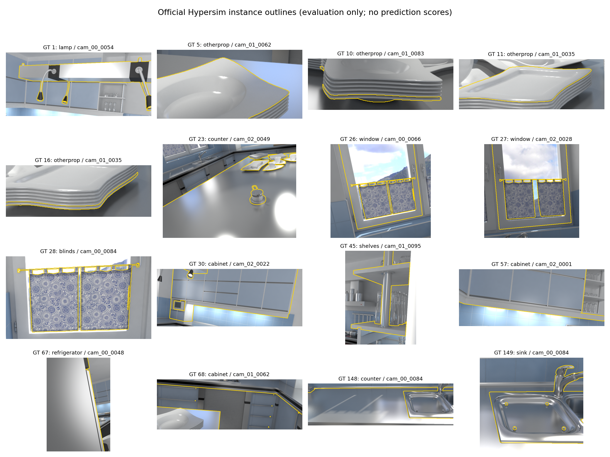
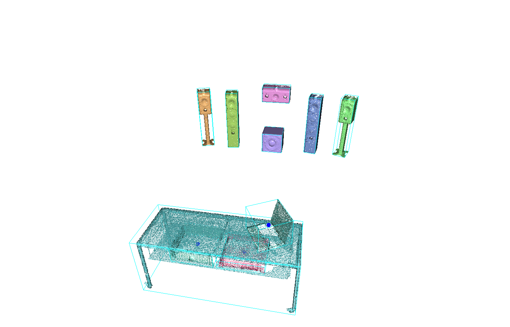
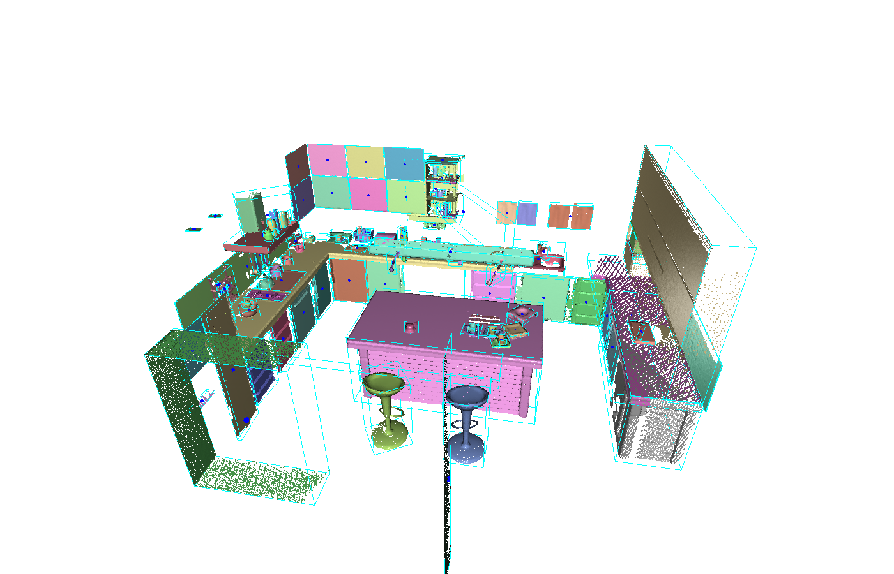
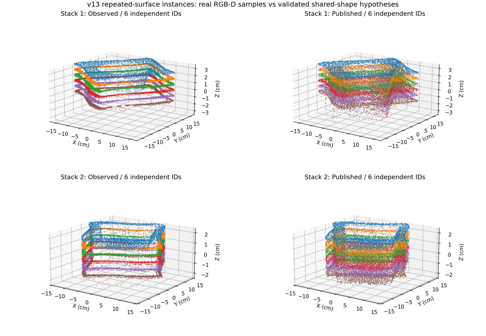
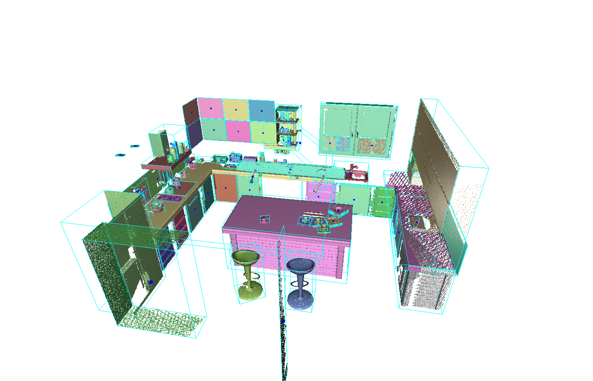

# PartAware-SG 综合研发与实验报告

更新：2026-10-09。仅保留各版本最终结果。默认原始版RAM、v11既有Qwen、v12与v13既有GPT；另保留GPT原始流程和Qwen→DINO对照。最终目录已归并，3RScan/KITTI和中途试验已清理，scene0802保留。

当前主流程为v13，复用v12完整GPT和SAM3观测缓存，新增整体掩码保护、实测面定向、重复边界实例恢复与视觉部件锚定。数学、接口和主脉络均描述最新代码；历史章节只保留各版最终结果。两场景完整重建与评价已完成：第二场景AP25/AP50/AP75为42.02%/25.97%/9.91%，优于v12；第一场景仍全部100%。第二场景数量误差变大，通用隐藏形状补全仍未解决。

## 1. 当前主脉络

**输入：ScanNet/Hypersim RGB-D、米制位姿和相机内参。功能树归并为 FOVEA → MICA → SHAPE → GRAPH，最终进入独立评价与原版可视化。** 以下是功能层级，点击分支可展开。构建时先产生供部件归属使用的临时物体图，再恢复实测几何并发布正式图；树形归类不改变这条真实依赖。

- **FOVEA — Fine Object and Visual Evidence Acquisition｜视觉证据获取**
  - **语义与缓存**
    - 复用原类别、描述及已完成观测；两个既有场景新增 Qwen 识图请求为零。
    - 原始版使用RAM，v11保留既有Qwen缓存；v12/v13使用同场景已完成的GPT缓存，构建入口不再调用任何VLM识图。
    - RGB、模型、协议和提示版本做哈希核验，保留原始响应与来源，不重新调用Qwen。
  - **基础定位与分割**
    - 当前v13复用SAM3直接产生整图概念实例与局部放大掩码；GroundingDINO保留256维视觉特征接口。
    - 原始版及v11保留既有定位/分割路径；Florence、SAM和YOLOE的旧组合不作为SAM3前端的重复步骤。
  - **精细证据与统一接口**
    - v12/v13研究注册点使用SAM3概念实例掩码及最多4处通用局部放大；两场景使用既有GPT缓存完成构建，保留最终成品和独立评价。
    - 物体特征统一为 DINO 256维和 SBERT 384维，部件 RN50 1024维独立保留。
- **MICA — Multiview Instance Consensus and Association｜多视角实例共识**
  - **实测投影与背景**
    - 用光轴深度、内参与位姿反投影；只有声明正确米制 Z-up 的 Hypersim 才启用对应地面规则。
    - 多帧背景支持的地面及低平台过滤；背景几何仍保留在背景输出中。
  - **实例关联**
    - Hungarian 一对一匹配综合实测几何、语义、可见性、轮廓与颜色。
    - 新精细候选的尺度规则与既有观测分开验证，避免小型功放等正常实例回归。
  - **身份与粒度复核**
    - **WOC — Whole Object Consensus｜完整物体表面共识**
      - 共享实测表面去重；图像身份与相机基线消解跨名称互补面。
      - 稳健主平面恢复有界末端面归属；多个独立分离视角否决错合并。
      - 只合并实际测量，互为唯一兼容归属；公开特征及接口保持一致。
      - 原生整图掩码核验接触体，逐次重新审核合体；独立分离证据否决。
    - **HMG — Hierarchical Mask Guard｜整体掩码保护**
      - 候选拒绝前核验原生重叠掩码、深度可见性和相机基线；整体不因部件占据互斥像素而消失。
      - 图像身份仍须胜过背景/结构反证；未知点保留，重复反证点才移除。
    - 保留可靠分离证据；候选验收、冲突身份及背景/台面反证决定最终独立物体。
    - GPT比较流程新增可见归属竞争、局部地板反证与唯一完整物体锚定；同一实测面不重复计数，精细实例受保护。
- **SHAPE — Scene-constrained Hypotheses Anchored to Physical Evidence｜场景约束几何**
  - **实测表面维护**
    - 留出视角的深度/掩码共识清理错误所有权；遮挡和未知区域不充当反证。
    - 缓存身份、前后平面及多视角测量恢复有界柜体、台面和其他结构表面。
  - **细结构与整体归属**
    - 已验收的部件、稀疏几何种子及密集原始深度补充真实测量。
    - 唯一同轴支撑、横梁与悬挂结构验收后纳入整体，同时保留部件身份。
    - **FDR — Fine Depth Recovery｜精细实测恢复**
      - 小物体在原生身份掩码内使用逐像素深度、2毫米体素和至少3个独立视角；保留真实坐标。
    - **RSI — Repeated Surface Instances｜重复表面实例**
      - RGB-D外缘沿高度出现多视角稳定周期时才拆分；实例数来自实测边缘，不来自类别或GT。
      - 顶部实测曲面作为共享先验，下层平移曲面标为生成；自由空间与原点残差否决不成立的假设。
  - **形状先验及验收**
    - 现有 AdaPoinTr 与后方结构约束提案均须接受实测验收；运行模型不等于补全成功。
    - 只发布通过当前准入的形状假设；生成点不充当实测或跟踪证据。
- **GRAPH — Geometry Relations And Part Hierarchy｜关系与层级发布**
  - **物体与空间图**
    - 沿用 ScanNet-SG 原始建图根基；临时物体图为后续部件父归属提供接口。
    - 最终用同一正式点云重算物体框、中心及空间边，不直接修改成品来提高分数。
    - **PCB — Physical Cue Boxes｜物理表面定向框**：两个广阔正交实测面提供方向，原点极值提供尺寸；没有第二个面就回退原框求解器。
  - **部件与层级图**
    - 官方 VLPart 检测部件，独立 RN50 特征和 OP3DSG 关联适配负责融合及父归属。
    - 独立物体、部件节点和 `part_of` 关系共存；部件不重复计入物体数。
    - **BHA — Body Hierarchy Association｜整物体与面板层级**
      - 唯一完整实测体、边界平面与至少3帧共同观测确定父归属。
      - 原分实例保留为可查询部件，不生成柜深；含糊归属保留独立。
    - **VPA — Visual Part Anchoring｜视觉部件锚定**
      - 已确认VLPart部件、多视角父体支持、真实接触和唯一父归属消解重复根节点。
      - 原根实例保留为可查询部件，实测及已验收生成点同步到父体；不凭名称或框包含判定。
  - **兼容接口与审计**
    - 保持 ScanNet/Hypersim 输入及原 `topology_map.json` 对象接口；按代码注册点拆卸组件。
    - 输出实测/生成来源、轨迹、接受与拒绝原因及中文日志；真值只进入独立评价。

**输出与核验：** 严格 AP25/AP50/AP75、MVO、数量误差和逐物体诊断 → 原版可视化。可视化命令默认不展示边、不启用 pick。各阶段的数学原理见第2至6章；各版本的实际改变与成功/失败证据单列于版本章节。


### 1.1 默认版本与识图来源

| 报告默认版本 | 识图来源 | 本轮是否重新识图 |
| --- | --- | --- |
| 原始版 | RAM | 否，保留已完成基线 |
| v11 | 既有Qwen缓存 | 否，停止GPT v11调优 |
| v12 | 既有GPT缓存 | 否，复用同场景完整响应 |
| v13 | 与v12同一GPT缓存 | 否，复用源观测并重建后续流程 |

从v12起默认类别来源改为GPT，v13继续复用同一缓存。另保留GPT原始流程作为独立基线，参与原始流程和v12对比，并与v12/v13复用同场景GPT识图缓存。旧GPT v11和旧Qwen v12中途产物已清理。SAM3是v12本地分割后端，不新增GPT或Qwen识图。

## 2. 前端与实例关联的数学原理

### 2.1 SAM3实例分割与公共特征接口

v12读取同场景已完成的GPT类别缓存，并合并项目既有室内词表；没有新GPT或Qwen识图。模型从ModelScope公开下载，使用固定提交的Meta官方图像推理代码，显式指定本地权重且关闭Hugging Face自动下载。每帧图像骨干只编码一次，随后逐个名词查询得到多个独立实例。原始版及v11继续保留各自既有算法。

官方处理器把检测分数与概念存在分数相乘：

$$
s_{qk}=\sigma(\ell_{qk})\,\sigma(\ell_q^{\mathrm{presence}}),\qquad
M_{qk}(u)=\mathbf1[\sigma(L_{qk}(u))>0.5].
$$

仅保留 $s_{qk}>0.5$、面积不少于32像素且不超过当前区域80%的掩码。该乘积仍是模型的未校准分数，不能写成正确概率。不同名词得到同一实测面时，掩码IoU不低于0.65才去重并保存查询别名；两个不相交瓶子不会因同名而合并。

对面积不超过图像12%的SAM3整图检测及已有二维源观测，生成边长256至512像素的通用局部窗口；裁剪重叠IoU不低于0.5时去重，每帧最多4处。不增加针对当前场景的描述提示词。离裁剪边缘不足3像素且越过原图内部窗口边界的结果拒绝作为新实例。

放大新增掩码先经实测深度反投影，要求至少32个采样点、2%至98%分位跨度每轴不超过35厘米。与整图掩码IoU不低于0.55的区域视为已有实例。若至少70%落在同一粗掩码内，还必须存在同名、面积比0.25至4、相交比例低于0.1的独立兄弟实例；单个局部部件不直接充当新物体。随后仍接受MICA的多视角验证，不以二维候选数作为最终物体数。

大区域先绘制，小实例占据内部像素；保存的局部ID、实际像素数和包围框保持一致。物体视觉特征继续从GroundingDINO投影后的骨干特征图作ROI平均池化：

$$
f_i=\frac{1}{|\Omega_i|}\sum_{u\in\Omega_i}F_{\mathrm{DINO}}(u),\qquad f_i\in\mathbb R^{256}.
$$

语义向量仍为384维SBERT，部件为独立1024维RN50，保持现有JSON字段和原uint8标签接口。SAM3的内部特征不冒充DINO特征；三种特征不混用。SAM3改善的是二维可见实例掩码，本身不生成隐藏三维表面，也不能保证把完全遮挡的堆叠盘子逐片分开。

### 2.2 投影、方向覆盖与在线关联

深度反投影与世界变换为：

$$
p_c=zK_d^{-1}[u_d,v_d,1]^T,\qquad p_w=R_{wc}p_c+t_{wc},\qquad \pi_c(p_c)=K_cp_c/z.
$$

设观测点集为 A，历史点集为 B，方向覆盖和语义相似度为：

$$
c(A,B)=\frac{1}{|A|}\sum_{a\in A}\mathbf1[d(a,B)\le r],\quad
g=\max(c(A,B),c(B,A)),\quad q=\hat s_A^T\hat s_B.
$$

在线融合使用10厘米覆盖半径。要求几何覆盖≥0.2；当语义相似度低于0.8时，必须有双向覆盖≥0.7的强几何证据。名称变化不再直接否定相同的实测物体。语义相似度≥0.8时，保留原几何与语义总分门控。

可见性、投影框 IoU、轮廓覆盖和颜色构成关联分数。Hungarian 矩阵增加未匹配列，禁止把没有证据的候选强行分配。两个可靠、同时独立可见的物体仍保留不同身份。

### 2.3 全局视角共识

参考 MaskClustering 的完整物体掩码共识思想：

$$
C(A,B)=\frac{N_{\mathrm{same\ whole\ mask}}}{N_{\mathrm{jointly\ visible}}}.
$$

代码在最多12个代表视角上检查两块表面。共同可见不足时视为未知。不同、可靠的掩码分别覆盖两块表面时形成分离冲突证据，阻止合并。

- 高重叠重复：3厘米双向覆盖最小值≥0.65、最大值≥0.85，至少2个支持视角，共识≥0.6且没有分离冲突。
- 互补表面：没有高重叠时要求语义相似度≥0.5、包围区域间隙≤25厘米，至少3个支持视角，共识≥0.8且没有分离冲突。
- 最终物体仍至少由两个不同帧确认；低可见物体通过增加真实候选寻找更多证据，不通过生成点凑足确认次数。

这是受论文启发的项目适配算法，不是 MaskClustering 或 MV3DIS 的完整原版复现。

### 2.4 SAM3精细候选、尺度与公共标签

当前v12使用第2.1节的SAM3整图实例及最多4个通用放大窗口。不再保留旧YOLOE-L切片、粗细独立观测的中途试验；当前指标只对应最终SAM3成品。SAM3整图掩码去重后重建本轮局部编号、DINO/SBERT特征；原GPT类别及响应缓存完整复用。

放大候选映射回原图，先拒绝裁剪边界截断、重复区域及仅有单一父物体局部的碎片，再按第2.1节的物理尺度和独立兄弟证据验收。SAM3原始重叠掩码另存打包缓存以供审核，公共uint8标签中每个像素只归属一个实例，小实例占据大实例内部像素。因此不能宣称公共标签保留了所有重叠整物体掩码；父物体表面完整性仍需多视角实测恢复。

新增独立放大实例标记为fine_scale_instance，并与整图实例分别关联，以免小区域单向覆盖吞并大物体：

$$
\operatorname{eligible}(a,b)=\mathbf1[\mathrm{fine}(a)=\mathrm{fine}(b)],\qquad
r(d)=\begin{cases}\operatorname{clip}(0.08d,0.006,0.02),&d<0.25\text{ m}\\0.1,&\text{其他}.\end{cases}
$$

双方均为细实例时采用尺度半径；整图实例仍用10厘米半径及1厘米体素。细实例体素为 $h(d)=\operatorname{clip}(d/80,0.002,0.005)$ 米，跨度不小于25厘米时仍用1厘米体素。只保留实测RGB-D投影，不用生成点建立独立物体。分通道可避免一种吞并，也可能暂留跨尺度重复；最终仍需MICA多视角共识与候选验收，不能把某帧95个掩码写成95个正确物体。

### 2.5 可见归属竞争与有界实测残片归并（当前GPT v13）

GPT仍只提供类别与描述。新算法使用既有RGB-D、原掩码及缓存SBERT特征；不调用GPT或Qwen，不读取GT。遮挡、缺失深度和未命名区域均不能直接视为物体不存在。令可见深度一致指示为 $v_t(p)$、投影权重为 $w_t(p)$、当前物体归属为 $a_{it}(p)$，则：

$$
R_i(p)=\frac{\sum_t v_t(p)w_t(p)a_{it}(p)}{\sum_t v_t(p)w_t(p)+\epsilon},\qquad
n_i(p)=\sum_t v_t(p)a_{it}(p).
$$

至少3次可见、至少2次正归属且 $R_i(p)\ge0.6$ 才计作稳定归属。相同实物在不同帧中的名称可变，兼容类别另用缓存语义余弦不低于0.8计算，不能把所有未关联区域当成背景。

**局部地板反证。** 从已估计的Hypersim米制Z-up地板高度与背景深度取XY支撑。候选在地板高度下方35厘米内、XY距该背景支撑不超过35厘米的点占比不低于0.7，同时至少5帧可见、稳定归属低于0.2、兼容类别稳定点低于0.3、重投影支持低于0.6，才否定低平台误检。该限制针对实际地板边界，不能泛化为“平面都删掉”，也不能迁移到未声明同一坐标约定的输入。

**完整物体锚定。** 对同时混入地板和多个前景的弱大候选，寻找重投影支持至少0.6的实测种子。候选与种子语义余弦至少0.6，体积比至少3、种子点位于大候选框内的比例至少0.95、种子到候选表面的3厘米覆盖至少0.85。若多个种子只是完整物体及其残片，用包含偏序消除伪歧义：

$$
j\prec k\iff V_k\ge2V_j\ \land\ \operatorname{inside}(P_j,B_k)\ge0.95.
$$

只有唯一极大的实测种子可以成为归属目标；两个互不包含的物体仍是歧义。转移点为候选中的真实测量，并限制在原目标框内，同时排除距其他独立前景种子3厘米内的点：

$$
P_k'=\operatorname{Voxel}_{0.01}\left(P_k\cup\{p\in P_i\cap B_k:d(p,P_\ell)>0.03,\ \ell\ne k\}\right).
$$

这里不会扩大框、产生隐藏点或使用GT尺寸。兼容的同物体残片不充当“独立前景”；其余种子仍保持独立。

**重复实测面与粗物体残片。** 三厘米表面覆盖至少0.85、框包含至少0.95是共同前提。严格重复路径要求至少3个完整掩码支持视角且没有独立分离证据。粗物体局部身份还要求至少5帧可见、稳定归属低于0.05、加权归属低于0.2、语义余弦至少0.6，父物体体积至少两倍且重投影支持至少0.6；至少2个完整掩码支持、独立分离视角不超过1。精细实例不走这条粗残片路径。表面覆盖与语义、视角证据缺一不可，不能因瓶子位于台面框内就吞并。

**强实测核心边缘净化。** 只有至少80%的点由3帧及归属比例0.65共同确认，才考虑删除至少5次可见、至少3次负归属、归属比例低于0.65的边缘点。保留点仍须不少于128、原点数的80%，且每轴跨度保留不低于0.6。未知和被遮挡的点保留。此次笔记本改善来自去掉桌面边缘混入，而非补全隐藏形状。

这些规则受到MaskClustering多视角完整掩码共识及Details Matter包含残片思想启发，是本项目适配，未宣称完整复现其网络。数量阈值不是指定场景必须输出几个物体；构建代码中没有GT编号或目标物体数。

### 2.6 WOC：图像身份与完整物体表面共识（当前流程）

WOC（Whole Object Consensus）在MICA候选验收后、部件识别前执行。它解决同一物体被分成不同名称或不同可见表面的情况，借鉴[MaskClustering的多视角掩码共识](https://github.com/PKU-EPIC/MaskClustering)及[对象级RGB-D语义建图的几何与身份关联](https://arxiv.org/abs/1903.00268)。下面的联合规则是本项目适配，不能写成上述论文原算法的完整复现。

**图像身份。** 沿用候选验收已经算出的多视角遮罩RN50向量 $z_i$ 和物体/背景文本分数，不额外调用VLM。对两候选 $i,j$，图像特征余弦为：

$
s_{ij}^{\mathrm{image}}=\frac{z_i^\top z_j}{\|z_i\|_2\|z_j\|_2},\qquad
b_i=\max_{t,u\in\mathcal T_i}\|c_t-c_u\|_2.
$

两者分别至少有2个实际图像裁剪、相机基线 $b_i,b_j\ge0.08$ 米、最佳图像类别一致、物体分数减背景分数至少0.01、图像余弦至少0.8才允许跨名称关联。类别相同本身不是合并理由；公开DINO 256维与SBERT 384维特征不替换成RN50，也不把物体图像特征混入部件特征。

**可见完整物体共识。** 只让深度一致且两候选均有至少16个投影点的帧参与。某一原始局部掩码分别承接双方不少于60%的加权可见点时计为完整物体支持 $H_{ij}$；各自被不同掩码承接时计为独立分离 $D_{ij}$。未见或被遮挡的区域不计作反证：

$
C_{ij}=\frac{H_{ij}}{N_{ij}},\qquad
Q_{ij}=\min\left(\frac{|\{p\in P_i:d(p,P_j)\le0.03\}|}{|P_i|},\frac{|\{p\in P_j:d(p,P_i)\le0.03\}|}{|P_j|}\right).
$

共享实测表面去重要求框IoU至少0.9、双向3厘米表面覆盖 $Q_{ij}\ge0.8$、名称SBERT余弦至少0.6、至少5帧完整支持、$C_{ij}\ge0.5$、$D_{ij}=0$。它可消解同一桌面被分别命名为table/desk的重复，不因容器把内容物包在框内就合并。

互补实体表面要求上述图像身份成立、框IoU至少0.6、最近实测距离不超过4厘米、至少3帧完整支持、$C_{ij}\ge0.8$、$D_{ij}=0$。这允许不同名词覆盖同一实体的不同表面，而不让名称向量成为唯一否决条件。

**有界末端面关联。** 对缺少框重叠的前后表面，先用1厘米距离容差、固定种子的RANSAC取实测主平面，至少70%的采样点必须支持该面，再计算其协方差特征值 $\lambda_0\le\lambda_1\le\lambda_2$ 满足 $(\lambda_1-\lambda_0)/\lambda_1\ge0.8$，即法向噪声小于较小切向方差的20%。不用最大切向方差归一化，以免细长矩形面被误判。法向与当前世界坐标轴余弦至少0.9。切向交叠面积除两侧较大切向面积至少0.8；该面法向跨度不超过另一侧一半，归并后的法向跨度不超过另一侧1.7倍。还要求最近实测距离不超过5厘米、至少1帧完整支持、至少2帧双方可见、$C_{ij}\ge0.5$、独立分离不超过1帧，以及图像身份成立。该分支是坐标轴对齐的实测表面适配，对任意旋转物体不宣称有效。

所有通过规则的候选还必须互为唯一兼容归属；多个目标均兼容则保留分离，不按GT选择。归并只并入已有测量，5毫米体素每格保留一个原始采样点，更新普通物体轨迹、别名与正式几何。跨名称关联后的规范名称取已存在候选中物体与背景分差更高的一方，并保留其对应SBERT向量；它不是新增提示或VLM重新识图。**没有填入隐藏背面，没有生成新点；对完全不可见厚度及堆叠盘子的未知数量，本算法仍不能提供通用补全。** 决策及否决原因写入object_validation.json，移除v12的WHOLE_OBJECT_VALIDATION导入/注册即可拆卸。

### 2.7 原生整图掩码与接触体关联

公共标签每像素只有一个实例；因此直接用标签图判断完整物体，会丢掉重叠整图掩码的支持。当前MICA中的 `native_assembly` 回溯签名、RGB哈希均一致的SAM3打包缓存，仅查询整图掩码，排除放大局部候选。对物体 $i$ 在帧 $t$ 的深度可见点，原生掩码 $m$ 的支持为：

$
A_{itm}=\frac{\sum_{p\in P_i}v_t(p)w_t(p)\mathbf1[\pi_t(p)\in m]}{\sum_{p\in P_i}v_t(p)w_t(p)+\epsilon}.
$

有效可见点不足16个不投票。同一原生掩码同时支持两个候选至少0.6时，记一次整物体支持；独立掩码分别支持各自至少0.8时，记分离证据。要求至少3个完整支持视角、共识至少0.6、分离视角为0、SBERT身份余弦至少0.8、最近实测接触距离不超过3厘米、合体最长跨度至少50厘米。最后一项用于保护相邻小盘子，不能靠接触把它们合成一件。逐次归并后重新检查整个合体，不允许仅凭相邻接触形成无界链。

只保留原实测坐标；5毫米体素选实际样本而非生成体素中心。整物体关联只使用实测支持，面板层级由2.8独立处理。

### 2.8 BHA：整物体—实测面板层级关联

**BHA — Body Hierarchy Association** 接受一个已有完整实测体作为父物体，并保留其边界上的原分实例为面板部件。它不是训练好的柜门语义模型，也不从薄片猜测隐藏柜深。设父物体实测定向框坐标为 $q=R^T(p-c)$，边界为 $l,u$，源面板为 $P_i$，身份余弦为 $s_{ij}$，共同观测帧集合为 $T_{ij}$：

$
I_{ij}=\frac{1}{|P_i|}\sum_{p\in P_i}\mathbf1[l-0.025\le R^T(p-c)\le u+0.025],\qquad
\rho_{ij}=\frac{\prod_k(u_k-l_k)}{\prod_k\operatorname{span}_k(R^T(P_i-c))+\epsilon}.
$

要求 $I_{ij}\ge0.98$、$\rho_{ij}\ge8$、$s_{ij}\ge0.8$、$|T_{ij}|\ge3$，且父实测框每轴跨度至少15厘米。源点协方差特征值为 $\lambda_0\le\lambda_1\le\lambda_2$，对应最小特征值的单位法向为 $n$。只有平面性与父框边界方向同时成立才关联：

$
F_i=\frac{\lambda_1-\lambda_0}{\lambda_1+\epsilon}\ge0.9,\qquad
a=\arg\max_k|n^TR_k|,\qquad |n^TR_a|\ge0.95.
$

源面在法向轴的中位位置 $\mu_a$ 距离父实测边界不超过3.5厘米；源面法向跨度不超过父跨度的0.2，两个切向跨度各至少10厘米：

$
\min(|\mu_a-l_a|,|\mu_a-u_a|)\le0.035.
$

只接受唯一兼容父物体；存在两个候选父体或依赖归并时保留独立实例。随后 $P_j'=P_j\cup P_i$，原 $P_i$ 完整保存为 `parts/assembly_<id>_panel.points.npy`，对应可查询的 `part_nodes` 和正式 `part_of` 边。原名称、ID、测量坐标、帧证据均保留，公开对象仍用256维DINO和384维SBERT；几何部件的视觉向量为null，明确不同于1024维VLPart视觉部件。

整物体AP继续按原GT、一对一匹配计算，不把每个子部件再次算作独立物体，也不修改GT标注。机器人可以查询子实例的位置与实测面板；仅凭面板尚不能宣称完整单柜、门的开合状态或内部容积已经恢复。没有部件级GT时，只统计部件数、父归属验证和测量保留，不捏造Part AP。该做法与[PartNet的多层级评价](https://arxiv.org/abs/1812.02713)和[Part2Object的层级实例建模](https://github.com/SooLab/Part2Object)方向一致，当前BHA是本项目几何适配，未复现或接入这些论文的训练网络。


### 2.9 HMG：互斥标签之外的整体存在证据

HMG在混合视角拒绝之前读取签名核验的SAM3原生重叠掩码，公共互斥PNG和物体接口保持原样。至少128个实测点、最大跨度至少0.5米才适用；名字来自原轨迹中占比不少于25%的身份及当前节点，不添加场景提示。至少32个、占采样点30%以上的深度可见点才记为可检验视角。

对身份相符的原生掩码，定义加权包含率与跨视角支持：

$$
r_{it}=\frac{\sum_{x\in P_i^{\mathrm{vis}}(t)}w_t(x)\,\mathbf1[\pi_t(x)\in M_{it}]}{\sum_{x\in P_i^{\mathrm{vis}}(t)}w_t(x)+\epsilon},\qquad
H_i=\frac{\sum_{t\in V_i}\mathbf1[r_{it}\geq0.8\ \land\ s_{it}\geq0.5]}{|V_i|}.
$$

完整身份至少被5个视角支持，$H_i\geq0.65$且相机基线至少0.1米，随后完整掩码的CLIP身份分数须比反证名称至少高0.01。满足条件才保护整体，跳过“互斥标签混合”及“包住若干碎片”的直接否决；地面、背景、反光平面和真正冲突身份仍须审核。

逐点精修只删除至少3次反证、至多1次正证且加权正证比例低于0.35的点。遮挡、出画、无效深度及没有原生身份掩码的视角不是删除依据。这修复了整体已经多次看见却在层级判断之前被删掉的执行顺序，不能创造未观察到的柜深。

## 3. 背景、表面精修与正式几何

### 3.1 深度权重及点归属

参考 MV3DIS 的深度一致性权重，采用与当前深度噪声相适配的容差：

$$
\delta_t=0.025+0.01D_t(\pi_t(p)),\qquad
w_t(p)=V_t(p)\max\left(0,1-\frac{|z_t(p)-D_t(\pi_t(p))|}{\delta_t}\right).
$$

归属可靠度为：

$$
v_i(p)=\frac{\sum_tw_t(p)\mathbf1[\pi_t(p)\in M_{i,t}]}{\sum_tw_t(p)}.
$$

分母为零表示未知。被遮挡、投影无效或无有效深度的视角不投反对票。精修在所属帧与额外视角中采样复核；仅当负面视角≥3、正面视角≤1且归属比例<0.35时删除该点。单帧漏检是较弱的否定证据。

物体排序分数结合逐帧平均检测分数、已有 SAM 质量和回投影支持：

$$
s_i=\overline{s}_{\mathrm{det},i}\,\eta_i\sqrt{\overline v_i},\qquad
\eta_i=\begin{cases}(1+\overline q_{\mathrm{SAM},i})/2,&\text{有 SAM 质量}\\1,&\text{质量未知}.\end{cases}
$$

未知质量不冒充高质量。当前没有训练校准器，不能把该分数解释为概率；借鉴 GFL 的质量感知思想不等于实现或训练了 GFL。

### 3.2 地面及低平台

只在已声明的米制 Hypersim Z-up 坐标中执行。首先沿用多帧背景覆盖的最低地面检查：至少100个10厘米背景网格、至少3个视角各提供30个支持点、最低位置约束。随后检查最低地面以上3至35厘米的低平台。

额外平台必须具有尖锐的水平高度峰：1厘米内支持占2厘米邻域至少80%；二维背景网格填充率至少25%。这避免把墙面在不同高度的切片误认成一组地面。接受的水平面使用±1厘米清除带。桌面不因“水平”这一条件自动删除。

`floor_filter.json` 记录所有接受高度、背景覆盖及支持帧。其他坐标约定保留基础几何，不自行假定竖直轴。

### 3.3 一次精修、统一正式框与空间边

统计离群点清理后，保留不少于最大聚类10%且达到最小点数的断开表面，避免只保留椅面而丢掉椅腿。正式图不再把已精修点云送回 C++ 再次裁剪。

已知竖直轴时，在 XY 平面凸包的候选边方向中求最小面积矩形：

$$
\theta^*=\arg\min_\theta
(\max x_\theta-\min x_\theta)(\max y_\theta-\min y_\theta).
$$

旋转后的各轴最小最大值确定尺寸，局部框中心变换回世界坐标。竖直轴保持世界 Z 轴。未知竖直轴沿用任意方向表面 OBB。该物理约束也减少了残缺表面 PCA 把水平物体拟合成倾斜框的问题。

空间边继续使用原 `next to` 接口：距离小于原阈值2米的中心对构建边，方向和距离根据最新中心重新计算。现有部件和父子关系随后进入同一正式图。

### 3.4 正式物体的候选验收

新增验收借鉴 [Details Matter（ICCV 2025）](https://arxiv.org/abs/2507.23134) 的迭代合并、包含清理及 SMS，以及 [MaskClustering](https://arxiv.org/abs/2401.07745) 的混合掩码反证。候选不会仅因出现在两帧中就直接成为正式节点。

**包含残片合并。** 在实测点云上计算有方向的表面覆盖：

$$
r_{a\to b}=\frac{1}{|P_a|}\sum_{p\in P_a}\mathbf1[d(p,P_b)\le0.03].
$$

候选先通过三维包围区域95%包含检查。相近语义（余弦≥0.6）的残片，若表面覆盖≥0.99，或原始完整掩码至少3个视角支持且共识≥0.8，可吸收到完整观测中。原始掩码从前端缓存读取，避免融合掩码的互斥像素把一个完整物体人为切开。

对于重复实测表面，要求语义≥0.8、双向3厘米覆盖最小值≥0.5且最大值≥0.8；这种直接几何证据可以纠正错误的二维分裂。其他情况仍被原始独立物体分离证据否决。对已经覆盖的重复表面只吸收观测身份，不扩张完整候选的几何；否则较差残片的边缘会再次拉大正确的框。95%包围检查是带噪观测的候选预筛，0.99表面包含与论文的超点包含率并非同一计算，不能宣称完全复现。仅在虚拟框内包含另一个物体，不足以合并。

**跨视角反证。** 只检查至少30%表面实际可见且有有效深度的视角。将局部掩码映射到物理实例后，如果同一候选在至少3个视角同时覆盖多个独立实例，且这类视角占比超过0.2，则拒绝混合候选。可见视角至少5个但检测支持比例低于0.2时，也不进入正式物体图。遮挡和未知深度不作负票。这些条件是项目适配；小物体漏检风险仍需同时看 FN。

**掩码语义与 SMS。** 使用已有 RN50，对最多5个高可见视角的掩码裁剪提取特征；非物体区域置灰，方形补边避免改变比例。这里使用普通 CLIP 掩码裁剪，没有安装论文的 Alpha-CLIP，不能把二者效果等同。观测特征按可见比例融合，得到与类别文字的余弦矩阵 $L$。逐类别标准化如下：

$$
\mu_c=\frac1K\sum_iL_{ic},\qquad
\sigma_c^2=\frac1K\sum_i(L_{ic}-\mu_c)^2,
$$

$$
c_i^*=\arg\max_cL_{ic},\qquad
\mathrm{SMS}_i=\frac{L_{i,c_i^*}-\mu_{c_i^*}}{\max(\sigma_{c_i^*},10^{-6})}.
$$

对于回投影支持低于0.6的候选，SMS低于0时拒绝；较强实测几何不会仅因普通 CLIP 的语义低分被删除。少于5个候选时不以场景标准化作删除依据。另将物体最大语义分数与 wall、floor、ceiling、background texture 的最大分数比较，差值不足0.02且回投影支持低于0.6时判为背景对比不足。该差值是工程验收阈值，不是校准概率，也不能保证所有场景都最优。

验收改变正式物体、实测点云、局部到全局映射及之后的框、边和部件父归属。拒绝和合并证据保留在日志；原始融合轨迹保存用于重建，不靠隐藏可视化节点降低统计数。全程不使用 GT 指定节点数量或身份。

### 3.5 外部取景与开口：逐点留出视角的身份核验

外部相机可以通过开口观测到室内真实物体。二维大掩码可能把墙、窗、吊柜及远处物体一起叫成`mirror`或其他单一类别；每个点的深度仍然正确，但它们不一定属于同一个物体。v6不改变深度或假设镜面，改的是这个整体身份的准入算法。借鉴[MaskClustering](https://arxiv.org/abs/2401.07745)的跨视角反证，并结合[Open3DIS](https://arxiv.org/abs/2312.10671)指出的二维掩码可能混入邻近物体/背景的问题；这里是项目适配，未完整移植两篇网络。

仅核验最长世界轴跨度超过3米的已有候选，以限制当前规则对小物体漏检的影响。候选原观测帧集合为 $S$；以确定性步长采样候选实测点云，记采样集合为 $P$。从最多100个已缓存帧中留出 $S$，以其他帧检查点归属。点与实测深度不一致、遮挡或投影无效时，沿用现有深度权重置零，不计反对票。

$$
k(p)=\sum_{t\notin S}\mathbf1[w_t(p)>0],\qquad
b(p)=\frac{\sum_{t\notin S}w_t(p)\mathbf1[M_t(\pi_t(p))=0]}{\sum_{t\notin S}w_t(p)},\qquad
H=\{p:k(p)\ge3\}.
$$

掩码0表示未分配给前景实例，不能单独当成材质真值。至少三个留出视角实际看见该点才纳入 $H$；逐点背景权重占比≥0.8才计为反证。候选的覆盖和反证比例为：

$$
\phi=\frac{|H|}{|P|},\qquad
B=\frac{1}{|H|}\sum_{p\in H}\mathbf1[b(p)\ge0.8].
$$

只有当 $\phi\ge0.5$、$B>0.5$，且至少5个留出帧各有16个深度一致可见采样点、这些点的加权背景占比≥0.8时，否决这个大物体身份。这里的0.5是多数实测点门槛，不按场景名、节点ID或类别决定。逐点统计允许大混合区域在不同视角仅部分可见，避免要求每个视角同时看见整个候选。

删除的是错误整体身份在正式图中的资格。原始RGB-D、位姿、原始融合及含背景导出保留；其他有效物体的几何、置信度和合并规则保持v5。后续正式PLY、映射、框、空间边和部件由正常流水线重新生成，没有手动删除成品节点。未被其他前景解释的实测点保留在原始/背景导出中，不冒充新物体。

每个候选的`direct_background_consensus`记录源帧留出后的覆盖、背景反证比例及视角数；代码挂接项是`BACKGROUND_VALIDATION`，删除注册项与对应导入即可撤除。未知/遮挡的点不构成否决。该规则当前针对大混合区域，不等于已经解决所有小物体识别，也未训练“外部相机”分类器。

### 3.6 冲突身份消解与反光台面候选核验

当前使用两个独立组件，构图时只使用实测几何、缓存掩码及位姿。对于语义余弦低于0.6的包含候选，不能仅因名称不同而保留第二个物体。记小候选在大物体框中的包含率为 $I$、距大物体表面3厘米内的点占比为 $C$，独立完整掩码支持帧数为 $V_+$、明确分离帧数为 $V_-$、共同可见帧数为 $V$。新身份消解条件为：

$$
I\ge0.95,\quad C\ge0.99,\quad V_+\ge3,\quad
\frac{V_+}{\max(V,1)}\ge0.5,\quad V_-=0.
$$

通过时将小候选记为完整物体的重复观测，保留来源名称、帧与证据。不会将错误名称的嵌入平均进父物体，也不把框内任意物体当部件。既有高语义相似分支保留原有规则。此规则修复凳子座面被误认成独立水槽/椅子的身份，不能单凭几何接近证明机器人已理解功能。

反光台面的核验只针对水槽身份声明及已声明竖直轴的米制输入。用点集协方差最小特征向量拟合平面法向 $n$，计算：

$$
\phi=\frac{1}{|P|}\sum_{p\in P}\mathbf1\bigl[|n^T(p-\bar p)|\le0.01\bigr],
\qquad \phi\ge0.9,\quad |n_z|\ge0.95.
$$

几何通过后，再检查不属于候选自身来源帧的留出视角。深度不一致、遮挡或未知情况不投否定票；投影落在背景或台面/桌面掩码才是反证。使用3.5节相同的逐点权重比：至少3个深度一致视角、有效覆盖率≥0.5、超过80%的有效点负证据比例≥0.8，且至少5帧负证据占比≥0.8，才撤销该候选的水槽身份。保留原始融合数据及中文拒绝记录。

这不是通用反光材质分类器，没有依据亮度或颜色直接删点，也未安装SpecSeg模型。真实盆缘可同样较薄，平面性单独不能触发拒绝；其他视角的身份反证不可缺少。构图时不读取真值，不修改RGB或深度。


### 3.7 几何触发的细结构恢复

很多帧检测到同一类结构并不等于已经获得三维表面。细杆可能只有一两个像素宽：隔点采样和1厘米压缩会降低覆盖；掩码边界混入的墙面/天花板点又会扩大范围，使不同灯头误关联。当前不修改识图文本，使用一条只针对已验收但欠解析物体的实测恢复路径。

对物体点数N与轴对齐跨度e，采用稀疏触发量：

$$
\rho=\frac{N(0.01)^2}{2(e_xe_y+e_ye_z+e_xe_z)}.
$$

要求N小于512、最大跨度至少0.5米、rho小于0.08。这是计算预算与欠解析筛查启发式，不是物理表面覆盖率。以缓存384维语义余弦至少0.65形成观测候选组；若有多个已验收物体与该组相容，停止恢复，避免混合独立实例。候选组须有至少12个不同帧。

候选掩码逐像素反投影，内部5毫米压缩。三维点投影到深度图，在中心及四个相邻像素内逐一核对深度；同一个深度像素必须通过注册内参对应到自己的颜色掩码。不能用一个像素的深度配另一个像素的标签。深度容差为0.004米加0.001倍光轴深度；遮挡、无深度和出视野不投反对票。

$$
v_t(p)=\mathbf1\{\exists u:\ |z_t(p)-D_t(u)|\le0.004+0.001z_t(p)\},
\qquad a_t(p)=\mathbf1\{\exists u:\ \text{同一深度样本一致且注册掩码支持}\}.
$$

$$
\sum_t a_t(p)\ge3,\qquad
\frac{\sum_ta_t(p)}{\max(\sum_tv_t(p),1)}\ge0.65.
$$

每帧最多一票。首轮共识仅在候选组出现的帧上统计；没有该组的帧不凭类别缺失否定物体。保留2.5厘米连通距离、至少64点的种子分量，排除距其他已验收物体1.5厘米以内的点。三视角种子至少128点且超过原点数三倍时才进入扩展。

参考SAMPro3D的三维种子投影思想，最多16帧使用自动最远点采样的16个正点，另生成由投影种子范围四周各扩展其最长边10%的ROI。已有SAM ViT-H只接收点和几何ROI，不接收物体名称、场景编号或新增文本。对点引导及点+ROI引导的全部候选先要求覆盖至少85%的实测投影种子、SAM分数至少0.65、面积不超过图像30%，再合并合格候选。最高模型分数若漏掉实测种子也被拒绝。

新增候选仍须独立三视角深度/掩码支持率至少0.65，与种子通过不超过5厘米的实测连通边相接，并避开其他物体。最终发布5毫米实测点；无插值、无生成点，也不扩大盒子以凑AP。替换只发生在触发物体的区域，其他点数组按原顺序保留，再通过原正式几何接口更新框和边。

这些是SAI3D的几何与多视角掩码共识思想及SAMPro3D的自动几何提示思想的项目适配，未完整复现两篇论文。自动几何提示不同于为某个类别编写文本特化提示词。阈值仍需在更多场景验证，不能把点数增加直接视为AP提高。

### 3.8 联合实测证据与稳定表面核心

语义标准化分数可能把外形罕见但稳定存在的物体排除。当前增加独立的 `OBSERVED_VALIDATION`，不按类别或场景编号放行。使用3.7节的深度像素与对应掩码联合核验，在全部输入帧统计同一全局实例的所有权。点的稳定集合为：

$$
P_* = \{p:\sum_t a_t(p)\ge3,\quad \sum_t a_t(p)/\max(\sum_t v_t(p),1)\ge0.65\}.
$$

每个确认帧至少有32个实际可见采样点，其中自身掩码所有权至少70%；至少5个确认帧，支持相机中心的最大基线至少0.08米。若至少65%的采样点稳定且混合视角比例不超过0.1，允许几何存在证据保护候选，语义分数仍保留在日志中。

若只有部分稳定表面，而且唯一拒绝原因是语义，则逐点重算稳定核心。要求核心至少128点、保留至少30%的原点数；三个世界轴跨度保留比排序后，最大至少0.8、第二大至少0.6。只发布核心，原来的不稳定点不被一起放行。混合实例、背景反证、台面身份反证仍能否决，几何救援不能覆盖这些拒绝。

$$
\eta_k=\frac{\operatorname{extent}_k(P_*)}{\max(\operatorname{extent}_k(P),0.01)},\qquad
\eta_{(3)}\ge0.8,\quad \eta_{(2)}\ge0.6.
$$

这两项是防止只剩细线的保守空间跨度检查，使用世界坐标轴，因此仍有旋转敏感性；不是从论文照搬的通用最佳阈值。稳定表面不能证明名称或功能正确，当前只确认物理实例的几何存在。小于阈值、没有足够视角或空间跨度时保持拒绝，并记录具体原因。

### 3.9 已确认横梁的密集实测恢复

唯一连接验收通过后，对其横梁来源掩码逐像素反投影，5毫米体素去重，重新执行独立三视角及65%可见所有权验收。候选须位于原横梁包围范围外扩2厘米以内、距离原横梁不超过3厘米，且距其他物体至少1.5厘米。距整体原云超过3毫米的新实测点至少64个才发布。

这条路径只作用于有真实连接证据的横梁，不依赖灯类别，也不补造细杆。保留整体已有点的原坐标，更新对应crossbar部件点、中心、跨度、轨迹点数及原正式图的框和空间边。审核产物为 `assembly_density_audit.json`。没有新增模型、文本提示或Qwen调用。


### 3.10 缓存身份与前后边界联合恢复平面物体

大柜门和台面可能与墙/地面相似，前端局部掩码或语义验收会删掉本来存在的表面。当前先保留原判定，再从含背景原始实测云提出几何区域；不能把“平面”直接当作“物体”。借鉴SAI3D的几何区域与多视角证据结合思想，但没有移植其完整超点图与网络。[SAI3D](https://arxiv.org/html/2312.11557v2)

在1.2厘米体素云上以9毫米RANSAC拟合平面，用4.5厘米邻接分量形成有界区域。至少700点，两条面内跨度分别至少0.5/1米。已声明Z轴时，储物立面要求 $|n_z|<0.01$，台面要求 $|n_z|>0.995$：

$$
\mathcal F=\{p:|n^Tp-h_f|\le0.009\},\qquad \|n\|_2=1.
$$

身份来自已有缓存的shelf/shelves/cabinet/bookshelf或counter/countertop轨迹；wall、floor、ceiling、sink、stove等不能授权这个分支。身份轨迹至少出现3帧，其中至少55%的点距平面小于2.5厘米，且至少256个点受到支持。没有新语言提示词、Qwen请求或GT坐标。这是类别族约束的几何适配器，不是一个训练好的通用物体模型。

储物立面在后方0.12至0.8米、台面在下方0.04至0.22米查找独立实测平行面。最多考察8个RANSAC假设，要求法向相容度至少0.995、至少256个平面点；不能让不平行的大墙面挡住较小的合法后界。只在实测前后边界和切向跨度内取原始点：

$$
\mathcal B=\{p:h_f-d+0.012\le n^Tp\le h_f+0.015,\quad a_k-0.015\le r_k^Tp\le b_k+0.015\}.
$$

台面还要求切向投影距实际前表面小于3.5厘米，保留L形足迹，不把包围矩形填满室内。距任何已验收物体小于1.5厘米的点排除；旧点和已有物体身份不删除。若同族旧物体至少90%位于区域内，则追加它的点；否则从原始编号最大值之后分配新整体编号。名称和256/384维特征继承最有支持的缓存身份。

原始全部帧提供逐点深度验收，精度容差为 $0.004+0.001z$ 米；中央及相邻像素仅处理采样误差，遮挡不算反证。每点至少3视角实测支持，且不能有2帧自由空间反证；自由空间容差为 $0.012+0.003D$ 米：

$$
s(p)=\sum_t\mathbf1[|z_t(p)-D_t(\pi_t(p))|\le0.004+0.001z_t(p)],\qquad
P_{new}=\{p\in\mathcal B:s(p)\ge3,\ b(p)<2\}.
$$

最终至少512点、保留候选至少65%、有效相机基线至少8厘米。新增的每一个点都是深度测量，不是长方体生成点。只把此前已拒绝的对应局部记录从负编号映射到已验收整体，其他字段、原PNG和特征缓存不改。实际帧观察历史与编号同步，不能把几何验证帧冒充新的识图观测。

### 3.11 原始像素中的上部本体恢复与杆身连续性

现有物体掩码可能只留下柔性灯头或长条本体的局部面。当前在含背景实测云中估计上方水平面，从已有本体的水平几何面自动提出ROI，再投影全部原始RGB-D像素，步长1、体素3毫米。先恢复本体真实深度表面，随后才检查独立杆件。这里的上方平面是搜索边界，不能把外部屋顶安装点直接当作室内杆身。

几何种子面至少128点，近水平，短边至少3.5厘米、长边至少30厘米。本体到上方边界距离0.3至1米，短边最多0.6米、长短比至少3。上部本体候选仅位于种子面上方25厘米内、种子XY足迹各外扩2厘米。要求每点三视角实测支持且无两帧自由空间反证；距其他已验收对象至少1.5厘米。以1.8厘米邻接连接到原本体，孤立屋顶点和无法连接的几何不进入整体：

$$
P_{body}=\{p\in P_{RGBD}:s(p)\ge3,\ b(p)<2,\ p\leftrightarrow P_{seed}\},\qquad
\|p_i-p_j\|\le0.018\ \text{for each connectivity edge}.
$$

去掉距旧本体3毫米内的重复点后，至少256个新增点、有效相机基线至少8厘米才发布。所有旧实测坐标保留；生成几何不被替换为实测子集。上部本体纳入整体点云、正式框与空间边，同时导出无视觉特征的geometry-only部件。这是实测表面恢复，不是根据标签生成长方体。

悬挂细杆独立要求竖直方向PCA特征值比至少50、竖直轴对齐至少0.98、跨度至少15厘米、横向最多5.5厘米，唯一父物体接触及上方端点接近条件保留：

$$
\Sigma=\frac1N\sum_i(p_i-\bar p)(p_i-\bar p)^T,\qquad
\frac{\lambda_1}{\lambda_2+\lambda_3}\ge50,\qquad |v_1^Te_z|\ge0.98.
$$

仅两端对齐也会满足PCA，这不足以证明中间有杆。按高度分12段，至少10段有真实点，且在新增点通过三视角支持、其他物体保护和重复过滤后再次检验连续性：

$$
o_k=\mathbf1[\exists p:z(p)\in I_k],\qquad \sum_{k=1}^{12}o_k\ge10.
$$

不足的杆件保持拒绝，不能把端点跨度或外包络框写成整杆恢复，也不插值伪造杆身。自动几何ROI方向参考[SAMPro3D](https://mutianxu.github.io/sampro3d/)，当前没有移植完整网络。完整的多视角线段三角化可参考[LIMAP](https://openaccess.thecvf.com/content/CVPR2023/html/Liu_3D_Line_Mapping_Revisited_CVPR_2023_paper.html)及[官方实现](https://github.com/cvg/limap)；本轮轴线匹配试验没有足够可靠RGB支持，未把推断圆柱加入成品。

FINAL_GEOMETRY=[suspension_geometry] 仍为独立挂接处；当前悬挂杆候选均未通过连续性，实际采用的是上部本体实测恢复。未知重力轴输入保持原ScanNet接口。期待恢复可见但被掩码遗漏的结构表面，不能保证恢复数据没有提供的真实隐藏结构。完整阶段的恢复参数不是组件开关，撤除仍通过代码注册项。

### 3.12 封闭柜体身份与墙体/开放格架的区分

本轮源码核查发现，检测标签0只说明没有物体掩码，不提供wall类别真值。background_consensus仍以可见未分配区域作为大候选的背景反证；这一反证可抑制外部错误投影，也会在系统性漏检柜面时误伤真实储物结构。当前采用有界结构恢复处理该冲突，没有全局取消背景过滤。其授权来自缓存身份、有限纵深、三视角实测点及自由空间核验。

原恢复代码直接继承最强种子轨迹的多数名称。一个完整柜面的局部观测多数为shelf，少数帧却已明确给出cabinet/cupboard；仅取多数名称会在几何恢复后继续丢失柜体身份。现汇总全部兼容种子的不同帧证据，结合闭合立面与侧面作有限语义推断。该逻辑位于structural_surfaces.storage_identity，在构图时执行，先于VLPart部件识别；原始缓存名称、掩码和特征均不改写。

将正面投影到其切平面，以2.5厘米网格计算实测占据率；侧面只能来自已通过多视角深度验收的点：

$$
C_f=\frac{|\{\text{occupied facade cells}\}|}{N_{\text{facade cells}}},\qquad
V_c=\{t:\exists\text{ cached observation at }t\text{ named cabinet/cupboard}\}.
$$

设正面到实测后方边界的距离为d，侧面点需在正面外框3厘米邻域内，且向后延伸至少0.15d。N_s为这些侧面点数，D_s为它们最大后向距离。柜体身份门控为：

$$
\text{closed cabinet}=\mathbf1[C_f\ge0.60\ \land\ N_s\ge128\ \land\ D_s\ge d/2\ \land\ |V_c|\ge3].
$$

这条门控还必须通过第3.10节的缓存身份、实测后界、三视角深度和相机基线检查，不能单独把平面变成柜子。开放格架的正面填充不足、没有侧面的薄片、没有cabinet类别缓存或同一帧的重复投票均保持原身份。名称和纵深不从GT取值；本轮没有新增文字提示或千问调用。256维视觉特征与384维语义特征仍继承原兼容轨迹，几何推断类别另外记录来源和门控证据。

整体/部件粒度尚需另一层证据。参考[Part2Object](https://www.ecva.net/papers/eccv_2024/papers_ECCV/papers/02657.pdf)的多层聚类与物体性选择、[Clutt3R-Seg](https://arxiv.org/html/2602.11660v1)的条件父掩码替代，下一项应建立多个尺度的父掩码树，并以多视角完整掩码和共有柜架边界选择整柜层；柜门、抽屉保留part_of。单凭共面、邻近或同名不能证明一个整体。此次共面柜门试验缺少可靠后界，未采用强并。

[MoMa-SG](https://momasg.cs.uni-freiburg.de/)进一步提供柜门运动与容器层级的路线，但其关键输入包括物体开合观测；当前静态Hypersim帧不能提供该运动证据，未宣称已经接入关节推断。这些论文支持分层方案的研究方向，不能保证本项目门槛的泛化，也不是其完整模型的复现。

### 3.13 共享表面与完整掩码的重复实例消解

当前主流程在物体候选验收之后、结构恢复和补全之前调用 instance_granularity。以实测点数从大到小比较实例，不依赖某个场景的类别提示词、坐标、对象编号或GT。重复判定同时需要：小候选至少128个点；95%以上点在大候选实测AABB加2.5厘米容差内；80%以上小候选点距大候选实测表面不超过1.5厘米；384维SBERT语义余弦至少0.6。

$$
C(B\!\to\!A)=\frac1{|B|}\sum_{b\in B}\mathbf1[d(b,A)\le0.015],\qquad
q=\frac{s_A^{T}s_B}{\|s_A\|\|s_B\|}.
$$

遍历均匀选取的至多24帧共同可见视图。每个区域每帧至少16个深度一致点，只有同一个非背景局部掩码各覆盖双方80%以上加权可见点才算完整掩码支持。支持至少5帧、支持率至少0.5，并且独立分离视角数必须为零；同时出现不同主掩码、双方各80%以上支持时构成独立分离反证。参考 MaskClustering 的多视角共识原则，但这是项目适配器，不是完整论文实现。

$$
\mathrm{merge}(B,A)=\mathbf1[I(B,A)\ge0.95]\mathbf1[C(B\!\to\!A)\ge0.8]\mathbf1[q\ge0.6]\mathbf1[V_{\mathrm{whole}}\ge5]\mathbf1[V_{\mathrm{whole}}/V_{\mathrm{joint}}\ge0.5]\mathbf1[V_{\mathrm{sep}}=0].
$$

每个小候选必须有唯一合格父候选。按实测点数建立无环映射并解析最终父编号，保留全部原坐标，以逐点拼接并入父节点；保持父节点原名称、特征和置信度，不以GT调分，不人为提高排序。更新轨迹、局部映射与来源别名；既有别名也重新解析到最终父节点。合并发生在部件检测之前，之后所有部件、正式框和边仍走原主流程。瓶子与格架仅凭包含关系不能合并；只有同语义、共享表面及完整掩码共同支持时才会合并。

### 3.14 断开小区域的既有所有权复核

对最大跨度不超过1米、至少256点的实例，2厘米DBSCAN（邻域至少5点）形成几何分量；至少64点的分量才提供稳定分离证据。弱小岛只在距稳定分量3厘米以内时加入最近稳定分量，其余未知点保留原归属。候选与其他稳定分量距离至少3厘米，并要求至少3个独立分离视角、零完整共掩码支持。

候选区域只能转移到已经存在且唯一的对象：该对象AABB内包含率至少95%，1.5厘米表面覆盖至少65%，SBERT余弦至少0.6；至少8帧主掩码提供80%以上加权所有权支持；目标获得至少70%的有效帧主归属票；旧来源支持帧数不超过目标支持帧数的25%；相机基线至少8厘米。所有点坐标保留，不新增候选节点。该分支已接入，但本次两场景没有区域通过最终全部门槛，因此不能写成已经解决了混合盘堆或挂架。

### 3.15 FDR与RSI：精细测量和原子实例分开恢复

FDR对最大跨度小于25厘米且至少5次观测的小物体，选择最多24个轨迹视角；身份原生掩码的表面包含率至少0.7、分数至少0.5。逐像素深度只取原实例25毫米邻域，2毫米体素至少被3个不同视角支持后选一个真实样本，禁止把同帧重复点当作多视角。密集样本多于原点数1.5倍、每轴范围增长不超过25毫米才追加；原点坐标全部保留。

RSI适用于具有可靠世界竖直轴的紧凑水平体：水平最大跨度10至50厘米，高2.5至15厘米，水平最小跨度大于高度3倍。它从实测投影包络内的RGB梯度和对应深度提取外缘；凸包外8毫米至内侧5至15毫米的边带排除盆腔内部纹理。高度直方图使用0.5毫米桶、0.8桶高斯平滑。每条边至少5个视角各支持16个点，水平跨度至少8厘米，才形成独立层候选。

从候选高度$z_1,\ldots,z_n$选择唯一的最长稳定序列：

$$
d=\operatorname{median}_{k}(z_{k+1}-z_k),\qquad
\max_k|(z_{k+1}-z_k)-d|\leq\max(0.00075,0.15d).
$$

需要至少4条边、总高度跨度不少于2厘米、周期4至20毫米、相机基线至少0.1米。实例数是通过这些条件的边缘数，不设“六个盘子”的目标值，不读取GT。单盘两条轮廓、非周期柜架和单视角纹理在回归测试中被拒绝。

顶部曲面$T$来自多视角真实深度。概念掩码遗漏的内部凹面只能用至少3帧深度验证的原点补回，且不越过已测顶部曲面的高度界限。第$k$层的共享形状假设为：

$$
Q_k=T+(0,0,z_k-z_{\mathrm{top}}),\qquad
c_k=\frac{|\{x\in E_k:d(x,Q_k)\leq0.01\}|}{|E_k|}.
$$

要求$c_k\geq0.8$，原聚合点到各假设并集的99%分位残差不超过25毫米；全部原点分给最近实例，不直接删掉残差来通过。每帧在投影的$3\times3$像素足迹中取最近有效深度，若假设比深度近5毫米以上，记一次自由空间反证。至少3帧反证的点占比不得超过2%。边界足迹避免把真实细边因像素取整误判为空气；悬浮表面仍被测试拒绝。

下层平移曲面存入完成点云和独立NPZ，明确标为生成；实测点云只存原点和已观测边缘。每片仍是独立object，集合节点不计物体，新增`stacked_on`空间关系。子实例分数沿用聚合轨迹的未校准分数乘以该边的支持视角比例；不从GT学习排序。顶部模板没有提供未知底面或壁厚，**这不是完全三维补全，也没有证明所有形状都能拆分**。

### 3.16 PCB：用物理实测面纠正残缺框方向

最小面积矩形对残缺L形表面可能选对角方向，完整前面和侧面因此仍会得到错误框。PCB每次最多抽4096点，RANSAC以3毫米容差拟合最多4个面。两个竖直面各占初始点至少15%，宽高各不少于10厘米，$|n_z|\leq0.1$，且$|n_a^Tn_b|\leq0.1$，才确定物体方向。

$$
\theta=\operatorname{atan2}(n_y,n_x)\bmod\frac\pi2,\qquad
l=\min_{x\in P}R_\theta^Tx,\quad u=\max_{x\in P}R_\theta^Tx,\qquad
c=R_\theta\frac{l+u}{2},\quad e=u-l.
$$

没有第二个可信实测面就沿用原最小面积/OBB接口。尺寸只来自已有点的极值，不填盒、不加厚，不把正确框冒充新增背面点。正式及实测图使用同一求解器，空间边同步更新。

## 4. 选择性形状补全

### 4.1 实际模型与准入

默认组件实际加载官方 AdaPoinTr-PCN 预训练权重，完整结构和参数严格匹配。该模型以几何为输入，没有文字或身份编码输入；类别信息用于限制适用范围，不能把它描述成已经实现文字条件补全。

当前考虑 chair、table/desk、cabinet、sofa、lamp 类物体，要求至少128个实测点、至少3个观测帧、质量分数≥0.4、回投影支持≥0.55且最大轴跨度≤3米。未知米制竖直轴或者缺少物体轨迹时保留基础几何。

输入先归一化到模型坐标，输出还原到原米制世界坐标：

$$
P_n=R_c(P-\mu)/\rho,\qquad
S=\rho R_c^Tf_\theta(P_n)+\mu.
$$

模型坐标使用 Y-up，Hypersim 使用 Z-up，适配器显式转换。归一化不能凭空提供真实隐藏尺寸；PCN 训练分布与实际房间物体之间仍有差异。

### 4.2 对齐与验收

借鉴 SCORP 的“先生成代理、再与实测对齐”结构，用观测点到候选表面的近邻对应优化有界 Sim(3)：

$$
\min_{s,R,t}\sum_{(p,q)\in\mathcal C}\|p-(sRq+t)\|_2^2,
\qquad R\in SO(3),\quad 0.8\le s\le1.25.
$$

当前实现进行8轮近邻/Procrustes更新，每轮保留距离较小的80%对应。它没有移植 SCORP 的整个 Gaussian 场景系统，也没有执行 SDS-Complete 的扩散优化。

候选完整度和实测锚定率分别为：

$$
\widehat C=\frac{1}{|S|}\sum_{q\in S}\mathbf1[d(q,P)\le\varepsilon],\qquad
A=\frac{1}{|P|}\sum_{p\in P}\mathbf1[d(p,S)\le\varepsilon].
$$

其中 $\varepsilon=\max(0.025,0.015\|\mathrm{extent}(P)\|_2)$ 米。要求锚定率≥0.8、估计完整度在0.1至0.85之间、轴向扩张不超过3倍。完整度依赖候选模型，不是真实完整度标签。

对于投影进入有效深度图的生成点，若其深度小于实测深度减去容差，则侵入已观测自由空间：

$$
L_{\mathrm{free}}=\frac{\#\{q:\exists t,\ z_t(q)<D_t(\pi_t(q))-\delta_t\}}{\#\{q:\text{至少有一次有效深度投影}\}}.
$$

自由空间冲突超过3%时拒绝候选。生成表面与独立物体可见掩码的冲突超过5%也拒绝。实测表面之后、被遮挡的未知区域不按空区域处理。至少32个有效新增点才发布补全。

生成点单独进入 `instance_cloud_completed.ply`，实测点仍在 `instance_cloud_cleaned.ply`。生成点不参与身份关联、不凑确认帧数、不新增物体编号。接受后会影响正式几何框及空间边，既有部件的父归属仍依赖实测证据。

当前没有多样本不确定性估计，也没有完整网格误差证明；不能声称生成背面一定正确。`completion_audit.json` 对每个物体记录未准入、拒绝或接受及具体数值。

### 4.3 实测后方结构约束的完整体积假设

当前在AdaPoinTr之后增加可独立移除的 `backed_cuboid`。这不是新训练的身份条件网络，也没有移植ROCA的CAD检索器；借鉴[CubeSLAM](https://arxiv.org/html/1806.00557v2)的受几何约束长方体提案与[Total3DUnderstanding](https://arxiv.org/html/2002.12212v1)的物体和布局联合约束，利用已有RGB-D、背景实测云和位姿。

用1.2厘米RANSAC拟合近竖直正面，至少512点、竖直跨度至少0.5米，正面点占比至少0.6，法向竖直分量不超过0.08。投影到20×20正面网格，覆盖至少65%；宽度至少0.3米、高度至少0.5米。正面法向朝支持相机的中位位置，组成局部坐标：

$$
R=[n,\ e_z\times n,\ e_z],\qquad p_{\mathrm{local}}=R^Tp.
$$

模型在正面后方查找原含背景实测云的独立平面，搜索深度在0.1米到正面宽度与1.2米的较小值之间，侧向各扩25%正面宽度，竖直上下扩0.1/0.25米。至少256个背景点，后方平面点占比至少45%，与正面法向相容度至少0.99，横向覆盖至少80%正面宽度。

不能仅凭一张薄片和远处一堵墙就推断体积。至少128个物体实测点已向后方延伸到预计纵深的15%以上，最深实测点至少达到预计纵深的40%，才提出“物体靠近后方结构”的假设。若实测物体已有超过宽/高较小值60%的纵深，或者后方边界不能提供至少3厘米新增纵深，则跳过。

$$
d=h_{\mathrm{front}}-h_{\mathrm{rear}},\qquad
|n_{\mathrm{rear}}^T n_{\mathrm{front}}|\ge0.99.
$$

把手或孤立凸起不被扩展为整个实体截面：生成正面终点采用正面中位平面，侧向及高度采用正面0.5%至99.5%分位范围；背面终点在实测后方平面前方1厘米。每2厘米采样背面、侧面和上下表面，保留全部实测点，生成点与实测点分文件存储。物体贴近后方结构仍是有条件假设，不是后方确切形状真值。

候选接受全部输入帧的自由空间与其他物体检查；遮挡后的未知区域不算空。深度容差为0.012米加0.003倍光轴深度：

$$
b_t(q)=\mathbf1[z_t(q)<D_t(\pi_t(q))-(0.012+0.003D_t(\pi_t(q)))].
$$

至少两帧反证的点占比超过3%、其他可见物体归属/2厘米邻近冲突超过5%，或者全部被否定候选点超过10%，则整项假设拒绝，不能靠删掉大量冲突点隐藏不合法体积。通过后仅保留零反证的新点，至少128点且距实测表面超过1.5厘米才发布。

正式图保存 `geometry_hypothesis.measured=false` 和靠后结构假设标记，`cuboid_completion_audit.json`记录每项准入/拒绝依据。点数增加、符合自由空间和高AP都不能证明隐藏细节完全正确。复杂非长方体、缺少后方边界、没有侧面支持或活动物体不适用；未知竖直轴的ScanNet输入继续保留原流程。


## 5. 部件融合与父归属的数学原理

VLPart 使用官方物体—部件词表和原生预测，SAM 对部件掩码进行现有精修。部件按1厘米体素下采样，使用独立 RN50 掩码裁剪1024维特征：

$$
\hat f=f/\|f\|_2,\qquad q_p=\hat f_A^T\hat f_B,\qquad S_p=(q_p+1)/2.
$$

相同部件名称、父归属无冲突且当前帧未进入候选轨迹时才关联。3厘米方向覆盖要求≥0.2，CLIP余弦要求≥0.7。

颜色采用四通道32箱归一化直方图，通道为 Lab 的 a、b，以及 $(R-G+1)/2$、$(R+G-2B+2)/4$。一维 Wasserstein 距离为：

$$
W_1(h_A,h_B)=\frac1{32}\sum_{k=1}^{31}
\left|\sum_{j=1}^{k}(h_{A,j}-h_{B,j})\right|,
\qquad S_c=\frac1{1+3\overline W_1}.
$$

部件融合分数为：

$$
S=2\left[(1-0.6)(G+S_p)+0.6S_c\right],\qquad S\ge1.5.
$$

特征按原始单位观测求和后归一化，避免对历史均值反复归一化。部件至少在两个不同帧出现才确认。父归属投票至少2票且占比≥0.7时建立子到父的 `part_of` 边；初始无父节点的部件允许后续观测恢复父归属。

部件进入正式 `scene_graph`，并将审核通过的实测水槽部件点回填整体物体几何；身份消解由独立物体证据决定。可视化的 `--show_parts` 只控制显示。

### 5.1 从实测部件回填整体几何

部件词表优先依据已验收的物体名称构建，避免帧级错误名称给凳子附上马桶或水槽部件。独立可撤除的 `PART_GEOMETRY`：在正式部件融合后，将已确认的水槽盆体、龙头、排水口实测点审核后回填整体水槽，重新计算原接口中的框与空间边。`--show_parts`仍只控制显示。

候选部件须与整体水槽名称一致、父编号一致，至少出现于3帧，至少3票支持该父节点且占有效父归属证据一半。每个点再次接受深度与对应部件掩码核验：

$$
v(p)=\sum_f\mathbf1[\text{depth consistent}]\,
\mathbf1[\pi_f(p)\in M_f^{\mathrm{part}}],\qquad
P_{\mathrm{accept}}=\{p:v(p)\ge3\}.
$$

盆体种子周边的XY扩展量为各自跨度与0.15米的较大值，Z上下各0.5米。审核点与原实测点建立3.5厘米连接图，只保留连接到原种子的分量；最终最大跨度不得超过2米，以1厘米体素合并重复观测。这些约束限制部件掩码泄漏，不根据真值调整边界。

所有回填点来自实测深度，生成点数为零。原物体编号、256维/384维特征接口保持不变；若其他物体存在已验收补全，其生成几何被保留并与实测文件分开。组件跳过未知竖直轴输入，ScanNet原始接口仍可运行。`part_geometry_audit.json`记录候选、三视角支持、最终点数、部件编号、逐帧证据与代码哈希。该组件当前只支持水槽，不宣称已解决所有类别的部件回填。


### 5.2 唯一实测连接的整体—部件组合

本体与细杆/底座可能分别获得独立物体编号。当前策略在已声明米制Z轴的输入上，从实测几何推断整体组成。处理发生在构图算法中，评价程序不按GT合并、不豁免FP。

支撑高度至少0.2米，且至少为最大水平跨度的1.5倍。取高度20%至80%的六个分带，要求每带至少16点；中位细杆水平跨度w须不超过本体跨度b的70%，最下方15%的底座跨度至少为w的1.4倍。杆心最大漂移不超过3厘米。

$$
\|c_{B,xy}-c_{S,xy}\|\le0.15\|b_{xy}\|,\qquad
-0.04\le z_B^{\min}-z_S^{\max}\le0.03,\qquad
\min_{p\in B,q\in S}\|p-q\|\le0.02.
$$

本体和支撑必须互为唯一几何候选，并至少有三帧同时获得各自60%以上深度一致掩码所有权支持。宽平台、相隔较远的堆叠物体和偏轴接触不组合。静态接触不能证明机械连接或动态刚性；这是有保守几何证据的整体粒度推断策略，不是完整的关节建模。

$$
P_{\mathrm{whole}}=P_{\mathrm{body}}\mathbin{\Vert}P_{S_1}\mathbin{\Vert}\cdots\mathbin{\Vert}P_{S_m}.
$$

这里是逐点拼接，不重新采样：每个原坐标和接触点都保留。整体使用本体原编号、名称、256/384维特征和原置信度；支撑独立物体编号变成来源别名。同时导出body、support或crossbar几何部件、实测点文件和part_of边，重映射已有部件父节点。几何部件没有视觉特征，明确记录geometry_only，不能伪装成VLPart的RN50输出。

对已经通过稀疏实测恢复的本体，还审核其上部横梁片段。横梁竖直跨度不超过0.18米，最大水平跨度至少0.3米且至少为竖直跨度的两倍，最小水平跨度不超过0.35米；最低点须在本体高度的上部45%，最高点不超过本体最高点加0.05米。双方水平PCA的最大特征值至少为最小特征值的2.5倍，主轴方向相容：

$$
|u_{B,xy}^{T}u_{S,xy}|\ge0.9,\qquad
\min_{p\in B,q\in S}\|p-q\|\le0.025,\qquad
\#\{q\in S:d(q,B)<0.035\}\ge32.
$$

每个横梁只能有一个合格的恢复本体，一个本体可以包含多个横梁碎片；原本体只拼接一次。遍历全部输入视角，以第3.7节的严格深度像素/注册掩码联合检查代替宽深度容差，双方每帧各须至少16个可见样点、60%自身掩码支持，并至少有三帧同时通过。被验收算法淘汰的旧本体观测只在内存中映射至唯一恢复本体用于复核，不修改原标签缓存。原横梁点全部保留为crossbar部件，不因被误命名而丢弃；名称、类别和真值都不授权连接。

严格AP仍按预测整体一对一匹配，部件仍不计作独立物体。整体框覆盖更完整、独立重复数减少属于构图结果改变；不是评价口径绕过错误。当前策略覆盖具有唯一细杆及展开底座、或恢复本体的唯一上部横梁的情况，不能自动解决所有坐垫/伸缩杆、可拆卸物体或不同人的粒度偏好。

### 5.3 VPA：确认视觉部件与唯一父体

VPA读取主流程已运行的官方VLPart部件及其原始观测，不重新识图。部件必须confirmed，部件后缀与根实例身份一致、前缀与候选父体一致；父体原掩码至少支持5帧，占实际核验帧不少于一半，且与源实例至少共享3帧。仅名字和包含关系都不能决定归属。

设源点$P_s$、父体实测点$P_b$、已确认视觉部件点$P_p$：

$$
I=\frac{|\{x\in P_s:x\in\operatorname{AABB}(P_b)\oplus0.02\}|}{|P_s|},\qquad
C=\frac{|\{x\in P_s:d(x,P_p)\leq0.015\}|}{|P_s|}.
$$

要求$I\geq0.98$、$C\geq0.8$，最近真实接触不超过15毫米，源包围体积不超过父体一半。存在多个合格父体或依赖归并链时弃权。源根节点转为`owned_<id>_part`，DINO/SBERT源特征单独保留，不能当作RN50部件特征。父体接收全部源实测点和已有生成点，别名、局部instance_id、part_of、正式图与原版空间边同步；源部件观测不伪装成完整父体检测。

BHA继续使用几何面板规则；对于HMG已经确认的本体，可用稳定实测面模态替代被把手撑大的框极面，但仍需原生父体身份和共享表面支持。VPA解决的是几何面板不够平整而官方视觉部件已确认的情况，两个模块的证据不同。

## 6. 接口、组件撤除与评价

### 6.1 原接口及新增产物

保留 `object_nodes.nodes`、`edge_hypotheses`、物体256维视觉特征和384维文本特征。部件使用额外字段及独立特征空间。ScanNet RGB-D、两套内参和位姿接口、Hypersim manifest 均保留；没有新增3RScan或KITTI360专属接口。

| 产物 | 用途 |
| --- | --- |
| `refined_instance/*.json` | 复用的类别/描述及局部实例结果；更新 JSON 映射到全局编号 |
| `frontend_cache/*.npz` | 原始前端观测和 RGB 校验值，支持恢复及避免重复融合 |
| `object_tracks.json` | 原始融合的实测视角、名称票、质量分数和点数，供阶段恢复 |
| `validated_object_tracks.json` | 验收后的物体与合并观测；正式评价和补全使用它 |
| `instance_granularity_audit.json` | 重复合并与断开区域归属证据、点坐标保留、代码哈希及零Qwen调用 |
| `object_validation.json` | 包含合并、语义分数及逐个拒绝原因，不读取真值 |
| `instance_cloud_cleaned.ply` | 身份确认后的实测点云，评价及部件证据使用它 |
| `instance_cloud_completed.ply` | 仅在补全验收通过时出现，生成点不会冒充实测点 |
| `topology_map_observed.json` | 最新物体的实测几何假设，用于补全前后对照 |
| `topology_map.json` | 正式物体、空间边、部件和层级图 |
| `completion_audit.json`、`cuboid_completion_audit.json` | 网络补全和结构约束体积分别记录逐项准入、对齐及拒绝/接受证据 |
| `assembly_density_audit.json` | 已确认横梁的逐点实测恢复审核 |
| `evaluation.json` | 最终AP、已测MVO、数量误差和逐对象诊断；记录实际图与点云哈希 |
| `thin_geometry_audit.json`、`geometry_recovery` | 稀疏触发、实测共识及自动SAM候选和掩码，不含生成点 |
| `assembly_audit.json`、`parts/assembly_*.points.npy` | 整体组成、接触证据、多帧复核和原始来源部件点 |
| `pipeline_zh.jsonl`、`object_association_zh.jsonl` | 中文阶段及算法决策日志 |

组件唯一挂接点是 `pipeline_components/__init__.py`：`FRONTEND`、`ASSOCIATION`、`FUSION`、`INSTANCE_REFINEMENT`、`GEOMETRY_COMPONENTS`、`GEOMETRY_OUTPUT`、`OBJECT_VALIDATION`、`GRAPH_COMPONENTS`及`BACKGROUND_VALIDATION`。移除采用删除导入与注册项的代码编辑，之后在新结果目录重建。不是靠备份或开关参数模拟移除。`--start-stage` 只用于恢复阶段，`--reuse-scene` 只指定同场景缓存。

独立注册项 `IDENTITY_VALIDATION`、`SURFACE_VALIDATION`、`PART_GEOMETRY` 和 `EVALUATION_DIAGNOSTICS`。前两项插入原候选验收；部件几何在 `GRAPH_COMPONENTS` 后发布；评价诊断只挂入评价程序。各自删除导入与注册即可撤除。新增 `object_identity_aliases` 保留重复观测来源，`part_geometry_audit.json` 保存实测回填证据，`granularity_surface_diagnostic` 保存新增统计。

当前v12的`MEASURED_REFINEMENT=[thin_geometry, part_body_assembly, axial_assembly, assembly_density]`在部件回填之后执行。删除某个列表项和对应import即可独立移除算法，再从原始融合在新目录重建；无需参数开关或备份。这些模块均只写正常图、点云、部件和审核产物。`OBSERVED_VALIDATION=observed_consensus`插入候选验收；`GEOMETRY_COMPONENTS=[shape_completion, backed_cuboid]`依次提出独立补全候选。分别删除导入与注册项即可移除，恢复原框必须从原始融合重建，不能沿用已补全成品。细结构算法兼容原ScanNet/Hypersim投影接口；轴向组合在未知重力方向输入上停止。

结构表面恢复位于 `GEOMETRY_COMPONENTS` 首项，悬挂杆位于独立 `FINAL_GEOMETRY`。新增审核文件记录实测点数、缓存身份来源、有效深度帧、连接/后界证据、代码哈希以及零Qwen调用。原物体字段（包括 `id`）、点云编码和特征维度不变；最终发布同时同步对象图、实测图、scene_graph和部件图。原可视化新增可选 `--view-front`、`--view-lookat`、`--view-zoom`，只改变相机，不改变几何。

独立评价还输出 `object_error_diagnostic`：全部GT的前三个最佳预测、25/50/75最优一对一匹配，以及全部预测按AP规则的排序命中/重复竞争/低IoU原因。它只解释原指标，不改变匹配、GT或对象。AP不是单个物体指标；单物体报告IoU与阈值命中。

### 6.2 指标与边界

当前采用类别无关的三维框 AP，预测框来自正式图的姿态和尺寸，真值来自官方完整物体框转为 AABB：

$$
\mathrm{IoU}_{3D}=\frac{|B_p\cap B_g|}{|B_p\cup B_g|},\qquad
\mathrm{AP}_\tau=\sum_k(R_k-R_{k-1})\max_{j\ge k}P_j.
$$

AP25、AP50、AP75分别要求 IoU≥0.25、≥0.5、≥0.75。预测按质量分数排序并贪心一对一匹配。另用最大一对一几何匹配统计 TP、FP、FN、precision、recall 和 F1；这个匹配不等同于 AP 的排序匹配。当前评价程序默认输出这三个阈值和预测框坐标，后续版本沿用。历史AP75补测覆盖v5及第二场景原始RAM、复用Qwen基线，后续评价默认包含AP75；v6试验分数另列，不补测v1—v4。

用户指定的数量指标为：

$$
E_N=\left|\ln\frac{N_{\mathrm{pred}}}{N_{\mathrm{GT}}}\right|.
$$

越小越好，但漏检与重复可以相互抵消。计数排除墙、地板、天花板和部件。零预测对应无限误差状态，JSON使用 null及明确状态；零真值为未定义。

评价只覆盖当前所选帧可观测、达到最小观测体素数量的官方物体。不是官方 ScanNet 掩码 AP，也不是完整 scene graph 关系正确率。Hypersim没有部件和关系三元组真值，相关指标保持不可用。两场景是本轮开发对照，不能据此宣称跨场景泛化成绩。

### 6.3 粒度、表面覆盖与实例精度分别统计

一个椅子能被理解为整体，也能有座面和底座等部件；正确层级应同时表达两者。当前严格AP本来就只统计 `object_nodes`，不统计独立 `part_nodes`。座面若仍占一个独立物体编号且未建立可靠归属，属于实例碎片，不能仅凭人工解释免除FP。

保留同一AP25/AP50/AP75与数量对数误差协议，另增加两个诊断层次。第一层仅检查几何是否观测出来：将1厘米体素中心作为点，以2厘米邻近容差，令所有预测实测点的并集为 $P$、可观测前景真值为 $G=\bigcup_jG_j$，定义：

$$
\operatorname{Prec}_{s}=\frac{\sum_i\sum_{p\in P_i}\mathbf1[d(p,G)\le0.02]}{\sum_i|P_i|},\qquad
c_j=\frac{\sum_{g\in G_j}\mathbf1[d(g,P)\le0.02]}{|G_j|},
\qquad R_s=\frac{\sum_j|G_j|c_j}{\sum_j|G_j|}.
$$

$$
F_s=\frac{2\operatorname{Prec}_{s}R_s}{\operatorname{Prec}_{s}+R_s},\qquad
C_t=\frac1{N_{\mathrm{GT}}}\sum_j\mathbf1[c_j\ge t],\quad t\in\{0.5,0.75\}.
$$

同时输出物体平均覆盖率。$C_{0.5}$、$C_{0.75}$是覆盖召回，不是AP50/AP75。这层忽略实例名称与归属：错误水槽落在真实台面上也可能有高表面精度，因此不能替代身份、语义和框评价；把全部前景混成一物体同样可能得到高几何覆盖。

第二层检查碎片与混合实例。每个预测点找到2厘米内最近真值物体，预测 $P_i$ 的主要归属纯度为：

$$
\rho_i=\frac{\max_j\#\{p\in P_i:d(p,G)\le0.02,\ \operatorname{nearestGT}(p)=j\}}{|P_i|},
\qquad\rho_i\ge0.8.
$$

仅满足纯度的预测进入对应真值的碎片并集，另统计纯碎片覆盖和每个真值的碎片个数 $K_j$。超额碎片量为：

$$
E_{\mathrm{frag}}=\sum_j\max(K_j-1,0).
$$

这里的真值分组只用于评价诊断，不写回预测父子关系，也不将GT自动组合作为算法。混合了两个物体的预测可能保有几何覆盖，却不能获得纯碎片覆盖。所有新增结果均在 `granularity_surface_diagnostic`，严格AP字段不变。Hypersim缺少部件级真值，PartPQ和真实层级准确率保持不可用；本轮采用PartPQ关于物体/部件分层评价的原则，没有伪造完整PartPQ分数。


### 6.4 最大体积归一重叠与标注粒度审计

新增用户定义指标“最大体积归一重叠”（Maximum Volume Overlap，MVO）：

$$
\operatorname{MVO}(B_p,B_g)=\frac{|B_p\cap B_g|}{\max(|B_p|,|B_g|)}.
$$

MVO25、MVO50分别要求严格大于0.25、0.5；同一置信度排序、一对一贪心匹配形成MVO-AP25、MVO-AP50，另报告最大一对一几何匹配的TP/FP/FN及precision/recall/F1。框仍是同一正式图和官方GT的AABB，不改变原AP的IoU≥阈值定义。新指标没有冒称论文或官方标准。

$$
\operatorname{IoU}\le\operatorname{MVO}\le1;\qquad
B_p\subseteq B_g\ \Longrightarrow\ \operatorname{MVO}=\operatorname{IoU}=|B_p|/|B_g|.
$$

因此它对部分交错但体积相近的框更宽容，却不能掩盖冰箱薄片的缺失纵深。已测MVO与AP统一保存在各最终成品的 `evaluation.json`，字段为 `maximum_volume_overlap`；v8的既有MVO合入其最终评价，原始对照和v12均列在第19章。清理只归并既有指标，不改框、GT或分数；未测的历史指标不补造。

预测数小于GT只说明总数净缺口，不能单独定位缺失类别。漏检与重复仍能同时发生。将FP50诊断为弱前景证据、混合实例、纯表面冗余片段以及纯实例框不完整/错位；2厘米表面容差与80%纯度是诊断规则，分类不能直接当成有人工审核的语义真假标注。真值只参与独立评价，不能据此手动删除成品或授予算法父节点。


### 6.5 GPT视觉类别与共用缓存接口

新增 `vision_api.py` 支持 Chat Completions 和 Responses，真实测试采用卡扣AI
`https://api.kakouai.com/v1` 返回的 `gpt-6.1-sol` 模型ID、Responses流式接口。
模型ID是中转站声明，本项目未独立证明上游实现。类别继续输出原
`objects: [{name, description}]`，不替代RGB-D、位姿、像素掩码或特征接口。
GT不参与类别请求和构建。SDK对未知流事件的失败通过原始SSE解析解决，
流事件与完整响应均保留，不能把中断当成成功。

$$
H_t=\operatorname{SHA256}(I_t),\qquad
Q=\operatorname{SHA256}(\text{model, URL, protocol, prompt, request settings}).
$$

图像哈希、请求指纹、场景及帧编号全部一致才复用；构建前再次核验完整帧
列表与原始响应哈希。锁防止同一场景重复请求，有限并发只处理不同未缓存
帧。每个场景只有一份GPT识图缓存，三个构建版本的新增识图调用为零。
现有两个输入共99+100帧，预期199份有效响应；失败请求是否计费由供应商
决定，不能用有效响应数替代账单。

报告默认来源为原始版RAM、v11既有Qwen缓存、v12既有GPT缓存。v12比较入口只核验并绑定完整GPT缓存，缺失即报错，不调用GPT或Qwen；独立识图接口保留用于用户明确授权的新输入。
当前v12细识别挂接 `FRONTEND = sam3_frontend`，由 `OWNS_COARSE_SEGMENTATION` 声明承担整图分割。删除该导入/注册并指回既有 `fovea` 即可撤除SAM3；通用补全候选未通过验收，不强行挂接默认。
配置、密钥及数据产物在Git忽略路径中；源码只保留无密钥模板。
直接命令和版本对照详见项目 `docs/VISION_API.md`。


类别解析版本为 `envelope_noun_exclusion_v2`：同时检查两栏英文名称的末尾名词，墙、地板、天花板及带修饰词的对应名称归入房间边界；`tiled wall`不会进入物体候选，`wall-mounted cabinet`、`floor lamp`、`ceiling light`与`countertop`仍保留。它是有限的类别归类规则，不能替代三维物体验收。修改解析时只重读已保存原始响应，新识图调用为零；绑定前核验规则版本，拒绝直接使用旧解析缓存。

### 6.6 GPT适配验收与拆卸接口

新增组件为 `pipeline_components/visibility_ownership.py`，在 `proposal_validation` 的初次候选验收后、实测粒度处理前调用。`prune` 返回仍成立的物体ID，更新实测点归属、轨迹、别名映射及中文审核；不修改公共节点字段。`observed_consensus.refine_verified_surface` 返回净化后的实测表面及保留跨度审核。随后仍沿用原图构建、VLPart部件、整体实测修复与统一几何发布。

挂接在 `run_gpt_comparison.configure_profile` 的代码注册点 `OWNERSHIP_VALIDATION`；删去导入和注册即可撤除。未通过两场景验收前，普通Qwen/ScanNet默认注册不启用它。比较进程把完整研究配置传给模型子进程，避免子进程错误加载默认配置而令算法名义挂接、实际没执行；这不是新增逐算法运行开关。原始DINO/C++对照不启用此组件。

新增独立 `compare_evaluations.py` 核验真实产物哈希及同一GT口径，要求AP25/AP50/AP75、数量绝对对数误差与各阈值TP/FP/FN均不退步，且至少一项实测改善。100%的指标允许保持100%。验收只用于本次场景，不能保证其他输入也提高，GT不反馈到构建。

### 6.7 完整物体与层级关联接口

whole_object_consensus.reconcile与native_assembly.reconcile位于proposal_validation内部，分别使用已有图像身份/共享面和原生整图掩码，返回普通候选ID并同步原实测点、轨迹和别名。WHOLE_OBJECT_VALIDATION、SURFACE_ASSEMBLY在v12/v13的configure_profile中挂接。

part_body_assembly.construct位于MEASURED_REFINEMENT，thin_geometry之后、axial_assembly之前；已有VLPart部件阶段已经完成。它只接收当前实测PLY、节点及观测轨迹，将满足唯一边界关系的原实例保存为几何部件，再同步正式PLY、对象轨迹、每帧instance_id、part_nodes、part_relations、scene_graph和身份别名，调用原canonical_geometry发布框及空间关系。

删除相应导入与注册即可独立撤除这些适配，不用备份恢复或逐算法开关。BHA没有柜子专属提示词，不依赖GT；中文审核与源码哈希写入part_body_assembly_audit.json。ScanNet未声明同一米制Z-up约定时BHA不执行，基础ScanNet和Hypersim接口保留。

### 6.8 v13新增组件与拆卸接口

| 组件 | 主流程注册点 / 接口 | 审计与撤除 |
| --- | --- | --- |
| HMG | `HIERARCHY_VALIDATION`；`Evidence.measure/refine`在候选拒绝之前调用 | `proposal_validation`中的原生身份审核；删除v13对应导入和注册 |
| FDR + RSI | `MEASURED_REFINEMENT`中的`repeated_instances.construct`，先于BHA | `repeated_instance_audit.json`、`geometry_recovery/repeated_surface_hypotheses.npz`；删除一项即可同时撤除 |
| PCB | `BOX_FITTING`；`plane_boxes.fit(points,upright,fallback)` | `box_fitting_audit.json`；删除注册后回到原框求解器 |
| VPA | `MEASURED_REFINEMENT`中的`visual_part_anchoring.construct`，BHA之后 | `visual_part_anchoring_audit.json`及独立部件点；删除注册即可撤除 |

挂接集中在`run_gpt_comparison.configure_profile`的v13分支；普通ScanNet默认配置和历史v12配置不被覆盖。没有逐算法开关或备份恢复机制。撤除组件后从原观测在新目录重建，旧成品不会被代码更改自动修改。真实次序是候选HMG/WOC → 选择性形状假设 → 原VLPart → thin_geometry → FDR/RSI → BHA → VPA → axial_assembly → 密集恢复 → 正式发布。

所有新模块、测试及注释为英语，研究解释和日志为中文。构建不读取GT，原始object字段与特征维数保持兼容；新部件、集合和观测来源是附加字段。现有GPT缓存不足就停止构建，不回落为新的GPT/Qwen识图。

### 6.9 保留的Hypersim GT说明：物体、部件与漏检

第二场景ai_001_010的100帧按原场景每三帧取一帧组成。评价独立读取官方semantic.hdf5、semantic_instance.hdf5，以及官方mesh的object-aligned bounding box元数据；不从预测点云反推GT框。仅排除NYU40的wall、floor、ceiling（1、2、22），保留至少100个可见1厘米体素的实例，得到109个GT。其中88个属于otherprop，小瓶、盘子、厨具和部分细组件虽然面积小，在AP中仍各计一个实例。第一场景同口径有10个GT。

**柜子、窗户和台面确实被标为物体，不能以“数据集没标”排除。** 闭合柜门主要属于cabinet，开放格架属于shelves；不能把所有墙上结构都称为shelf。人工粒度也不是统一“越细越好”：一套下柜是一个实例，叠盘却逐盘标注。机器人可以保留可操作的部件，但用于严格AP的object层必须另有完整父归属。

| 官方实例 | 官方类别 / NYU40编号 | 位置与评价粒度 |
| --- | --- | --- |
| 1 | lamp / 35 | 上方多段悬挂灯具，整体为一个GT |
| 5–10、11–16 | otherprop / 40 | 桌面两摞方盘，共12个独立GT；每片盘子不是盘堆的part |
| 23 | counter / 12 | 中央岛台整体 |
| 26、27 | window / 9 | 水槽旁的两个独立窗体 |
| 28、29 | blinds / 13 | 窗旁帘状结构，独立于窗体 |
| 30、57、68 | cabinet / 3 | 两处上柜及下柜；68是整套U形下柜，一个GT，柜门应保留为part |
| 45 | shelves / 15 | 开放上层置物格架，一个GT |
| 67 | refrigerator / 24 | 完整冰箱，包括门体；仅预测两片门不能代替完整冰箱 |
| 148 | counter / 12 | 环绕厨房的台面，整体为一个GT |
| 149 | sink / 34 | 两个真实盆位组成的一套双盆水槽，一个GT；这不允许保留反光造成的第三个盆位 |
| 99–104 | otherprop / 40 | 挂杆和厨具的若干独立实例；位置说明不改变其官方标签 |



表中的外观名称用于定位；官方实例号和NYU40类别没有重命名。GT只进入独立评价、事后诊断和报告配图，运行时的构建组件不读取这些编号、坐标、数量或掩码。

严格AP的低分可能来自漏检、多个碎片竞争一个GT、多个物体混成一个预测、整体框偏斜或缺少厚度，以及高置信度错误排序。预测数小于GT不能证明没有假阳性；例如漏掉10个盘子同时多出若干柜门，仍可能出现“数量偏少但FP不少”。数量误差、表面覆盖与AP必须同时报告。

叠盘的官方完整框沿高度方向相互重叠，因为盘子嵌套放置；把盘堆简单切成互不重叠的高度薄片，不能等同于逐盘完整形状。精细分割需要独立可见边界，非遮挡形状还需要可验证的形状先验，两者不能混称。完全没有可见证据的盘片数量仍有歧义。

## 7. 版本 v1：最终结果

接入VLPart部件观测和OP3DSG知识适配，保留原物体接口。

| 场景 | 预测/GT | AP25 | AP50 | AP75 | 数量绝对对数误差 |
| --- | --- | --- | --- | --- | --- |
| ai_001_002 | 10/10 | 3.33% | 0.00% | 未测 | 0.0000 |
| ai_001_010 | 未生成 | 未测 | 未测 | 未测 | 未测 |

最终产物：/home/lewisliu/datasets/scannet-sg-processed/partaware_v1/hypersim/。已有ScanNet成品也在同版本的scannet/目录保留。未测数值不补造。

保留状态：Hypersim v1的图、部件和历史评分仍在；清理时误删了其依赖的hypersim_joint_v4共享点云，现存文件未找到相同SHA256副本，当前无法重现该版本的原点云可视化。此处只报告已记录历史评分，不以其他版本点云替代或宣称它是完整可复现实验。当前GPT原始、v11、v12及scene0802不受影响。

## 8. 版本 v2：最终结果

加入Florence裁剪证据，部件沿用原版可视化接口。

| 场景 | 预测/GT | AP25 | AP50 | AP75 | 数量绝对对数误差 |
| --- | --- | --- | --- | --- | --- |
| ai_001_002 | 9/未统一评价 | 未测 | 未测 | 未测 | 未测 |
| ai_001_010 | 未生成 | 未测 | 未测 | 未测 | 未测 |

最终产物：/home/lewisliu/datasets/scannet-sg-processed/partaware_v2/hypersim/。已有ScanNet成品也在同版本的scannet/目录保留。未测数值不补造。

## 9. 版本 v3：最终结果

部件进入正式图，多视角一对一关联与实测融合进入主流程，增加独立GT评价。

| 场景 | 预测/GT | AP25 | AP50 | AP75 | 数量绝对对数误差 |
| --- | --- | --- | --- | --- | --- |
| ai_001_002 | 13/10 | 35.00% | 0.00% | 未测 | 0.2624 |
| ai_001_010 | 138/109 | 14.92% | 1.36% | 未测 | 0.2359 |

最终产物：/home/lewisliu/datasets/scannet-sg-processed/partaware_v3/hypersim/。已有ScanNet成品也在同版本的scannet/目录保留。未测数值不补造。

## 10. 版本 v4：最终结果

加入实例共识、YOLOE原生分割、深度权重与选择性补全准入，统一正式几何。

| 场景 | 预测/GT | AP25 | AP50 | AP75 | 数量绝对对数误差 |
| --- | --- | --- | --- | --- | --- |
| ai_001_002 | 24/10 | 88.73% | 72.91% | 未测 | 0.8755 |
| ai_001_010 | 182/109 | 22.82% | 8.23% | 未测 | 0.5127 |

最终产物：/home/lewisliu/datasets/scannet-sg-processed/partaware_v4/hypersim/。已有ScanNet成品也在同版本的scannet/目录保留。未测数值不补造。

## 11. 版本 v5：最终结果

候选验收消解同表面重复、局部残片与弱背景身份。

| 场景 | 预测/GT | AP25 | AP50 | AP75 | 数量绝对对数误差 |
| --- | --- | --- | --- | --- | --- |
| ai_001_002 | 13/10 | 94.06% | 81.54% | 32.14% | 0.2624 |
| ai_001_010 | 80/109 | 18.47% | 7.53% | 0.60% | 0.3093 |

最终产物：/home/lewisliu/datasets/scannet-sg-processed/partaware_v5/hypersim/。已有ScanNet成品也在同版本的scannet/目录保留。未测数值不补造。

## 12. 版本 v6：最终结果

对外部开口大掩码执行逐点留出视角身份核验。

| 场景 | 预测/GT | AP25 | AP50 | AP75 | 数量绝对对数误差 |
| --- | --- | --- | --- | --- | --- |
| ai_001_002 | 13/10 | 94.06% | 81.54% | 32.14% | 0.2624 |
| ai_001_010 | 79/109 | 18.74% | 7.62% | 0.61% | 0.3219 |

最终产物：/home/lewisliu/datasets/scannet-sg-processed/partaware_v6/hypersim/。已有ScanNet成品也在同版本的scannet/目录保留。未测数值不补造。

## 13. 版本 v7：最终结果

增加台面反光候选核验、冲突身份消解和粒度覆盖诊断。

| 场景 | 预测/GT | AP25 | AP50 | AP75 | 数量绝对对数误差 |
| --- | --- | --- | --- | --- | --- |
| ai_001_002 | 12/10 | 96.33% | 86.67% | 32.70% | 0.1823 |
| ai_001_010 | 76/109 | 20.19% | 8.34% | 0.61% | 0.3606 |

最终产物：/home/lewisliu/datasets/scannet-sg-processed/partaware_v7/hypersim/。已有ScanNet成品也在同版本的scannet/目录保留。未测数值不补造。

## 14. 版本 v8：最终结果

加入细结构实测恢复及轴向整体—部件组合。

| 场景 | 预测/GT | AP25 | AP50 | AP75 | 数量绝对对数误差 |
| --- | --- | --- | --- | --- | --- |
| ai_001_002 | 10/10 | 100.00% | 100.00% | 62.50% | 0.0000 |
| ai_001_010 | 74/109 | 21.50% | 8.55% | 0.62% | 0.3873 |

最终产物：/home/lewisliu/datasets/scannet-sg-processed/partaware_v8/hypersim/。已有ScanNet成品也在同版本的scannet/目录保留。未测数值不补造。

## 15. 版本 v9：最终结果

稳定实例、后方结构体积约束与横梁密集实测恢复进入正式输出。

| 场景 | 预测/GT | AP25 | AP50 | AP75 | 数量绝对对数误差 |
| --- | --- | --- | --- | --- | --- |
| ai_001_002 | 10/10 | 100.00% | 100.00% | 62.50% | 0.0000 |
| ai_001_010 | 75/109 | 22.09% | 8.88% | 1.18% | 0.3739 |

最终产物：/home/lewisliu/datasets/scannet-sg-processed/partaware_v9/hypersim/。已有ScanNet成品也在同版本的scannet/目录保留。未测数值不补造。

## 16. 版本 v10：最终结果

恢复缓存身份一致的柜体、台面与上部灯具实测结构，区分柜体与墙体。

| 场景 | 预测/GT | AP25 | AP50 | AP75 | 数量绝对对数误差 |
| --- | --- | --- | --- | --- | --- |
| ai_001_002 | 10/10 | 100.00% | 100.00% | 62.50% | 0.0000 |
| ai_001_010 | 77/109 | 24.33% | 9.65% | 1.29% | 0.3475 |

最终产物：/home/lewisliu/datasets/scannet-sg-processed/partaware_v10/hypersim/。已有ScanNet成品也在同版本的scannet/目录保留。未测数值不补造。

## 17. 版本 v11：最终结果

共享表面和完整掩码消解重复实例，输出逐对象低AP诊断。

| 场景 | 预测/GT | AP25 | AP50 | AP75 | 数量绝对对数误差 |
| --- | --- | --- | --- | --- | --- |
| ai_001_002 | 10/10 | 100.00% | 100.00% | 62.50% | 0.0000 |
| ai_001_010 | 74/109 | 25.42% | 10.49% | 1.31% | 0.3873 |

最终产物：/home/lewisliu/datasets/scannet-sg-processed/partaware_v11/hypersim/。已有ScanNet成品也在同版本的scannet/目录保留。未测数值不补造。

## 18. 版本 v12：最终结果

复用完整GPT缓存；SAM3可见实例、WOC完整表面共识、原生掩码关联及BHA面板层级进入主流程。

| 场景 | 预测/GT | AP25 | AP50 | AP75 | 数量绝对对数误差 |
| --- | --- | --- | --- | --- | --- |
| ai_001_002 | 10/10 | 100.00% | 100.00% | 100.00% | 0.0000 |
| ai_001_010 | 126/109 | 32.21% | 18.86% | 6.17% | 0.1449 |

最终产物：/home/lewisliu/datasets/scannet-sg-processed/partaware_v12/hypersim/。已有ScanNet成品也在同版本的scannet/目录保留。未测数值不补造。

当前第一场景10个物体、19个确认部件、15条part_of；第二场景126个物体、344个确认部件、126条part_of。13块柜体薄面保留为可查询几何面板，其他物体的实测坐标变化为0。VLPart没有确认这些源实例为柜门，BHA没有伪造视觉特征；已实现面板层级，仍不能保证每块就是完整单柜。

第一场景严格准入通过。第二场景AP及召回较历史最终参照改善，但严格阈值下FP仍偏多，全面不退步门控未通过。通用隐藏形状补全和完全遮挡盘片识别未解决，当前成果不作这些保证。178项离线回归、两场景正式图/父归属、实测点保留及真实ScanNet原C++/默认三帧路径核验通过。新增GPT/Qwen识图请求为0。





## 19. 原始流程与最终版本对照

GPT原始流程保留原DINO/SAM及C++建图，只替换类别来源；它与v12/v13复用同场景GPT响应。以下分别列RAM原始、GPT原始、Qwen→DINO原始对照和最终v12/v13，不把GPT原始流程省略。第一场景早期RAM成品没有同一99帧口径的完整评价，因此不虚构其可比分数。

| 场景/流程 | 预测/GT | AP25 | AP50 | AP75 | MVO25 | MVO50 | 数量绝对对数误差 |
| --- | --- | --- | --- | --- | --- | --- | --- |
| 010 RAM原始 | 50/109 | 0.43% | 0.00% | 0.00% | 0.71% | 0.03% | 0.7793 |
| 002 GPT原始 | 14/10 | 17.33% | 0.00% | 0.00% | 17.33% | 0.00% | 0.3365 |
| 010 GPT原始 | 75/109 | 4.97% | 0.17% | 0.05% | 6.32% | 1.04% | 0.3739 |
| 010 Qwen→DINO原始 | 46/109 | 1.73% | 0.03% | 0.00% | 3.28% | 0.11% | 0.8627 |
| 002 GPT v12 | 10/10 | 100.00% | 100.00% | 100.00% | 100.00% | 100.00% | 0.0000 |
| 010 GPT v12 | 126/109 | 32.21% | 18.86% | 6.17% | 32.21% | 22.81% | 0.1449 |
| 002 GPT v13 | 10/10 | 100.00% | 100.00% | 100.00% | 100.00% | 100.00% | 0.0000 |
| 010 GPT v13 | 134/109 | 42.02% | 25.97% | 9.91% | 42.02% | 31.24% | 0.2065 |

| 场景/流程 | TP/FP/FN@25 | TP/FP/FN@50 | TP/FP/FN@75 |
| --- | --- | --- | --- |
| 010 RAM原始 | 4/46/105 | 0/50/109 | 0/50/109 |
| 002 GPT原始 | 3/11/7 | 0/14/10 | 0/14/10 |
| 010 GPT原始 | 15/60/94 | 2/73/107 | 1/74/108 |
| 010 Qwen→DINO原始 | 8/38/101 | 1/45/108 | 0/46/109 |
| 002 GPT v12 | 10/0/0 | 10/0/0 | 10/0/0 |
| 010 GPT v12 | 64/62/45 | 45/81/64 | 19/107/90 |
| 002 GPT v13 | 10/0/0 | 10/0/0 | 10/0/0 |
| 010 GPT v13 | 76/58/33 | 57/77/52 | 28/106/81 |

严格框AP与MVO采用原始GT，类无关项目适配评价，不是官方点云掩码benchmark或关系准确率。数量比可能因漏检与重复相抵而接近1，必须一起看TP/FP/FN。当前第一场景100%只覆盖这份可观测GT和框口径。

## 20. 版本 v13：最终重建与低AP物体

v13从两场景原始融合输出和已有源观测完整重建，100帧厨房与99帧音响场景均完成。保留同一GT、置信度排序/匹配评价程序和GPT缓存；构建不读GT，不手改最终节点或点。新算法为HMG、FDR/RSI、PCB、VPA及BHA的实测面适配，数学和真实依赖见第2、3、5、6章。

| 场景 | 预测/GT | AP25 | AP50 | AP75 | 数量绝对对数误差 |
| --- | --- | --- | --- | --- | --- |
| ai_001_002 | 10/10 | 100.00% | 100.00% | 100.00% | 0.0000 |
| ai_001_010 | 134/109 | 42.02% | 25.97% | 9.91% | 0.2065 |

第二场景较v12分别提高9.81、7.11、3.73个百分点。TP/FP/FN在25%阈值从64/62/45变为76/58/33，50%从45/81/64变为57/77/52，75%从19/107/90变为28/106/81。三个AP与三个阈值的TP/FP/FN均改善，保留本轮算法为v13。

数量比从126/109变为134/109，绝对对数误差从0.1449变为0.2065；新增正确盘片并不自动让数量接近GT。严格“所有指标均不退步”的旧门控仍未通过，失败项为数量误差，不能宣称全面胜出。第一场景三个AP和数量门控均保持通过，实测PLY与v12逐字节相同。

### 20.1 叠盘：由一摞一个节点改为逐片对象

两摞分别得到6个独立object，总共12个；不再把叠盘当作一个napkin/plate整体或把盘片当作part。外缘周期从多帧测量得到，分别约7.729与6.623毫米；代码没有盘子专用提示词、目标数量或当前GT编号。两处相机基线和每条边的多帧支持均通过，非周期柜架和单盘轮廓没有被额外拆分。

| 官方GT组（仅事后核验） | v13实例ID | 最佳框IoU范围 | 一对一严格匹配 |
| --- | --- | --- | --- |
| 5–10 | 84、444–448 | 80.54%–88.98% | 6/6通过AP75阈值 |
| 11–16 | 39、449–453 | 60.89%–87.70% | 6/6通过AP50阈值，其中1/6通过AP75阈值 |

框阈值匹配数不是这12片单独计算的AP。部分框在重叠嵌套中会互相竞争，因此使用完整一对一评价，不拿每片最佳IoU之和代替结果。



左列保留真实边缘与原点，右列加入共享顶部形状的下层平移假设，共103290个生成样本，明确标记于独立NPZ。原子边界与层数得到实测支持，但生成曲面、未知底面、壁厚与点级所有权不是同一件事。部分下层的纯净片段覆盖仍为0，说明点级精度没有随框匹配一起完全解决；嵌套表面的近距离歧义仍需处理，不能宣传精细分割已经普遍完成。

18个小物体共追加49899个通过独立视角支持的真实深度样本。架上plate节点58、59、61的稀疏采样得到恢复，但密集点数增多不等于全体小物体召回成功。没有可见周期边界、只有一个视角或完全遮挡的对象仍会弃权。

### 20.2 冰箱、窗户、柜体和灯具逐项核查

下面是严格评价完成后的诊断；每个GT列最佳框IoU与几何覆盖，而非单物体AP。几何覆盖忽略预测身份，仅用于区分“点没有回来”和“点回来但归属仍错”。

| GT / 官方类别 | v12最佳IoU | v13最佳IoU | v13可观测几何覆盖 | 结论 |
| --- | --- | --- | --- | --- |
| 1 lamp | 6.72% | 6.72% | 94.93% | 整体仍分成6个纯净片段；未解决整体灯具框 |
| 23 counter | 94.02% | 94.02% | 99.57% | 岛台主体已有稳定测量 |
| 26 window | 6.04% | 39.05% | 94.59% | 表面恢复，但与27仍是同一根节点156 |
| 27 window | 21.51% | 39.31% | 97.48% | 表面恢复；尚未分成两个独立窗体 |
| 30 cabinet | 86.70% | 86.70% | 97.72% | 一处柜体保持准确 |
| 45 shelves | 43.03% | 43.03% | 96.11% | 开放格架仍有身份与整体归属问题 |
| 57 cabinet | 7.25% | 7.25% | 75.13% | 上柜仍碎片化，未解决 |
| 67 refrigerator | 5.35% | 98.58% | 91.50% | 完整冰箱主体恢复；两块门保留为part，实测面确定正确方向 |
| 68 cabinet | 18.60% | 18.60% | 75.54% | 整套下柜仍未归并为完整父体 |
| 148 counter | 56.27% | 56.27% | 86.76% | 台面仍有局部缺失及两个片段 |
| 149 sink | 82.92% | 83.21% | 99.42% | 双盆维持测量，水龙头转为部件，未将第三盆放行 |

冰箱恢复分两部分：HMG保住原先因互斥部件像素被拒绝的完整实测主体；PCB用实测前面和侧面纠正L形最小面积框的对角方向。VPA将不平整的door 18及faucet 149分别转为冰箱138、水槽131的可查询部件，BHA另保留上部门140。全部源坐标进入父体，未复制GT形状。**98.58%的冰箱框IoU不证明已经生成不可见背面；本轮没有实现通用CAD/物体完整形状推断。**

两个窗体的可观测几何覆盖分别94.59%与97.48%，恢复了之前丢失的表面；但根节点156仍包住两个窗体，所以严格一对一AP25至多匹配一个，AP50均未通过。这是明确未完成的实例粒度问题。柜体57/68和灯具1的整体归属也未被这一轮改善，不能借总AP上升掩盖它们。



### 20.3 正式框和实测框的独立核验

| 第二场景最终同一对象集合 | AP25 | AP50 | AP75 |
| --- | --- | --- | --- |
| 正式发布：实测点与已验收共享形状假设 | 42.02% | 25.97% | 9.91% |
| 只用实测点：topology_map_observed.json | 39.16% | 22.61% | 9.04% |

这两行属于同一最终版本的来源诊断，不是另存试验版本。正式分数的提升包含共享形状假设对下层盘片框的贡献，不能全部说成二维分割改善。两者都使用同一官方GT、完整帧列表和子实例证据排序；只改变已有正式/实测图的选择，评价不反向修改构建。

### 20.4 仍低于AP25阈值的对象清单

AP是整体置信度排序指标，不适合给单个物体冠以“AP”。以下列出最佳IoU仍小于25%的GT；另有部分IoU够高的碎片因重复竞争变成FP，不能把低分全部归于漏检。完整逐预测排序、表面纯度和一对一归属保存在最终evaluation.json。

| GT编号 | 官方类别 | 最佳预测 ID / 名称 | 最佳IoU | 诊断 |
| --- | --- | --- | --- | --- |
| 1 | lamp | 298 / ceiling light | 6.72% | 整体仍分成6个纯净片段；未解决整体灯具框 |
| 3 | otherprop | 3 / countertop | 0.09% | 未得到足够完整的单实例框；查看GT图和原始帧进一步区分遗漏、碎片与错归属 |
| 4 | otherprop | 22 / plate | 4.22% | 未得到足够完整的单实例框；查看GT图和原始帧进一步区分遗漏、碎片与错归属 |
| 18 | otherprop | 22 / plate | 21.65% | 未得到足够完整的单实例框；查看GT图和原始帧进一步区分遗漏、碎片与错归属 |
| 36 | otherprop | 131 / sink | 1.01% | 未得到足够完整的单实例框；查看GT图和原始帧进一步区分遗漏、碎片与错归属 |
| 37 | otherprop | 443 / glass | 5.34% | 未得到足够完整的单实例框；查看GT图和原始帧进一步区分遗漏、碎片与错归属 |
| 38 | otherprop | 443 / glass | 6.11% | 未得到足够完整的单实例框；查看GT图和原始帧进一步区分遗漏、碎片与错归属 |
| 41 | otherprop | 240 / glass | 20.64% | 未得到足够完整的单实例框；查看GT图和原始帧进一步区分遗漏、碎片与错归属 |
| 43 | otherprop | 240 / glass | 1.04% | 未得到足够完整的单实例框；查看GT图和原始帧进一步区分遗漏、碎片与错归属 |
| 44 | otherprop | 78 / cabinet | 0.23% | 未得到足够完整的单实例框；查看GT图和原始帧进一步区分遗漏、碎片与错归属 |
| 49 | otherprop | 213 / glass | 6.79% | 未得到足够完整的单实例框；查看GT图和原始帧进一步区分遗漏、碎片与错归属 |
| 50 | otherprop | 213 / glass | 12.19% | 未得到足够完整的单实例框；查看GT图和原始帧进一步区分遗漏、碎片与错归属 |
| 51 | otherprop | 88 / drinking glass | 12.82% | 未得到足够完整的单实例框；查看GT图和原始帧进一步区分遗漏、碎片与错归属 |
| 53 | otherprop | 88 / drinking glass | 9.29% | 未得到足够完整的单实例框；查看GT图和原始帧进一步区分遗漏、碎片与错归属 |
| 54 | otherprop | 82 / glass | 4.96% | 未得到足够完整的单实例框；查看GT图和原始帧进一步区分遗漏、碎片与错归属 |
| 57 | cabinet | 78 / cabinet | 7.25% | 上柜仍碎片化，未解决 |
| 68 | cabinet | 3 / countertop | 18.60% | 整套下柜仍未归并为完整父体 |
| 69 | otherstructure | 93 / oven | 12.05% | 未得到足够完整的单实例框；查看GT图和原始帧进一步区分遗漏、碎片与错归属 |
| 80 | otherprop | 347 / fruit | 2.38% | 未得到足够完整的单实例框；查看GT图和原始帧进一步区分遗漏、碎片与错归属 |
| 99 | otherprop | 3 / countertop | 0.00% | 未得到足够完整的单实例框；查看GT图和原始帧进一步区分遗漏、碎片与错归属 |
| 101 | otherprop | 27 / spoon | 19.87% | 未得到足够完整的单实例框；查看GT图和原始帧进一步区分遗漏、碎片与错归属 |
| 102 | otherprop | 70 / cooking utensil | 4.57% | 未得到足够完整的单实例框；查看GT图和原始帧进一步区分遗漏、碎片与错归属 |
| 103 | otherprop | 32 / spoon | 23.48% | 未得到足够完整的单实例框；查看GT图和原始帧进一步区分遗漏、碎片与错归属 |
| 104 | otherprop | 60 / spoon | 2.27% | 未得到足够完整的单实例框；查看GT图和原始帧进一步区分遗漏、碎片与错归属 |
| 112 | otherprop | 264 / kitchen utensil | 13.40% | 未得到足够完整的单实例框；查看GT图和原始帧进一步区分遗漏、碎片与错归属 |
| 114 | otherprop | 292 / box | 0.91% | 未得到足够完整的单实例框；查看GT图和原始帧进一步区分遗漏、碎片与错归属 |
| 116 | otherprop | 292 / box | 3.67% | 未得到足够完整的单实例框；查看GT图和原始帧进一步区分遗漏、碎片与错归属 |
| 120 | otherprop | 102 / jar | 15.78% | 未得到足够完整的单实例框；查看GT图和原始帧进一步区分遗漏、碎片与错归属 |
| 124 | otherprop | 210 / jar | 11.21% | 未得到足够完整的单实例框；查看GT图和原始帧进一步区分遗漏、碎片与错归属 |
| 125 | otherprop | 212 / jar | 13.65% | 未得到足够完整的单实例框；查看GT图和原始帧进一步区分遗漏、碎片与错归属 |
| 139 | otherprop | 273 / utensil holder | 0.22% | 未得到足够完整的单实例框；查看GT图和原始帧进一步区分遗漏、碎片与错归属 |
| 146 | otherprop | 96 / utensil rack | 5.36% | 未得到足够完整的单实例框；查看GT图和原始帧进一步区分遗漏、碎片与错归属 |

### 20.5 验证、出处与适用边界

193项离线回归通过，包括单面不能虚构体积、旋转L形实测面的定向框、周期/非周期边界、独立视角、内凹纹理、真实像素边界与悬浮表面反例，以及VPA整段发布后源点、既有生成点和无关点保持不变。两个最终图均由原TopologyMap读取，256/384维物体特征保持一致，已归属部件的父体均有效。部件confirmed表示检测身份被确认，不自动表示父体确认；第二场景361个确认部件中137个有part_of，剩余不伪造父体。

199份SAM3原生缓存逐文件哈希与v12一致，并在v13最终场景保留只读复用副本；GPT缓存仍只有每场景一组。本轮新GPT/Qwen识图为零，v12图和点云哈希未变。第一场景实测点云和三个AP保持原值，预览通过同一原版可视化路径；正式版只有partaware_v13这一目录。

[RICE](https://arxiv.org/abs/2106.15711)说明拥挤实例可通过拆分、合并和图评估改善；[ZISVFM](https://arxiv.org/abs/2502.03266)说明深度、视觉证据和几何选点可以互补；[Open3DIS](https://arxiv.org/abs/2312.10671)支持二维引导三维区域的方向。本轮HMG/RSI/PCB/VPA为项目适配算法，未移植这些论文的训练网络，也没有采用它们的公开分数作为本项目分数。

下一步优先缺陷仍为整体灯具、无完整锚点的柜排、相邻窗的独立划分，以及嵌套盘片的点级身份。它们需要新的可验证结构/边界证据；同名强行合并、补满框体或使用GT尺寸都不构成解决方案。


## 21. 保留数据、日志与直接可视化命令

数据只保留ScanNet/Hypersim及scene0802。每个PartAware版本归并到一个partaware_vN目录，v12保留既有参照，v13只保留一套包含两个场景的最终成品；原始RAM、GPT原始和Qwen→DINO对照分别保留。scene0802的矫正输入、基础/改进流程结果及fuse点云保留，443份矫正位姿与输入逐文件一致。3RScan/KITTI、中途试验和无用调试日志按用户要求删除，没有备份。

最新命令显示正式完成点云；RSI下层曲面是已标记的形状假设。改成instance_cloud_cleaned.ply可只查看真实观测，配合topology_map_observed.json查看实测框。

GPT共享缓存位于scannet-sg-processed/gpt_vision_cache/hypersim/；v12的SAM3打包缓存、源观测和审核转入各最终场景，199份缓存哈希核验一致。正常JSON/PLY、物体轨迹、部件点、中文算法日志、最终评价保留。最终指标索引为scannet-sg-processed/final_results.json。

ai_001_002：

```bash
env -u WAYLAND_DISPLAY -u WAYLAND_SOCKET \
XDG_SESSION_TYPE=x11 LIBGL_ALWAYS_SOFTWARE=true \
/home/lewisliu/miniconda3/envs/scannet-sg/bin/python \
/home/lewisliu/PartAware-SG/script/visualize_map.py \
--map_ply_path /home/lewisliu/datasets/scannet-sg-processed/partaware_v13/hypersim/ai_001_002/instance_cloud_cleaned.ply \
--topology_map_path /home/lewisliu/datasets/scannet-sg-processed/partaware_v13/hypersim/ai_001_002/topology_map.json \
--show_bboxes --node_radius 0.02
```

ai_001_010：

```bash
env -u WAYLAND_DISPLAY -u WAYLAND_SOCKET \
XDG_SESSION_TYPE=x11 LIBGL_ALWAYS_SOFTWARE=true \
/home/lewisliu/miniconda3/envs/scannet-sg/bin/python \
/home/lewisliu/PartAware-SG/script/visualize_map.py \
--map_ply_path /home/lewisliu/datasets/scannet-sg-processed/partaware_v13/hypersim/ai_001_010/instance_cloud_completed.ply \
--topology_map_path /home/lewisliu/datasets/scannet-sg-processed/partaware_v13/hypersim/ai_001_010/topology_map.json \
--show_bboxes --node_radius 0.02
```

需要看部件时，自行加 --show_parts --show_part_points；默认不显示边、不启用pick。scene0802的基础与PartAware结果仍在scene0802_scannetsg_v1、scene0802_partaware_v1中；独立fuse点云归并到scene0802_fuse_v1/scannet/scene0802_00/scene0802_00_fused.ply。

## 22. 当前采用方法的来源

[ScanNet-SG](https://github.com/tud-amr/ScanNet-SG)保留原建图接口；[OP3DSG](https://github.com/AutoCompSysLab/OP3DSG)提供融合参考；[VLPart](https://github.com/facebookresearch/VLPart)运行视觉部件预测；[SAM3官方代码](https://github.com/facebookresearch/sam3)承担当前v12/v13二维实例；[MaskClustering](https://github.com/PKU-EPIC/MaskClustering)提供多视角完整掩码共识依据；[AdaPoinTr](https://arxiv.org/abs/2301.04545)为选择性形状提案网络；[PartNet](https://arxiv.org/abs/1812.02713)、[Part2Object](https://github.com/SooLab/Part2Object)支持物体—部件分层观点，BHA是本项目几何适配，没有宣称移植它们的训练网络。来源不替代本项目实测评价。

本轮文献方向：[RICE](https://arxiv.org/abs/2106.15711)支持拥挤实例的拆分与合并研究思路，[ZISVFM](https://arxiv.org/abs/2502.03266)支持深度与视觉边界联合，[Open3DIS](https://arxiv.org/abs/2312.10671)支持二维引导三维实例。RSI/HMG是项目自有适配，没有移植这些论文的训练网络或宣称复现其指标。
